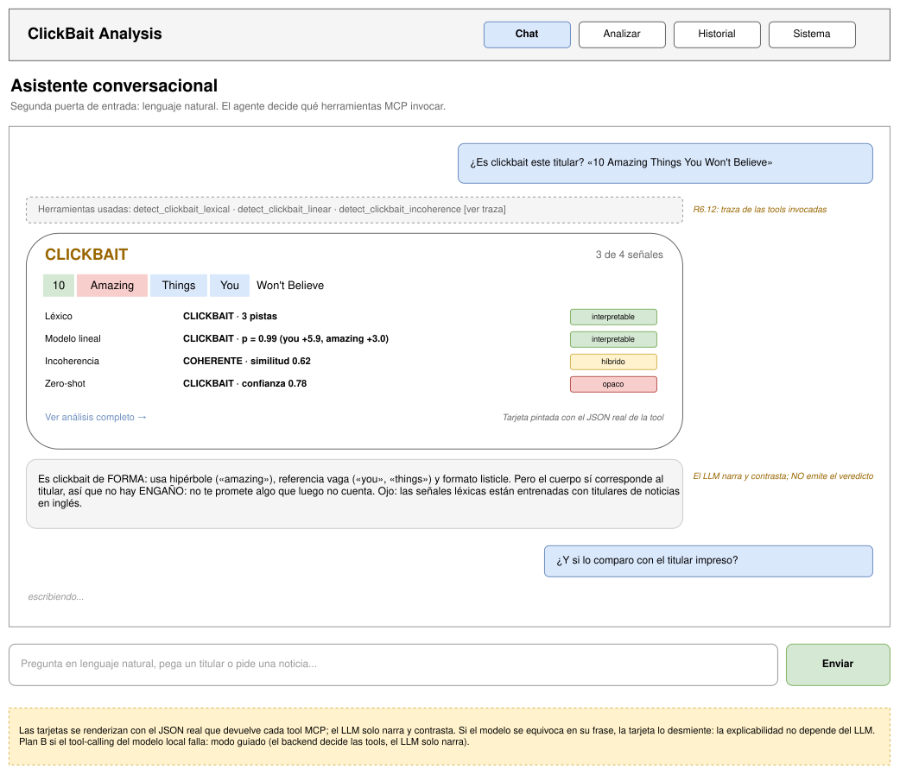
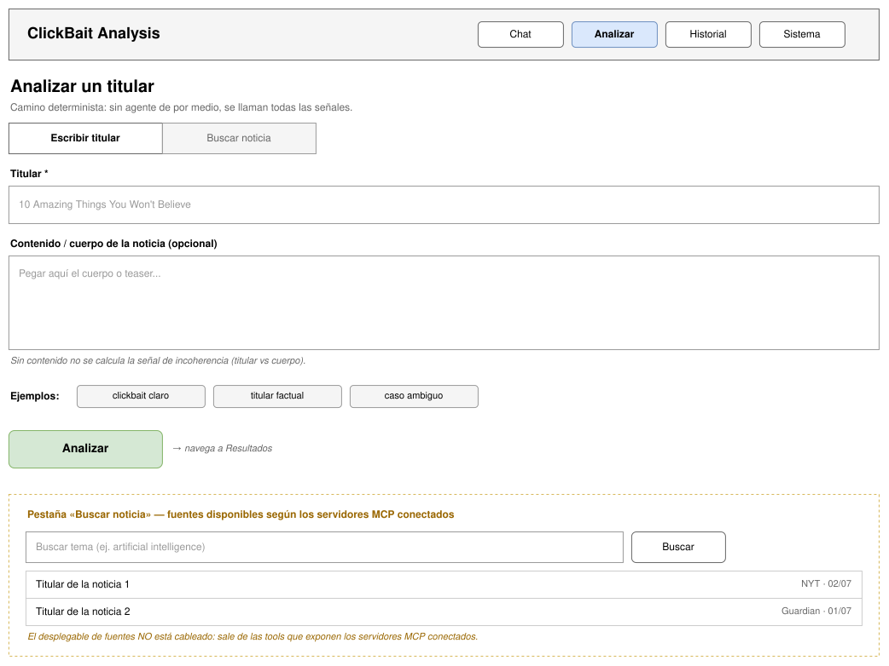
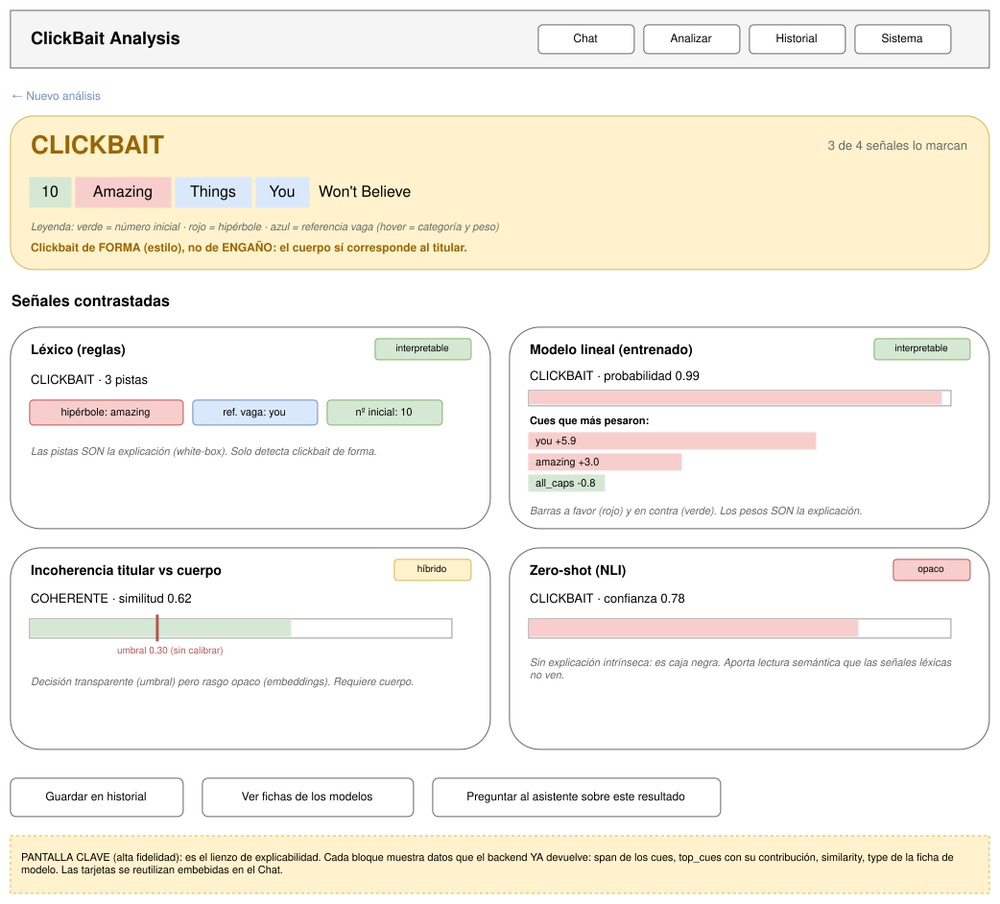
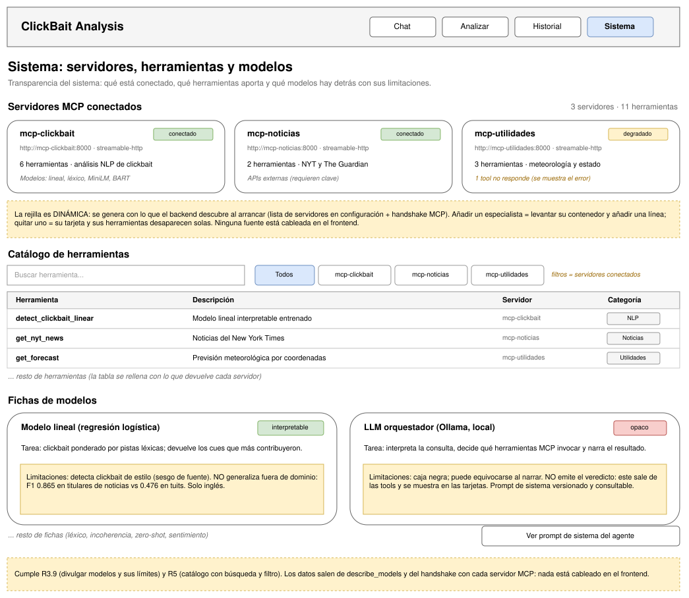
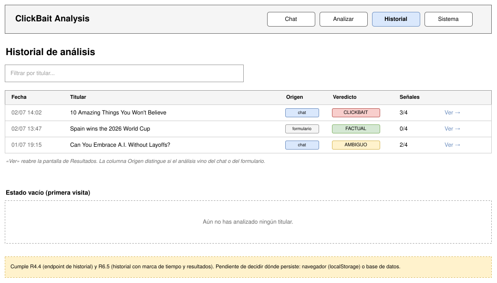

# 2026-ClickBaitAnalysis

Version de Python: 3.12.3

**Documentación:** [Requisitos](docs/requisitos.md) · [Arquitectura (UML + cierre del MVP)](docs/arquitectura.md)

---

## Plan de trabajo — hitos hasta la entrega

**Estado actual (agosto 2026): `v0.2.0`.** El núcleo NLP está completo y validado: cuatro señales de clickbait contrastables, un modelo lineal interpretable propio, divulgación de modelos y una evaluación metodológicamente cerrada (split train/dev/test + validación externa). Lo que resta es la **capa web** (R4–R8) y la memoria. **Entrega: febrero 2027.**

| Hito | Fecha | Contenido | Requisitos |
|---|---|---|---|
| **H1 · Diseño de interfaz** | ago–sep 2026 | Wireframes de pantallas y navegación, definición de funcionalidades, diseño de los endpoints REST | — |
| **H2 · `v0.3` API REST** | octubre | FastAPI: exposición de las tools, catálogo con metadatos, historial **persistente**, OpenAPI, CORS, tests | **R4, R5, R9** |
| **H3 · `v0.4` SPA funcional** | noviembre | Angular: análisis de un titular → resultados con explicabilidad visual (cues resaltados, contraste de señales), catálogo de tools | **R6** |
| **H4 · `v0.5` Docker** | diciembre | Docker Compose (MCP + API / web), **volumen** para el historial, despliegue continuo | **R7, R8** |
| **H5 · `v1.0` Pulido y despliegue** | enero 2027 | Responsive, gestión de errores, pruebas E2E, despliegue | R6 |
| **H6 · Memoria y defensa** | ene–feb 2027 | Redacción de la memoria y preparación de la defensa | — |

_(Corrección de la tabla, 2026-08-11: **R9 —la persistencia— no figuraba en ninguna fila**. H2 pedía «historial de ejecución» y H4 «historial persistente», pero el requisito que los sostiene no estaba listado en ninguno de los dos. Se asigna a H2: hacer el historial en memoria ahora y persistirlo en diciembre sería construirlo dos veces y entregar una pantalla que pierde los datos al reiniciar. A H4 le queda lo que de verdad le corresponde — montar el volumen (R7.6) para que ese fichero sobreviva al contenedor.)_

**Criterios de priorización:**

- **El backlog de NLP queda congelado** como opcional (multi-dominio #78, featurización alternativa #75, fine-tuning neural E5-05, meta-tool de contraste, post-hoc LIME/SHAP). El límite de generalización ya está **medido y documentado** (#76), que es lo que exige el rigor; resolverlo no es condición para la entrega.
- **La memoria arranca en diciembre**, en paralelo con H4. Esta sección de épicas actúa como **borrador y diario de desarrollo** desde el inicio del proyecto.
- El stack está fijado en [requisitos.md](docs/requisitos.md): **FastAPI** (R4) + **Angular/TypeScript** (R6) + **Docker Compose** (R7).

---

## Convenciones de desarrollo

### Organización del trabajo: hitos, issues y ramas

Tres niveles, y **solo uno tiene rama**:

| Nivel | Qué es | ¿Rama? | ¿Versión? |
|---|---|---|---|
| **Hito** (H1–H6) | Checkpoint con fecha y meta; agrupa issues | no | **sí**, al cerrarlo |
| **Issue** | Unidad de trabajo | **sí** — 1 rama → 1 PR → squash a `dev` | no |

Un hito **no es trabajo, es un punto de control**: no se ramifica ni se mergea. La unidad de trabajo es —y ha sido siempre— el issue.

**Épicas (histórico).** Hasta la `v0.2.0` el trabajo se agrupaba en épicas (E1–E5): dominio sin fecha, de ahí los labels `epic:*`. En Fase B **los hitos las sustituyen**, porque cada hito ya trae dominio *y* fecha («H2 · API REST · octubre»); mantener los dos ejes duplicaría la misma información. Los labels `epic:*` se conservan como registro de los issues de Fase A.

### Ramas

Cada rama de trabajo parte de `dev` (recién actualizada: tras un squash la rama de origen queda inservible como base) y sigue el patrón `<tipo>/<nº issue>-<descripción-corta>`:

| Prefijo | Uso |
|---|---|
| `feat/` | Nueva funcionalidad |
| `fix/` | Corrección de bug |
| `chore/` | Setup, estructura, mantenimiento |
| `docs/` | Documentación |
| `test/` | Tests nuevos o mejoras de cobertura |

Ejemplos: `feat/72-splits-train-dev-test`, `feat/86-app-fastapi`, `fix/lexico-cue-una-letra`. El número se omite cuando el trabajo no tiene issue (típico en `docs/`).

### Estilo

`ruff` hace de linter y formateador; las reglas activas y las exclusiones están en [`ruff.toml`](ruff.toml), y el CI lo comprueba en cada PR.

```bash
ruff check . --fix     # corrige lo automatizable
ruff format .          # reformatea
```

### Commits — Conventional Commits

Formato: `tipo(scope): descripción`

**Tipos:** `feat`, `fix`, `chore`, `docs`, `test`, `refactor`

**Scopes:** `core`, `integrations`, `settings`, `tests`, `docs`

Ejemplos:
```
feat(integrations): añadir tool get_news_this_week para Guardian API
chore(settings): configurar pydantic-settings con validación al inicio
fix(core): corregir serialización de ToolResult en tools MCP
test(integrations): añadir tests unitarios para weather tools
```

### Flujo de ramas y versiones (dev → main)

Dos ramas permanentes con papeles distintos:

- **`dev` — integración** (rama por defecto): las features llegan por PR (**squash merge**), cada PR vinculado a una issue con `Closes #N`. Es donde se desarrolla.
- **`main` — producción/estable**: **solo** recibe merges desde `dev` (PR de release, **merge normal** — sin squash, conserva la historia). Un workflow (`protect-main.yml`) rechaza cualquier PR a `main` cuyo origen no sea `dev`.

**Releases:** al promocionar `dev → main` se crea un **tag** (`vX.Y.Z`). Una versión es **tageable** solo si cumple los cuatro criterios:

1. **Bloque funcional completo** — en Fase B, **hito cerrado**; en Fase A era la épica. Un conjunto coherente de issues DEBERÁ, sin features a medias.
2. **CI verde** en `dev` (suite completa).
3. **Verificación E2E** del servidor MCP pasada (tools respondiendo en vivo).
4. **Documentación al día** (README y requisitos reflejan lo incluido).

**Esquema de versiones** (semver adaptado al TFG): **minor** (`v0.X.0`) = bloque funcional — **un hito** en Fase B (`v0.3` = H2, `v0.4` = H3…), una épica en Fase A (`v0.1.0` = MVP, `v0.2.0` = Épica 5 NLP explicable); **patch** (`v0.X.Y`) = hotfix sobre lo shipeado; **major** (`v1.0.0`) = entrega final del TFG.

> **Principio:** las versiones son **cortes en el tiempo**, no contenedores temáticos. Una mejora posterior va a la **siguiente** versión aunque pertenezca por dominio a una épica ya taggeada (la trazabilidad temática la dan los labels de épica en los issues, no los tags). Los tags son inmutables: nunca se "reabre" una versión.

_(Histórico: hasta la v0.2.0 el flujo era feature → PR → `main` directo; el esquema dev→main se adoptó al cerrar la Épica 5.)_

---

## Recopilación de épicas

Aquí se documentan las épicas y las iteraciones realizadas durante el desarrollo del proyecto. No se trata de un documento final sino simplemente un histórico de progreso para la memoria final.

## Épica 0 — Experimentación con MCP y APIs externas (MARZO - MEDIADOS DE ABRIL)

Objetivo: validar la viabilidad de construir un servidor MCP en Python que exponga herramientas (tools) capaces de consultar APIs externas reales, estableciendo las bases de arquitectura sobre las que se apoyará el resto del proyecto.

### Iteraciones

#### 0.1 — Prototipo MCP con Weather.gov
- Creación de `weather.py` como script monolítico de prueba.
- Integración con la API pública de [NOAA Weather.gov](https://api.weather.gov) para obtener alertas meteorológicas por estado y previsiones a partir de coordenadas.
- Añadidos `requirements.in` y `requirements.txt` con las dependencias base: `mcp`, `fastmcp`, `httpx`.

#### 0.2 — Estructura de paquete `backend/`
- Extracción del prototipo a una arquitectura en capas: `backend/api/`, `backend/tools/`, `backend/main.py`.
- `main.py` instancia el servidor FastMCP y registra las tools disponibles.
- Separación de responsabilidades: la capa API gestiona las llamadas HTTP; la capa de tools expone las funciones al servidor MCP.

#### 0.3 — Modelo de respuesta estandarizado (`ToolResult`)
- Introducción de `ToolResult` (Pydantic `BaseModel`) en `backend/models.py` para unificar el contrato de respuesta entre la capa API y las tools.
- Campos: `success: bool`, `data: Any | None`, `error: str | None`.
- Métodos de fábrica: `ToolResult.ok(data)`, `ToolResult.fail(error_message)` y predicado `has_content()`.

#### 0.4 — Integración con The Guardian API
- Añadida `GuardianAPI` en `backend/api/the_guardian_api.py` para consultar artículos de la última semana por tema (`get_news_this_week_call`).
- Registrada la tool `get_news_this_week` en el servidor MCP.
- Primer test exploratorio en `tests/simple_test.py`.

#### 0.5 — Refactor: herencia desde `BaseAPI`
- Creada la clase abstracta `BaseAPI` en `backend/api/base_api.py` con el método genérico `make_request(endpoint, method, params)`.
- `WeatherAPI` y `GuardianAPI` heredan de `BaseAPI`, eliminando duplicación de lógica HTTP (timeout, errores HTTP, manejo de excepciones).
- `make_request` inyecta automáticamente la API key si está configurada.

#### 0.6 — Corrección de tipos y uso correcto de la capa API (PR #1)
- Las tools instancian y usan correctamente los objetos API en lugar de llamar funciones sueltas.
- Los tipos de retorno de las tools se limitan a tipos serializables (`str | dict`) compatibles con el protocolo MCP.

### Decisiones de diseño relevantes

| Decisión | Motivo |
|---|---|
| FastMCP como framework MCP | Reduce el boilerplate del protocolo y permite registrar tools con un simple decorador `@mcp.tool()` |
| `httpx.AsyncClient` para HTTP | API totalmente asíncrona, coherente con el modelo async/await del servidor |
| `ToolResult` como capa de abstracción | Desacopla el manejo de errores HTTP del código de las tools; facilita los tests unitarios |
| Herencia `BaseAPI` | Centraliza timeout, inyección de API key y manejo de excepciones HTTP en un único lugar |

---

## Épica 1 — Infraestructura MCP ()

### Iteraciones

#### 1.1 — Incidente: filtración de API key y rotación

Debido a un descuido y una experimentación algo apresurada, la clave API fue filtrada en github y tuve que cambiarla. Este error fue un toque de conciencia para empezar a definir una estructura completa del proyecto en épicas y priorizar las más relevantes. 

#### 1.2 — E1-01 + E1-03 · Migración de estructura a `core/` + `integrations/<nombre>/`

Antes de crear nuevos archivos y carpetas, decidí definir la estructura del proyecto primero, pero con un enfasis en YAGNI, la estrucutra podría ser modificada SOLO cuando sea necesario, sin intentar predecir como será a futuro:

Por el momento dentro de backend tenemos:
- Core: Con una clase API para hacer peticiones básicas y un archivo de modelos personalizados para las tools.

- Integration: que contiene varias subcarpetas, cada una relacionada con un API y que a su vez contiene las peticiones (client) y las tools que expone al MCP (tool)

- Test: Carpeta que contendrá tests en el futuro, por ahora un placeholder

Ya que en la próxima épica se tratarán las variables de configuracion, se creó la carpeta config.


#### 1.3 — E1-04 · Gestión de configuración con `pydantic-settings`

Para evitar nuevas filtraciones accidentales de la API key en el código, doy prioridad a establecer las variables de configuración del proyecto. Decidí usar pydantic-settings y no os.getenv por el fail fast y escalabilidad de variables a futuro.


La clase settings.py maneja ahora todas las variables de configuración y seguridad, conectandose con el archivo .env (el cual nunca está en el git ignore)

Siguiente paso: Manejo de tests para depurar llamadas a API, pues algo falla.


### 1.4 - E1-02 · Formalizar convención de ramas y commits

Aunque se trate de un paso pequeño, antes de seguir trabajando en las épicas pensé que sería necesario formalizar la creación de ramas y commits para mejorar la organización del proyecto a largo plazo

Se usará Conventional Commits por simplicidad, empezando cada rama por el tipo de épica al que hace referencia (chore, fix, fet, docs) y con commits usando "scopes" que vienen a indicar sobre que parte del proyecto se trabajó. Esto es también útil para no subir macro-commits que afecten a demasiados archivos y poder hacer "rollback" de ser necesario.

Ejemplos: 

feat(integrations): añadir tool get_news_this_week para Guardian API
chore(settings): configurar pydantic-settings con validación al inicio

#### 1.5 — E1-09 · Configurar pytest y estructura de tests

Se instalaron pytest, pytest-asyncio y pytest-cov como dependencias de desarrollo. Se creó `pytest.ini` en la raíz del proyecto con configuración mínima (testpaths y pythonpath). Se añadió un smoke test (`tests/test_smoke.py`) que verifica que el servidor MCP importa sin errores.

#### 1.6 — E1-10 · Tests unitarios para weather tools

Se añadió `respx` para mockear llamadas HTTP en tests. Tests implementados para `get_alerts_API` (respuesta válida, vacía y error HTTP) y para `get_forecast` (respuesta válida con mockeo de dos llamadas encadenadas, error HTTP en `get_zone_by_points` y error HTTP en `get_forecast_API`). Durante el testing se descubrió y corrigió un bug en `get_zone_by_points` donde faltaba `/` en la URL construida. Se añadió también validación de periods vacíos en `tool.py`; el test correspondiente queda fuera del scope de esta iteración por depender de la capa tool y no del client.

#### 1.7 — E1-06 · Logging estructurado con `structlog`

El criterio de aceptación del issue (`logger.info("test", key="value")` debe producir salida estructurada) descartó el `logging` estándar de Python, que no acepta kwargs arbitrarios — se eligió `structlog` por soportar esa sintaxis de forma nativa. (Básicamente, el logging básico fija las salidas a ciertos argumentos. Utilizar structlog nos permite más libertad al configurarlos)

La configuración vive en `backend/core/logging.py` (función `configure_logging()`) y se controla desde dos nuevas variables en `Settings` (`backend/config/settings.py`):

- `LOG_LEVEL`: `DEBUG` / `INFO` / `WARNING` / `ERROR` (default `INFO`).
- `LOG_FORMAT`: `console` (renderer legible y coloreado, default para desarrollo) o `json` (renderer estructurado para producción).

Ambas se declaran como `Literal[...]` en pydantic-settings, de modo que un valor inválido falla al arrancar (fail-fast, coherente con la decisión de E1-04). La pipeline de processors aplica `merge_contextvars`, `add_log_level` y un `TimeStamper` ISO en UTC antes del renderer final.

En `backend/main.py` se invoca `configure_logging()` al inicio de `main()` y se reemplaza el `logging.info("Starting server...")` por `log.info("server.start", transport="stdio")`, ya con campos estructurados. El test `tests/test_logging.py` valida el DoD del issue forzando `LOG_FORMAT=json` con `monkeypatch` y verificando que la salida JSON contiene `event`, `key`, `level` y `timestamp`.

#### 1.8 — E1-07 · Registro de invocaciones de tools

Se añade `backend/core/observability.py` con el decorador `log_tool_invocation`, que envuelve cada tool MCP para registrar cada invocación con `tool` (nombre), `params` (kwargs recibidos, ya que MCP transmite los parámetros como JSON object), `duration_ms` medido con `time.perf_counter()` y un booleano `success`.

El decorador se aplica en cascada con `@mcp.tool()`:

```python
@mcp.tool()
@log_tool_invocation
async def get_alerts(state: str) -> str | dict: ...
```

El orden importa — Python aplica los decoradores de abajo a arriba, así que `@mcp.tool()` registra ya la versión envuelta con logging. Aplicado a las tres tools existentes (`get_alerts`, `get_forecast`, `get_news_this_week`).

En caso de éxito se emite el evento `tool.invoke`. Si la tool lanza una excepción, se emite `tool.invoke.failed` con el traceback completo (`traceback.format_exc()` en el campo `exception`) y la tool devuelve al cliente MCP un mensaje genérico (`"Internal error while executing tool"`) — el detalle interno solo aparece en el log.

**Limitación conocida:** cuando una tool retorna un string de error sin lanzar excepción (patrón actual de `get_alerts` y `get_news_this_week`: `return response.error or "Error fetching..."`), el decorador no puede distinguir éxito real de error suave y lo loguea como `success=True`. Estabilizar ese contrato queda fuera del scope de E1-07 y será cubierto por los issues #13 (`[E1-11]`) y #14 (`[E1-12]`).

El test `tests/test_observability.py` cubre dos casos con `pytest-asyncio`: invocación correcta (assert sobre `event`, `tool`, `params`, `success=True`, `duration_ms`) y excepción (assert sobre `event=tool.invoke.failed`, `success=False`, presencia del traceback en `exception`, valor devuelto = mensaje genérico).

#### 1.9 — E1-12 · Fix: `get_news_this_week` con respuestas sin `results`

`backend/integrations/news/client.py:get_news_this_week_call` rompía con `TypeError: 'NoneType' object is not iterable` cuando la respuesta de The Guardian no incluía la clave `results` (o llegaba como `null`). El list comprehension iteraba directamente sobre `response.data.get("response", {}).get("results")` sin validar.

Con el decorador `log_tool_invocation` (E1-07) la excepción se capturaba ahora como `tool.invoke.failed` y el cliente MCP recibía `"Internal error while executing tool"` — funcional, pero "no hay artículos" no debería ser un error técnico, sino un resultado legible.

**Fix:** un guard antes del list comprehension:

```python
results = response.data.get("response", {}).get("results")

if not results:
    return ToolResult.fail("No articles found")
```

`not results` cubre con una sola línea tanto `None` (clave ausente o `null` explícito) como `[]` (lista vacía).

**Contrato:** se eligió `ToolResult.fail("No articles found")` sobre la alternativa `ToolResult.ok("...")` por dos razones:

1. **Tipo único de `data`:** en éxito, `data` siempre es `list[dict]`; un string vacío como `data` rompería esa consistencia.
2. **Output limpio al cliente:** la tool serializa `response.data` con `json.dumps(...)` solo cuando `has_content()`; si `data` fuera un string, saldrían comillas dobles literales (`'"No articles found."'`). Por el camino `fail`, la tool devuelve `response.error` directamente — string limpio.

El test `tests/test_news_guardian.py` cubre tres casos con `respx`: respuesta válida con artículos (verifica `success=True` y campos `title`/`url`/`date`), `results=[]` (verifica el guard sobre lista vacía) y respuesta sin la clave `results` (verifica el guard sobre `None`, que era el escenario del bug original).

#### 1.10 — E1-08 · Health check con probes activos

Se añade `backend/core/health.py` con la tool MCP `health_check`, que reporta el estado del servidor y de sus dependencias externas haciendo una petición real a cada API. Devuelve un dict con:

- `status`: `Literal["ok", "degraded", "down"]` — agregado por la función pura `_aggregate_status` según cuántas integraciones respondan.
- `timestamp`: ISO 8601 en UTC (`datetime.now(timezone.utc).isoformat()`).
- `integrations`: dict por integración (`weather`, `guardian`) con `reachable: bool` y `error: str | None`.

Los probes se ejecutan **en paralelo con `asyncio.gather`**, así la latencia total es `max(probes)` y no `sum(probes)` — relevante con timeout corto (5s) y dos integraciones. Cada probe usa `httpx.AsyncClient` directo (sin pasar por `BaseAPI`) porque la lógica es trivial y la inyección automática de API key no aporta para una petición one-shot. Para Guardian la key se pasa explícita en `params={"api-key": settings.guardian_api_key}`; `raise_for_status()` convierte 4xx/5xx en excepción para que el `except httpx.HTTPError` los trate uniformemente como `reachable=False`.

**Sub-fix incluido:** `backend/core/logging.py` redirige structlog a `sys.stderr` mediante `logger_factory=structlog.PrintLoggerFactory(file=sys.stderr)`. El protocolo MCP por stdio reserva **stdout para JSON-RPC** y **stderr para logs del servidor**; sin este fix, structlog escribía sobre stdout y mezclaba con el protocolo, lo que hacía que Claude Desktop no pudiera parsear las respuestas y el servidor pareciese "muerto" desde el cliente. Deuda heredada de E1-06 que se descubrió al integrar en Claude Desktop por primera vez.

Los tests viven en `tests/test_health.py` y combinan **dos niveles** deliberadamente:

- **Unit tests (3)** sobre `_aggregate_status` — función pura, sin red ni mocks. Cubren los tres estados con dicts dummy. Mantienen valor real porque la lógica de agregación tiene 3 ramas no triviales.
- **Integration tests (2)** marcados con `@pytest.mark.integration` que invocan `_probe_weather` y `_probe_guardian` contra las APIs reales. Verifican comportamiento end-to-end: conectividad de red + validez de la API key + contrato HTTP.

Se descartó la opción de mockear las APIs con `respx` (patrón que sí se usa en `test_weather.py` y `test_news_guardian.py`): un mock de la integración que el health debe detectar no aporta en un proyecto de un solo programador frente a un test real automatizado que sirve también como pre-deploy check. El marker `integration` está declarado en `pytest.ini` para separar ejecuciones (`pytest -m "not integration"` cuando no haya red o API key).

### Decisiones de diseño relevantes

| Decisión | Motivo |
|---|---|
| Uso de pydantic-settings | Evitar filtraciones de variables críticas y valores hardcodeados |
| `structlog` sobre `logging` stdlib | Soporta kwargs estructurados (`log.info("evt", key=value)`) sin recurrir a `extra={...}`; pipeline de processors configurable con renderer condicional console/json |
| Decorador `log_tool_invocation` sobre middleware | FastMCP no expone un punto claro de middleware; un decorador propio es portable, fácil de testear de forma aislada y se compone explícitamente con `@mcp.tool()` |
| Mensaje genérico al cliente en error | Evita filtrar detalles internos (paths, librerías, stack) en la respuesta MCP; el detalle solo vive en el log interno (Req 1.5) |
| `asyncio.gather` para probes en paralelo | Latencia total = `max(probes)` en lugar de `sum`; con dos integraciones y timeout 5s, evita esperas innecesarias |
| Logs por `sys.stderr` en transporte stdio | El protocolo MCP por stdio reserva stdout para JSON-RPC; sin redirigir, structlog corrompe el canal y Claude Desktop pierde el servidor |
| Integration tests sobre mocks para health | Para un solo programador, automatizar la detección real de fallos vale más que mocks que reproducen exactamente la funcionalidad bajo test |

---

## Épica 2 — Integración New York Times

Objetivo: añadir una segunda fuente de noticias al servidor MCP para alimentar el análisis de clickbait con titulares de procedencia distinta a The Guardian. La épica se descompone en cliente (E2-01), tool MCP (E2-02) y tests (E2-03), siguiendo el mismo patrón de integraciones ya consolidado.

### Iteraciones

#### 2.1 — E2-01 · Cliente NYT con búsqueda de titulares

Se añade `backend/integrations/nyt/` con `NYTAPI` heredando de `BaseAPI`, replicando el patrón de `GuardianAPI`: constantes de clase (`BASE_URL`, `API_KEY`, `API_KEY_PARAM`) y `make_request` ya inyecta la `api-key` como query string sin tocar el método.

`Settings` extendido con `nyt_api_key: str` (obligatoria, fail-fast vía pydantic-settings). En `.env` se carga como `NYT_API_KEY` (mayúsculas, convención 12-factor; pydantic-settings mapea automáticamente).

El único método público es `search_articles(topic: str)`, que llama a [Article Search API](https://developer.nytimes.com/docs/articlesearch-product/1/overview) con `q=<topic>`, `begin_date=YYYYMMDD` (hoy menos 7 días) y `sort=newest`. Devuelve `ToolResult.ok(list[dict])` con el mismo schema común que Guardian — `{title, url, date}` — para que el consumidor (la tool MCP de E2-02) no tenga que distinguir el origen.

#### 2.2 — E2-02 · Tool MCP `get_nyt_news`

Se añade `backend/integrations/nyt/tool.py` con la función `register(mcp)`, siguiendo el mismo patrón de `news/tool.py`, y maneja el `ToolResult` con el mismo contrato que Guardian — `if not response.has_content(): return response.error or "Error fetching news"` y `json.dumps(response.data)` en éxito.

`backend/main.py` registra la nueva tool junto a las anteriores (`nyt_tool.register(mcp)`), elevando a **5 las tools expuestas** al cliente MCP: `get_alerts`, `get_forecast`, `get_news_this_week`, `health_check` y `get_nyt_news`.

#### 2.3 — E2-03 · Tests del cliente NYT

`tests/test_news_nyt.py` combina **dos niveles** siguiendo el patrón establecido en E1-08 (health check):

**Unit tests (4 con `respx`)**, deterministas, cubren todas las ramas de parseo:

- `test_search_articles_valid_response` — payload OK con artículos, asserta `success=True` y mapeo de campos `headline.main`/`web_url`/`pub_date` al schema común `{title, url, date}`.
- `test_search_articles_no_results` — `docs=[]`, asserta `success=False` con `"No articles found"` en `error`. Cubre el guard `if not docs`.
- `test_search_articles_missing_docs_key` — payload sin la clave `docs`, cubre el mismo guard sobre `None`.
- `test_search_articles_http_error` — respuesta HTTP 500, asserta que `BaseAPI` propaga el fallo y `search_articles` retorna `ToolResult.fail`.

**Integration tests (2 con `@pytest.mark.integration`)**, hacen petición real a NYT:

- `test_search_articles_valid_use` — drift detection del schema: con la API key real, asserta que cada artículo de la respuesta contiene `title`, `url` y `date`. Si NYT renombra o anida distinto algún campo, el test falla y se entera el dev.
- `test_search_articles_invalid_topic` — topic improbable (`"nonexistingtopicabcde"`) que actualmente no devuelve resultados; asserta `not result.success` y `"No articles found" in result.error`, conectando el contrato del cliente con el string que finalmente recibe el LLM. **Aceptado como potencialmente flaky** (algún día puede aparecer un artículo con ese topic); documentado en el propio archivo como warning.

#### 2.4 — E1-13 · Tests de integración para Guardian (cierre de asimetría)

Como follow-up de E2-03 se replicó el patrón mixto unit + integration en `tests/test_news_guardian.py`, que hasta entonces solo tenía cobertura con mocks. Cierra la asimetría: ahora las dos integraciones de noticias (Guardian y NYT) tienen el mismo nivel de cobertura, incluyendo drift detection del contrato real con la API.

### Decisiones de diseño relevantes

| Decisión | Motivo |
|---|---|
| Schema común `{title, url, date}` entre Guardian y NYT | Permite que la futura tool MCP (E2-02) y el analizador NLP (E3) consuman datos sin ramificar lógica por fuente |
| Hereda de `BaseAPI` igual que Guardian/Weather | Reutiliza la inyección automática de `api-key`, manejo uniforme de timeout y errores HTTP; cualquier mejora futura en `BaseAPI` aplica a las tres integraciones |

---

## Refactor transversal de coherencia (post-MVP)

Tras cerrar E2, un repaso del proyecto destapó deuda e inconsistencias acumuladas entre épicas. Se abordaron en un PR de refactor (sin nueva funcionalidad de producto), agrupadas por tema.

### Health check dinámico (+ NYT)

`backend/core/health.py` tenía una función `_probe_*` por integración (`_probe_weather`, `_probe_guardian`) con estructura `try/except/raise_for_status` **idéntica** — repetición real. Se extrajo un único `_probe(url, params)` genérico y las integraciones se declaran como **datos** en un diccionario `PROBES`. Beneficio doble: añadir una API = una entrada (no más funciones), y **NYT entró de paso** (el health check ignoraba NYT pese a ser la tercera integración — incoherencia heredada de cuando se diseñó E1-08, antes de que NYT existiera). Los integration tests pasaron a `@pytest.mark.parametrize` sobre `PROBES`, generándose uno por integración automáticamente.

Se distinguió esta repetición **real** de la **aparente** del registro de tools en `main.py`: ahí cada `*.register(mcp)` invoca módulos distintos sin patrón que extraer, así que el "register dinámico" se descartó (YAGNI) — explícito es más legible que un loop o autodescubrimiento mágico con `importlib`.

### `topic` opcional + `days` configurable en clientes y tools

Los clientes de noticias tenían `topic` obligatorio y rango temporal fijo (7 días hardcodeado). Se hizo `topic: str | None = None` (si se omite, devuelve lo más reciente sin filtrar) y `days: int = 7` configurable. Los params se construyen condicionalmente: la clave `q` solo se envía si hay `topic`.

Decisión clave de **frontera de confianza**: al exponer `days` también en las tools (para que el usuario final pueda pedir rangos vía el LLM), `days` pasó de input interno a input **no confiable** del LLM. Por eso se validó **en la tool** con `pydantic.Field(ge=1, le=30)` — el rango aparece en el schema que ve el LLM y FastMCP rechaza valores fuera de rango antes de ejecutar. El cliente no revalida: la frontera ya filtró.

### Rename por coherencia

`get_news_this_week_call` (cliente Guardian) pasó a `search_articles`, idéntico a NYT — ambos clientes exponen ahora la misma interfaz, reforzando el schema común. La tool `get_news_this_week` pasó a `get_guardian_news`, simétrica con `get_nyt_news` y nombrando la fuente para que el LLM desambigüe mejor. El nombre viejo (`this_week`) además se había vuelto engañoso al hacer `days` configurable.

### Limpieza

- Eliminado `tests/simple_test.py` (código muerto de E0: importaba de `backend.api.the_guardian_api`, ruta que desapareció en la migración E1-03; pytest no lo recogía por no matchear `test_*.py`).
- `tests/test_logging.py` y `tests/test_observability.py` leían `capsys` desde **stdout**, pero desde el fix de stderr de E1-08 los logs salen por **stderr**. Tests desincronizados (latentes hasta correrlos juntos): se corrigieron a `captured.err`. Ahora además verifican que los logs van a stderr, justo lo que el protocolo MCP stdio exige.
- Start del servidor más descriptivo: el log `server.start` incluye ahora `log_level` y `log_format` (QoL para diagnóstico al arrancar).
- Imports muertos (`Optional`, `ToolResult` sin usar), `f""` sin interpolación y TODOs vagos eliminados.

### Decisiones de diseño relevantes

| Decisión | Motivo |
|---|---|
| `_probe` genérico + dict `PROBES` (health) | Repetición real entre probes; añadir integración = una entrada de datos. Distinto del register de `main.py`, donde la repetición es aparente y explícito gana |
| Validar `days` con `Field` en la tool, no en el cliente | La frontera de confianza está en la tool (input del LLM); validar una vez en el borde, el cliente confía en lo que recibe |
| `topic` opcional construyendo params condicionalmente | Evita enviar `q=None` a la API; permite el caso "titulares recientes sin tema" |
| Rename a `search_articles` / `get_guardian_news` | Interfaz idéntica entre clientes y tools simétricas que nombran la fuente; el nombre viejo era engañoso con `days` configurable |

---

## Integración continua

### E1-14 · CI con GitHub Actions

Se añadió `.github/workflows/ci.yml`, un workflow que ejecuta la suite de tests en cada `pull_request` hacia `main` (y en `push` a `main`). El job configura Python 3.12, instala `requirements.txt` y corre `pytest -m "not integration"`. Es la red de seguridad que da sentido al esfuerzo de testing acumulado: un cambio que rompa el código se detecta en el PR, antes del merge.

### E1-15 · Renombrar paquete `news/` → `guardian/`

El paquete `backend/integrations/news/` contenía en realidad la integración de The Guardian, mientras NYT vivía en `backend/integrations/nyt/`: asimetría `news`=Guardian vs `nyt`=NYT. Se renombró a `backend/integrations/guardian/` para que el nombre del paquete refleje la fuente, igual que NYT. Cambios asociados: imports en `main.py` (incluido el alias `news_tool` → `guardian_tool`), el import interno de `guardian/tool.py`, y el test `tests/test_news_guardian.py` renombrado a `tests/test_guardian.py`. El movimiento se hizo preservando el historial git de los archivos.

Fue el **primer PR validado por el CI de E1-14** antes del merge — estreno de la red de seguridad sobre un cambio mecánico pero con riesgo real de romper imports.

## Épica 3 — NLP via HuggingFace

> **Estado:** E3-01 (cliente `HFClient`) ✅ mergeado (PR #40). E3-02 (detección de clickbait, zero-shot) en curso. E3-03 (sentimiento) y E3-04 (tests) pendientes.

### Conceptos NLP (sin asumir experiencia previa)

**1. Clasificar texto = ponerle una etiqueta.** Un clasificador recibe un texto (un titular) y le asigna una etiqueta de un conjunto, con un *score* de confianza (0–1). Ej.: clickbait → `{clickbait, no-clickbait}`.

**2. Modelo *fine-tuned* específico** (lo que son `elozano` o `distilbert-sst2`). Se entrena con miles de ejemplos **ya etiquetados** de **una** tarea. La aprende muy bien, pero: sus etiquetas son **fijas**, necesitas un modelo por tarea, y —clave aquí— alguien tiene que tenerlo **desplegado** para usarlo por API. Los de clickbait no lo están en el serverless de HF.

**3. *Zero-shot classification* = clasificar SIN haber entrenado para esas etiquetas.** Le pasas el texto **y** las etiquetas candidatas *en el momento de la consulta* (`["clickbait", "factual"]`) y el modelo puntúa cuánto encaja cada una. No fue entrenado para "clickbait"; razona sobre la marcha. Por eso puedes **cambiar las etiquetas sin reentrenar nada**.

**4. ¿Cómo hace esa "magia"? Con NLI (*Natural Language Inference*).** NLI es una tarea clásica: dadas dos frases —una **premisa** y una **hipótesis**— decidir si la premisa **implica** (*entailment*), **contradice** o es **neutral** respecto a la hipótesis. Ej.: premisa *"El gato duerme en el sofá"* → hipótesis *"Hay un animal en el sofá"* = *entailment*.

El truco del zero-shot es **reformular la clasificación como NLI**:
- **Premisa** = el titular.
- **Hipótesis** = una plantilla por etiqueta: *"Este texto es clickbait"*, *"Este texto es una noticia factual"*.
- La probabilidad de *entailment* de cada hipótesis se usa como **score** de esa etiqueta; la de mayor *entailment* gana.

Por eso los modelos zero-shot son en realidad modelos **entrenados en NLI**, como `facebook/bart-large-mnli` (entrenado en el dataset MNLI).

**5. *Cross-encoder* vs *bi-encoder*.** Es **cómo** el modelo compara las dos frases:
- **Cross-encoder:** mete premisa + hipótesis **juntas** en la misma pasada; las "lee" a la vez y da un score de relación. Muy **preciso**, pero **lento**: hay que reprocesar por cada par → con N etiquetas, N pasadas. Los `cross-encoder/nli-deberta-...` son esto.
- **Bi-encoder:** codifica cada frase **por separado** en un vector y compara vectores. **Rápido** y reutilizable, pero menos preciso en juicios par-a-par.

Para clasificar pocos titulares con pocas etiquetas, el coste de las N pasadas del cross-encoder es asumible y **ganas precisión**.

**6. Ejemplo real** (zero-shot con `facebook/bart-large-mnli`, etiquetas `["clickbait", "factual news"]`):

| Titular | `clickbait` | `factual news` |
| :--- | :---: | :---: |
| *"You will not believe what happened next"* | **0.79** | 0.21 |
| *"Federal Reserve raises interest rates by a quarter point"* | 0.17 | **0.83** |

Sin entrenar nada específico de clickbait, el modelo discrimina correctamente.

> **Estado de diseño:** decisiones tomadas antes de codificar. La elección final de modelo de cada tarea se documenta en su iteración (E3-02 clickbait, E3-03 sentimiento).

### Evaluación de modelos candidatos

Para el análisis de los titulares en el servidor MCP se han evaluado las siguientes opciones de modelos ligeros de Hugging Face, priorizando un balance entre baja latencia y precisión. Son **candidatos**: el modelo definitivo de cada tarea se fija en su issue (E3-02 clickbait, E3-03 sentimiento).

| Categoría | Modelo (Hugging Face) | Ventajas (Pros) | Desventajas (Contras) |
| :--- | :--- | :--- | :--- |
| **Sentimiento (Inglés)** | `cardiffnlp/twitter-roberta-base-sentiment-latest` | • Excelente precisión con texto corto.<br>• Entiende matices periodísticos y sarcasmo.<br>• Clasificación en 3 vías (Positivo, Negativo, Neutral). | • Ligeramente más pesado en RAM/VRAM.<br>• Inferencia marginalmente más lenta que modelos destilados. |
| **Sentimiento (Inglés)** | `distilbert/distilbert-base-uncased-finetuned-sst-2-english` | • Inferencia ultra-rápida (ideal para latencia crítica).<br>• Consumo mínimo de recursos (modelo *distilled*). | • Solo clasificación binaria (Positivo/Negativo, omite neutralidad).<br>• Menor capacidad para captar ironías complejas. |
| **Clickbait (Específico)** | `elozano/bert-base-cased-clickbait-news` | • Solución "Plug & Play" (enchufar y listo).<br>• Entrenado específicamente con titulares de noticias. | • Difícil de ajustar (no puedes redefinir qué es "clickbait").<br>• Puede fallar con el clickbait sutil o "elegante" (ej. NYT). |
| **Clickbait (Zero-Shot)** | `cross-encoder/nli-deberta-v3-small` | • Control total: permite definir tus propias etiquetas (ej. `["factual", "sensationalism"]`).<br>• Excelente capacidad de razonamiento lógico e inferencia. | • Requiere afinar empíricamente las etiquetas de entrada.<br>• Inferencia ligeramente más computacional al evaluar múltiples etiquetas. |
| **Traducción (EN ➔ ES)** | `Helsinki-NLP/opus-mt-en-es` | • Ejecución 100% local y privada (sin costes de API externa).<br>• Extremadamente ligero (~300MB).<br>• Traducciones rápidas de oraciones cortas. | • Calidad ligeramente inferior a APIs comerciales (DeepL/OpenAI) en textos muy literarios.<br>• Añade un paso extra de procesamiento al pipeline del MCP. |

#### Backend de inferencia: remoto ahora, local pendiente

Para el MVP se ejecutan en **remoto**; el salto a **local** queda supeditado a si hay infraestructura de cómputo disponible (p. ej. de la universidad). Comparativa:

- **Remoto — HF Inference API:** disponible ya, sin GPU propia. HF asume el cómputo; a cambio se paga en latencia de red, *rate limits* y dependencia de un token (`HF_TOKEN`). Encaja con `BaseAPI` (HTTP) extendiéndola a `POST` + header `Authorization: Bearer`.
- **Local — `transformers`:** descarga los pesos y usa RAM/VRAM propias, pero da privacidad total y sin *rate limits*. No usa `BaseAPI`.

**Decisión para no bloquear la épica:** el cliente NLP se programa contra una **interfaz estable** (`classify` / `zero_shot` → `{label, score}`); las tools (`detect_clickbait`, `analyze_sentiment`) y sus tests dependen del *contrato*, no de la implementación: pasar de remoto a local más adelante es escribir otra implementación detrás de la misma interfaz, sin tocar las tools. Se empieza por **remoto**, que no depende de infraestructura externa. Un futuro selector `nlp_backend` (remoto/local) se añadirá **junto con** el backend local (hoy no lo leería nadie → aplazado, *YAGNI*).

> **Sobre la tabla:** las ventajas/inconvenientes de **RAM/VRAM, "100% local" y tamaño en disco** solo aplican al backend local; en remoto ese coste lo absorbe HF. Los modelos son los mismos en ambos casos.

> **Alcance:** la **traducción EN→ES** (`Helsinki-NLP/opus-mt-en-es`) es una capacidad candidata adicional, aún no comprometida en el MVP (las 2 tools núcleo son clickbait y sentimiento).

### E3-01 · Cliente HuggingFace (`HFClient`) — realizado

Primer cliente que rompe el patrón GET + api-key en query: HF exige **POST con body JSON** y **auth por header** `Authorization: Bearer`. Cambios:

- **`Settings`:** nueva variable obligatoria `hf_token` (`HF_TOKEN` en `.env`), fail-fast.
- **`BaseAPI`:** soporte de `POST` con body JSON, y auth delegada en un método sobreescribible `_apply_auth` (por defecto, api-key en query → Guardian/NYT intactos). La subclase decide *dónde* va la auth sin un solo `if` por tipo (polimorfismo).
- **`HFClient(BaseAPI)`** (`backend/integrations/nlp/`): `classify(text, model)` hace POST y normaliza a `{label, score}` (clase ganadora) con parseo defensivo.
- **CI:** `HF_TOKEN: dummy` añadido al workflow (la nueva key obligatoria rompería el fail-fast de `Settings` en CI).

**Motivo del cambio de endpoint:** el endpoint clásico `api-inference.huggingface.co` está **deprecado** (ni resuelve DNS). Se migró al router del provider serverless: `https://router.huggingface.co/hf-inference/models/{model}`. *(De paso se detectó que WSL2 no tiene salida IPv6 — gotcha latente del entorno.)*

### E3-02 · Detección de clickbait con zero-shot — decisión

**Restricción descubierta probando:** el serverless `hf-inference` **no sirve ningún modelo de clickbait específico** — sondeados `elozano/bert-base-cased-clickbait-news`, `valurank/distilroberta-clickbait` y `Stremie/bert-base-uncased-clickbait-detection`, todos devuelven `400 "Model not supported by provider"`. El `cross-encoder/nli-deberta-v3-small` de la tabla **tampoco** está servido.

Lo **único** viable para clickbait en remoto es **zero-shot vía `facebook/bart-large-mnli`** (confirmado servido; discrimina bien, ver ejemplo arriba).

**Decisión:** zero-shot remoto con `bart-large-mnli` para el MVP. Definimos nosotros las etiquetas (`["clickbait", "factual"]`) y dejamos `elozano` (modelo dedicado, más preciso) como **mejora futura** en backend local, si llega la infra.

**Implicación de código:** la respuesta zero-shot del router es una **lista plana** `[{label, score}, ...]` (ordenada), distinta del text-classification `[[...]]`. Por eso `classify` (que normaliza `data[0][0]`) **no sirve** tal cual: E3-02 añade una **variante `zero_shot(text, labels)`** que envía `parameters.candidate_labels` y normaliza `data[0]`.

### E3-03 · Análisis de sentimiento — decisión

Tool `analyze_sentiment(text)` que **reutiliza `classify`** (es *text-classification*, no necesita variante nueva) sobre `cardiffnlp/twitter-roberta-base-sentiment-latest`.

**Por qué `cardiffnlp` (3 vías) y no `distilbert` (binario):** en titulares de noticias el **neutral** es frecuente (enunciados factuales); forzarlos a *positive/negative* distorsiona. cardiffnlp clasifica en `positive` / `neutral` / `negative`. Verificado: *"The committee will meet on Tuesday"* → `neutral` (0.94). Ambos están servidos en remoto; `distilbert` quedaría como opción si se priorizara latencia.

> **Fiabilidad:** la inferencia remota da *timeouts* puntuales (HF); el cliente ya los reporta como `ToolResult.fail("Request timed out.")`. El reintento queda como mejora futura.

### E3-04 · Tests NLP

`tests/test_nlp.py` con **respx** (mockeando el `POST` al router de HF), cubriendo las dos formas de respuesta:

- **`classify`:** etiqueta ganadora `data[0][0]`; forma inesperada → `fail` (no excepción); HTTP `503` → propaga el error.
- **`zero_shot`:** etiqueta ganadora `data[0]`, y que la petición incluye `parameters.candidate_labels`.
- Que la petición lleva el header `Authorization: Bearer` (cubre `_apply_auth`).
- **Integration** (marcados `@pytest.mark.integration`): llamadas reales a `classify` y `zero_shot` que validan el contrato `{label, score}`, fuera de la CI.

Cierra la **Épica 3** (las 2 tools núcleo —clickbait y sentimiento— sobre el cliente HF, con tests).

## Épica 4 — Validación E2E del MVP

> Smoke test E2E del MVP OK (2026-06-03): `health_check` → `get_nyt_news` → `detect_clickbait`/`analyze_sentiment`, encadenado por el protocolo MCP real. Titulares del NYT salen `factual` (sin sobre-marcar; el *listicle* fue el de menor confianza factual); sentiment 3-vías discrimina bien. Dos hallazgos → issues **#44** (escenarios/evidencias) y **#45** (fiabilidad).

### E4-01 · Escenarios E2E + evidencias

Desde un cliente MCP real, el LLM **orquesta** las tools para resolver la petición del usuario. Escenarios que soporta el MVP:

| # | Escenario | Tools que encadena el LLM |
| :--- | :--- | :--- |
| 1 | **Flujo estrella:** "titulares del NYT sobre `<tema>` → ¿cuáles son clickbait?" | `get_nyt_news` / `get_guardian_news` → `detect_clickbait` |
| 2 | "¿qué tono tienen esos titulares?" | `analyze_sentiment` |
| 3 | Estado del servidor y sus integraciones | `health_check` |
| 4 | Tema inexistente → mensaje claro, sin excepción | `get_*_news` (rama de error) |

**Evidencia — smoke test E2E (2026-06-03)**, ejecutado por el protocolo MCP real (`health_check` → `get_nyt_news` → NLP):

| Titular (NYT real) | `detect_clickbait` | `analyze_sentiment` |
| :--- | :--- | :--- |
| 5 Things to Know About Nithya Raman | factual **0.74** | — |
| Scientists Find Way to Supercharge Dangerous Computer Worms With A.I. | factual 0.80 | — |
| Political Newcomer Beats Trump-Backed Candidate in Iowa Governor Primary | factual 0.83 | `neutral` 0.86 |
| U.S. Treasury Imposes Sanctions on Iran's Biggest Crypto Exchange | factual 0.88 | — |
| Trump Has Failed as Commander in Chief | — | `negative` 0.91 |

Conclusiones:
- **Sin sobre-marcar:** los titulares del NYT (fuente reputada) salen `factual`; el *listicle* "5 Things to Know…" es el de **menor** confianza factual (0.74) — el modelo capta el estilo. Que sí marca clickbait se validó aparte ("You will not believe…" → `clickbait` 0.79).
- **Sentiment de 3 vías** discrimina bien (opinión → `negative` 0.91; noticia → `neutral` 0.86).
- **Fiabilidad:** 1 de 5 llamadas NLP dio *timeout* → motivó **E4-02** (reintento).
- **Limitación:** con 2 fuentes reputadas (NYT/Guardian) apenas aparece clickbait; evaluarlo de verdad pide una fuente/dataset sensacionalista (E4-03, aparcado).

> Las capturas desde Claude Desktop se adjuntan en la memoria del TFG; esta tabla es la transcripción de la validación in-session.

### E4-02 · Reintento ante fallos transitorios de HF

El smoke test confirmó que la inferencia remota de HF falla de forma **transitoria** (~1 de cada 5 llamadas dio *timeout*; recurrente durante E3). Se añadió un **reintento** en `BaseAPI.make_request`:

- **Opt-in por clase:** `MAX_RETRIES` (default `0` → Guardian/NYT no reintentan) y `RETRY_BACKOFF`. `HFClient` lo activa con `MAX_RETRIES = 3`.
- **Solo transitorios:** `httpx.TimeoutException` y HTTP `503`; cualquier otro error falla al instante (reintentar no lo arregla).
- **Tests (`respx`):** `503→200` y `timeout→200` (recupera al reintentar), y `503` perpetuo → agota reintentos (`MAX_RETRIES + 1` intentos). Usan `RETRY_BACKOFF = 0` para no esperar de verdad.

Motivo: mejorar la fiabilidad del MVP frente a la *flakiness* del backend remoto, sin romper el contrato (sigue devolviendo `ToolResult.fail` si se agotan los reintentos).

### E4-04 · Ajustes de tools tras validación E2E

La validación destapó tres problemas al buscar por tema (p.ej. "artificial intelligence"), todos corregidos:

- **NYT — relevancia:** el cliente forzaba `sort=newest`, que hacía que `q` **no filtrara** (devolvía lo más nuevo sin relación). Ahora `sort = "relevance" if topic else "newest"`. *(Verificado: devuelve IA limpia.)*
- **Guardian — precisión:** el `q` libre matchea palabras sueltas ("intelligence" arrastraba espías/música). Ahora filtra por **tag** curado: `/tags?q=<topic>` → top tag → `/search?tag=<id>`, con **fallback** a `q` si no hay tag.
- **Usabilidad del LLM:** `topic` no tenía `description` en el schema (solo en el docstring), así que el LLM a veces inventaba parámetros (`query`). Ahora usa `Field(description=…)` en ambas tools.

**Lección de la validación:** fueron un bug de **comportamiento de API externa** (NYT `sort`) y uno de **precisión de búsqueda** (Guardian) que un test **mockeado no destapa** — solo la llamada real. La validación garantiza *forma*, no *corrección*; por eso aquí pesa la verificación empírica/integración.

Tests (`respx`): NYT manda `sort=relevance`/`newest` según haya topic; Guardian usa `tag` o cae a `q`.

### Rate limiting, tracking de llamadas y cuota — R2.4 / R2.6 / R2.7 (issue #50)

Endurecimiento del `API_Consumer` en `BaseAPI`, heredado por los tres clientes (NYT, Guardian, HF):

- **R2.4 · Rate limiting** — `AsyncLimiter` (*token bucket*) **por instancia**, configurable por clase con `RATE_CALLS` / `RATE_PERIOD`. Límites reales: NYT `5/60s`, Guardian `60/60s`. Es **por instancia** (no atributo de clase compartido) para que cada cliente tenga su propio cupo y no se pisen entre ellos.
- **R2.6 · Tracking** — `call_count` cuenta **cada intento real** a la API (incluidos los reintentos de E4-02). Property de solo lectura.
- **R2.7 · Cuota restante** — `remaining_quota`, resuelta de forma **híbrida** según lo que cada API expone (polimorfismo con el hook `_read_quota`):
  - **Guardian** lee el header real `x-ratelimit-remaining-day`.
  - **NYT** no manda headers → la **deriva**: `DAILY_LIMIT − call_count` (con `DAILY_LIMIT = 500`).

**Decisión de diseño — observabilidad, no payload.** R2.6/R2.7 se redactaron como "devolver/mostrar al usuario", pero meter el uso de API en la salida de cada tool **ensucia** la respuesta que lee el consumidor/LLM. Se expone como **observabilidad interna**: un evento estructurado `api.call` (`structlog` → stderr) con `api`, `endpoint`, `call_count` y `remaining_quota` en cada llamada exitosa. El requisito se ajustó en consecuencia (registrado en la memoria de cambios del TFG).

Tests (`respx`): NYT deriva `DAILY_LIMIT − call_count`; Guardian lee la cuota del header; ambos cuentan llamadas (Guardian: **2** por búsqueda con `topic`, por el `/tags` + `/search`).

> **Aislamiento de tests:** emitir el log `api.call` destapó un bug latente — `test_logging.py` configuraba structlog **global** apuntando al `stderr` temporal de `capsys`; al cerrarse ese buffer, cualquier test posterior que logueara petaba con `ValueError: I/O operation on closed file`. Se añadió `tests/conftest.py` con un fixture `autouse` que **resetea structlog tras cada test** (un fallo de logging quedaba además enmascarado por el `except Exception` de `make_request` como "No articles found" — doble disfraz).

**Selección de tag de Guardian (afinada en este PR):** `_find_tag` ya no coge `tags[0]` a ciegas. Para temas que son una **sección** ("technology"), Guardian lista antes tags de **nicho** (`sustainable-business/technology`) que, con el filtro `from-date`, daban **0 resultados recientes**, dejando el canónico más abajo. Ahora `_find_tag` prefiere el tag **canónico de sección** (`id` con forma `X/X`, p.ej. `technology/technology`) y cae a `tags[0]` para temas multi-palabra (p.ej. `technology/artificialintelligenceai`, que no es `X/X`). *(Verificado contra la API real.)*

### E4-03 · Evaluación con dataset etiquetado + baseline del léxico

Primer **harness de evaluación offline** (`backend/evaluation/eval_lexical.py`) para **medir** el detector léxico con datos reales en vez de umbrales "a ojo". Issue #63.

- **Dataset:** **Chakraborty et al. 16k** (vendorizado en `data/`) — 15 999 titulares clickbait + 16 001 no-clickbait, de noticias. **Licencia MIT** + **cita obligatoria** (ver `data/ATTRIBUTION.md`).
- **Tubería reproducible** (`python -m backend.evaluation.eval_lexical`): `load_dataset` (lee los `.gz`, etiqueta **por fichero**) → `score_headlines` (corre `lexical.detect` **una vez** por titular, guarda el `score`) → `confusion`/`metrics` (sklearn: matriz + P/R/F1) → `sweep` (barre umbrales reutilizando los scores guardados → barato).

**Baseline 1 — lexicón mínimo (~12 pistas hardcodeadas):**

| t | Precision | Recall | F1 |
|---|---|---|---|
| 1 | 0.887 | 0.506 | 0.644 |
| 2 | 0.985 | 0.183 | 0.309 |
| 3 | 0.997 | 0.019 | 0.037 |

**Baseline 2 — lexicón dinámico (~384 pistas, listas completas de Chakraborty):**

| t | Precision | Recall | F1 |
|---|---|---|---|
| **1** *(default)* | 0.847 | 0.850 | **0.849** |
| 2 *(modo conservador)* | 0.969 | 0.543 | 0.696 |
| 3 | 0.994 | 0.263 | 0.416 |

**Lectura:** ampliar el léxico de ~12 a ~384 pistas (cargadas dinámicamente desde `cues/`: `hyperbolic` palabra-por-línea, `subjects` literal Python vía `ast.literal_eval`) **dispara el recall 0.506 → 0.850** a cambio de 4 puntos de precisión → **F1 0.644 → 0.849**. Confirma la hipótesis: el cuello de botella era la **cobertura del lexicón**, no el umbral. `common_phrases` se deja **fuera** del léxico de reglas a propósito (n-gramas genéricos tipo "for the" → hundirían la precisión; son material de *features* para el modelo lineal, no reglas booleanas).

**Punto de operación:** `THRESHOLD = 1` por defecto (mejor F1, P≈R≈0.85); `t=2` documentado como **modo conservador** (precisión 0.97, menos falsos positivos). Sigue marcado `TODO: Parametrizar`.

**Caveat metodológico:** el sweep elige el umbral sobre **todo** el dataset → ligeramente optimista. Para una regla con 1 hiperparámetro apenas sobreajusta (vale como techo), pero la comparación **justa** contra el futuro modelo lineal exigirá un split **train/test**.

**Siguiente:** modelo de **pesos lineales** (LogisticRegression/LinearSVC sobre estas mismas pistas como *features*) — sigue siendo **interpretable** (los pesos son la explicación, R3.8) y deja que el modelo aprenda el peso de cada señal (incl. ~0 para las genéricas). Es el "modelo propio" del peldaño 2, alineado con Rudin (interpretable-primero, medir el hueco).

- **Dependencias:** `numpy` + `scikit-learn` van en `requirements-dev.txt` (tooling offline), **no** en `requirements.txt` (CI ligero).
- **Incoherencia — fuera de alcance:** Chakraborty son solo titulares (sin cuerpo) → calibrarla necesita **Webis-17** (follow-up).

## Épica 5 — Núcleo NLP: backend local, incoherencia y explicabilidad

> Fase B. Surge del **dilema HF**: la Inference API alojada de HuggingFace resultó poco fiable (timeouts ~1/5, caídas del proveedor, modelos de clickbait específicos no servidos). Issues #54–#58.

### E5-01 · Backend NLP seleccionable (remoto / local)

Desacopla el NLP del proveedor concreto para poder ejecutarlo **en local** (con `transformers`), eliminando la dependencia de la API alojada de HF.

- **Interfaz `NLPBackend`** (ABC, `nlp/base.py`): contrato con `classify` y `zero_shot`, ambos devolviendo `ToolResult.ok({"label", "score"})`. Al ser clase **abstracta**, las implementaciones están obligadas a cumplir las dos firmas (*enforcement* en runtime al instanciar).
- **Dos implementaciones, un contrato (polimorfismo):**
  - `HFClient(BaseAPI, NLPBackend)` — backend **remoto** (HTTP a HF). Herencia múltiple: es a la vez cliente HTTP y backend NLP; `NLPBackend` actúa de interfaz (sin lógica), `BaseAPI` aporta el transporte.
  - `LocalNLPClient(NLPBackend)` — backend **local** con `transformers.pipeline`. **Carga perezosa + cache** por clave `(task, model)` (cargar un modelo es caro → se crea una vez y se reutiliza), e **inferencia en hilo** (`asyncio.to_thread`) para no bloquear el *event loop*.
- **Factoría `get_nlp_backend()`** (`nlp/factory.py`): elige `remote`/`local` según el setting `nlp_backend` (`Literal`, default `"remote"`). Las tools llaman a la factoría, no a una clase concreta.
- **Las tools no cambian:** `detect_clickbait` / `analyze_sentiment` siguen llamando `api.zero_shot` / `api.classify`; como **ambos** backends cumplen el contrato, cambiar de backend es **una línea**. Ese es el premio del ABC + factoría.

**Motivo:** mitigar el riesgo de fiabilidad/disponibilidad del backend remoto (ver Épicas 3 y 4) y ganar control total del modelo — precondición de **R3.7** (incoherencia) y del **fine-tuning** local. La inferencia local es viable en el hardware de desarrollo (GTX 1650 SUPER 4 GB / CPU Ryzen 5).

**Dependencias y tests:** `transformers` (con sus dependencias) está en `requirements.txt`. **`torch`** es dependiente del hardware (CPU o CUDA), así que **no se fija** en `requirements.txt` — se instala aparte para usar el backend local (CI y los tests **no** lo necesitan, porque mockean el `pipeline`). Cobertura: `LocalNLPClient` (normalización de `classify`/`zero_shot`, manejo de errores, cache por `(task, model)`) y la factoría — todo sin descargar modelos ni tocar la red.

### E5-02 · Enriquecer la salida de noticias con el contenido

`get_guardian_news` y `get_nyt_news` ahora devuelven un campo **`content`** (el teaser/resumen del artículo) además de `title`/`url`/`date` — **prerequisito de la detección por incoherencia (E5-03)**, que compara titular ↔ contenido.

- **Guardian:** el teaser **no viene por defecto** → se pide con el param `show-fields=trailText` y se extrae de `fields.trailText`.
- **NYT:** el `abstract` **ya viene** en la respuesta → solo se extrae. Bonus: también se devuelve `print_headline` (titular impreso), que habilita la variante **titular web vs. impreso** de R3.7.
- **Acceso defensivo:** el teaser está anidado (`fields.trailText`, `headline.print_headline`) → patrón `.get("...", {}).get(...)` para no petar si falta.
- **Tests (`respx`):** los `fake_payload` incluyen los campos fuente y se verifica que el cliente los mapea a `content` (y `print_headline` en NYT).

**Motivo:** sin el contenido no hay con qué comparar el titular; E5-02 es el **habilitador** de E5-03.

### E5-03 · Detección de clickbait por incoherencia (R3.7)

Segunda señal de clickbait, **complementaria** a `detect_clickbait` (que juzga el titular de forma aislada con zero-shot): mide si el **titular se corresponde con el contenido**. La esencia del clickbait es prometer algo que el cuerpo no cumple → un titular *incoherente* con su contenido es sospechoso.

- **Componente `IncoherenceDetector`** (`nlp/incoherence.py`): usa `sentence-transformers` **directamente**, sin pasar por el contrato `NLPBackend` — no es clasificación, sino *embeddings* + similitud. Mismo patrón que `LocalNLPClient`: **carga perezosa + cache** del modelo `all-MiniLM-L6-v2` (instancia única creada en `register` → se carga **una sola vez por proceso**) e **inferencia en hilo** (`asyncio.to_thread`) para no bloquear el *event loop*.
- **Técnica:** se generan los *embeddings* del titular y del contenido y se calcula su **similitud del coseno**. Similitud baja = el titular no encaja con lo que cuenta la noticia = señal de incoherencia. El umbral (`THRESHOLD`) decide el flag `incoherent`. Coseno porque es la métrica con la que se entrena SBERT (elección documentada, no arbitraria).
- **Tool nueva `detect_clickbait_incoherence(headline, content)`** — separada de `detect_clickbait` (R3.7 dice *"además de"*): el LLM puede usar una, otra, o contrastar ambas.
- **Explicable por diseño:** la salida es un dict auto-descriptivo `{"similarity", "incoherent", "headline", "content"}` — el *score* **es** la explicación, a diferencia de la etiqueta opaca del zero-shot. Refuerza el eje de **explicabilidad** del TFG.
- **Tests:** se mockea `_get_model` con un modelo falso que controla la similitud (`FakeModel` + `FakeSim`, que imita el tensor de `.similarity()` con su `.item()`); casos coherente / incoherente / error. Sin descargar modelos ni tocar la red.

**Dependencias:** `sentence-transformers` **no se fija** en `requirements.txt` — arrastra `torch` + CUDA (varios GB, dependientes del hardware), así que sigue la **misma política que `torch` en E5-01**: se instala **aparte** para usar la incoherencia en local. CI y los tests **no** lo necesitan (mockean `_get_model`).

**Motivo:** R3.7 — segunda señal de clickbait complementaria al zero-shot. La incoherencia captura el desajuste titular↔cuerpo (la promesa incumplida) y es **intrínsecamente explicable** (la similitud es el motivo), reforzando el eje de explicabilidad del TFG.

### E5-04 · Explicabilidad: explicador léxico + formalización de R3.8 (R3.8–R3.11)

Formaliza la **explicabilidad** —eje del TFG— y entrega la primera señal **genuinamente white-box**.

**Requisitos:** se añaden a R3 cuatro criterios (ver `docs/requisitos.md`): **R3.8** explicar veredictos priorizando lo intrínsecamente interpretable; **R3.9** divulgar e intercambiar modelos; **R3.10** exponer ≥2 señales contrastables; **R3.11** post-hoc opcional (LIME/SHAP).

- **Detector léxico `lexical.detect(headline)`** (`nlp/lexical.py`): busca **pistas de clickbait** y devuelve **cuáles dispararon y dónde**. A diferencia de la incoherencia (decisión transparente pero *feature* opaca), esta señal es **íntegramente interpretable**: las pistas **son** la explicación.
  - **Pistas categorizadas + regex** (palabras y frases separadas a propósito): `WORD_CUES` (hipérbole, forward-reference) por `set`, `PHRASE_CUES` (curiosity-gap) por subcadena con `re.escape`, y `PATTERNS` estructurales (número inicial, `?` final, MAYÚSCULAS, elipsis) por regex. Sembradas de las listas de **Chakraborty et al. 2016** (citadas).
  - **Salida auto-descriptiva:** `{score, is_clickbait (score ≥ THRESHOLD), matches:[{category, cue, span}], headline}` — los `span` dejan preparado el **resaltado en el frontend** futuro.
  - **Función pura y síncrona** (no hay modelo ni red) → sin `async`/`to_thread`; guard de entrada vacía (R3.5).
- **Tool nueva `detect_clickbait_lexical(headline)`** — tercera señal independiente → habilita el **contraste** (R3.10): el LLM puede cruzar zero-shot + incoherencia + léxico.
- **Sin dependencias nuevas** (solo `re` de la stdlib). **Tests sin mocks** (determinista): positivo / negativo / guard de entrada.

**Postura (Rudin):** se aplica lo intrínseco donde se puede (léxico = white-box; incoherencia = a medias, el modelo de embeddings es opaco) y se reserva lo post-hoc (LIME/SHAP) solo para el zero-shot, que no se puede abrir de otro modo.

**Backlog (en memoria, fuera de este PR):** fichas de modelos (R3.9 divulgación), meta-tool de contraste con cascada, post-hoc (R3.11). La **combinación calibrada** de señales depende de un dataset etiquetado (Webis-17 CC0 / Chakraborty 16k) → sube **E4-03** de prioridad.

**Motivo:** R3.8 — la explicabilidad es el eje del TFG; el explicador léxico es la pieza que responde *"qué palabras"*, la única señal plenamente interpretable, y completa las tres señales contrastables.

### E5-06 · Modelo lineal interpretable (peldaño 2 hacia el "modelo propio")

Issue #65. Primer modelo **entrenado** del proyecto: una **regresión logística** que *aprende* un peso por señal en vez de contar pistas con un umbral fijo. Sigue siendo **interpretable** (los pesos son la explicación, R3.8) — peldaño 2 alineado con Rudin (interpretable-primero, medir el hueco antes de plantear una caja negra).

- **Featurización — dos granularidades:**
  - **Opción A (por categoría):** `featurize` cuenta los `matches` por categoría → vector de **7** enteros en el orden de `lexical.CATEGORIES`.
  - **Opción B (por cue):** `featurize_cues` cuenta **cada cue individual** (clave `match["cue"]`) → vector de **~390** en el orden de `lexical.ALL_CUES`; los `PATTERNS` se quedan por categoría (su texto casado varía → híbrido). Es un bag-of-words restringido al vocabulario de pistas.
- **Tubería** (`backend/evaluation/linear_model.py`): `load_dataset` (reusa E4-03) → `featurize` → **split train/test estratificado** (`test_size=0.2`, semilla fija → corrige el **sesgo optimista**) → `LogisticRegression.fit` (minimiza **log-loss**) → `predict` → métricas + pesos.

**Resultado (todos sobre el mismo held-out test, `random_state=24`):**

| | Reglas (t=1) | Lineal A (categoría) | Lineal B (por cue) |
|---|---|---|---|
| Precision | 0.841 | 0.863 | **0.927** |
| Recall | **0.845** | 0.842 | 0.811 |
| F1 | 0.843 | 0.852 | **0.865** |

> Sobre **todo** el dataset las reglas daban F1=0.849 (optimista); en el test honesto bajan a 0.843 → el *caveat* era real, pequeño (parte sesgo, parte muestreo).

**Veredicto:** el lineal **gana, modesto pero limpio** (F1 0.852 vs 0.843). Toda la ventaja es **precisión** (+0.022); el recall queda empatado. Y la **explicación predice la métrica**: las reglas contaban `all_caps`/`question` como +clickbait → falsos positivos → precisión 0.841; el lineal aprendió que son **negativos** → menos falsos positivos → precisión 0.863. La tabla de pesos (R3.8) anticipó dónde estaría la ganancia. Aun así, con 7 features gruesas el margen es pequeño → **la granularidad de las features es el cuello de botella**, no el modelo.

**Explicabilidad (R3.8) — pesos aprendidos:**

| Categoría | Peso | Lectura |
|---|---|---|
| forward_reference | +2.79 | señal de clickbait más fuerte ("this/these/you") |
| leading_number | +2.61 | listicles ("10 things…") |
| hyperbole | +2.05 | "amazing/shocking" |
| curiosity_gap | 0.00 | **feature muerta** (`PHRASE_CUES` mínimo → casi nunca dispara) |
| ellipsis | ≈0 | no informativa (signo inestable entre semillas) |
| all_caps | −0.76 | empuja a **no**-clickbait (siglas de prensa seria: NASA, NATO…) |
| question | −3.80 | empuja a **no**-clickbait (el `?` final sale más en noticias reales aquí) |

Los tres positivos = clickbait de manual → **valida** el white-box. Hallazgo clave: `all_caps` y `question` salen **negativos** — el modelo **corrige solo** suposiciones que las reglas tenían *al revés* (las contaban como +clickbait). Ejemplo de **medir > intuir**. Los pesos grandes son **estables entre semillas** (la explicación es fiable, no un artefacto del split). *(Caveat: pesos condicionales y dataset específico de titulares EN — no sobre-generalizar.)*

**Opción B — features por cue (F1 0.865):** una feature por **palabra/frase** (~390) en vez de por categoría. La granularidad **revela heterogeneidad dentro de las categorías hechas a mano**:

- **TOP (clickbait):** `you` (+5.9, el nº1 → dirigirse al lector), `we`, `what`, `this`, `everyone`, `guys` (sujetos vagos) + `adorable`, `hilarious`, `funniest`, `amazing`, `literally` (hipérbole afectiva).
- **BOTTOM (no-clickbait):** `question` (−4.5, estable con A) + `extraordinary`, `legendary`, `striking`, `memorable`, `grand` — **todas de la categoría `hyperbole`**, pero léxico **formal de prensa seria**.

Ese contraste explica el salto de precisión (0.863 → **0.927**): A daba `hyperbole = +2.0` (el **promedio**); B distingue `adorable` (clickbait) de `extraordinary` (serio) y **deja de dispararse** con los formales. La categoría a mano era **heterogénea** y el modelo lo destapa — hallazgo lingüístico, no solo métrico. *(Caveat: algunos pesos del bottom — `ethnic`, `psychological`, `charged` — son artefacto temático del corpus, no "no-clickbait" universal.)*

**Siguiente (opcional):** **B2** — añadir `common_phrases` como features (arrastra el acoplamiento de `detect()`, que es a la vez la tool de reglas → decisión pendiente); o el peldaño neural (E5-05). El modelo lineal interpretable ya **bate al baseline con explicación legible** (R3.8).

### E5-07 · Tool MCP del modelo lineal (4ª señal contrastable)

Issue #66. Convierte el modelo lineal de E5-06 (script de investigación) en una **señal usable** del servidor MCP, **sin engordar el runtime**.

- **Modelo persistido** en JSON (`backend/integrations/nlp/linear_clickbait.json`): `weights`, `intercept` y `feature_names` (orden `PATTERNS` + `ALL_CUES`). Lo exporta el script de entrenamiento (`linear_model.py`); es un **asset versionado** (sin él, el import de la tool falla).
- **Inferencia en Python puro** (`backend/integrations/nlp/linear.py`, sin `sklearn`/`torch`): un modelo lineal solo necesita `sigmoid(w·x + b)` → un producto escalar. `featurize_cues` vive aquí (fuente única; el entrenamiento la importa de aquí).
- **Tool `detect_clickbait_linear(headline)`** → `{is_clickbait, probability, top_cues, headline}`. `top_cues` = los cues que más contribuyeron al veredicto (`peso × frecuencia`, ordenados) = **explicación intrínseca** (R3.8).
- **4ª señal contrastable** (R3.10): zero-shot + incoherencia + léxico + **lineal**.

**Ejemplo:** `"10 AMAZING things that happened!"` → `is_clickbait=True`, `p≈0.9998`, `top_cues = [things +3.24, amazing +2.99, leading_number +2.76, that +1.78, all_caps −0.79]`.

**Nota de diseño:** entrenar (sklearn, en `evaluation/`, deps pesadas) y servir (pesos JSON + Python puro, en `integrations/nlp/`) quedan **separados** → CI y runtime siguen ligeros. Tests deterministas (sin mocks, el JSON está versionado).

### E5-08 · Divulgación de modelos (model cards) — R3.9

Issue #71. Cierra la mitad pendiente de **R3.9** (DEBERÁ): *divulgar los modelos que emplea el sistema* (la otra mitad —intercambiarlos por configuración— ya la cubría la factoría `nlp_backend`).

- **Fuente única** `backend/integrations/nlp/model_cards.py`: `MODEL_CARDS`, una ficha por señal con `name`, `task`, **`type`** (interpretable / híbrido / opaco), `limitations` y `backend`.
- **Tool `describe_models()`** (sin argumentos) → devuelve las fichas en JSON: **divulgación consultable en runtime** por la interfaz MCP, forward-compatible con un futuro frontend.
- El campo **`type`** enlaza R3.9 con **R3.8**: marca de un vistazo qué señal es **white-box** (léxico, lineal) frente a **caja negra** (zero-shot, sentimiento) o **híbrida** (incoherencia: decisión transparente, feature opaca).
- Limitaciones **honestas**: el zero-shot es genérico y opaco; el sentimiento está entrenado en tuits; la incoherencia tiene el umbral sin calibrar; el léxico solo capta clickbait de *forma*, no de engaño.

Es transparencia **de sistema** (qué modelos, con qué límites), no solo de modelo. Tests deterministas (estructura + serialización). Con esto, **el alcance obligatorio (DEBERÁ) de la Épica 5 queda completo**.

### Split físico train/dev/test — evaluación sin overfitting (#72)

Issue #72 (sugerencia del tutor). Cierra el **caveat metodológico** arrastrado desde E4-03: el `THRESHOLD` se eligió barriendo **todo** el dataset, y comparar modelos sobre el mismo test que decide el ganador infla el número (sesgo optimista).

- **Tres conjuntos, tres trabajos** (`backend/evaluation/splits.py`, 60/20/20 estratificado, semilla fija):
  - `train` (19 200) — el modelo aprende;
  - `dev` (6 400) — banco de pruebas: **aquí se afinan umbrales/hiperparámetros y se comparan modelos** (absorbe el optimismo del afinado);
  - `test` (6 400) — **congelado; se corta PRIMERO** y se abre **una sola vez** al final para el número honesto.
- **Persistencia física** (`data/splits/*.jsonl`, versionados): los pares **crudos** `(headline, label)` — los datos son el contrato, cada modelo featuriza aguas abajo → mismo split para reglas, lineal y futuros modelos, aunque cambie la featurización (p. ej. el fix #69 no invalida los ficheros). `create_splits()` **rehúsa sobrescribir** (regenerar rompería la comparabilidad); `load_split(name)` es la única puerta de entrada.
- **Decisiones re-tomadas en dev:** el sweep del léxico sobre `dev` re-confirma `THRESHOLD=1` (F1 0.845); el lineal se re-entrena solo con `train` (60 %) y se re-exporta el JSON servido.

**Resultado final (test, abierto una única vez, evaluado por la vía shipeada — `lexical.detect` / `linear.predict` con el JSON):**

| | dev | **test (final)** |
|---|---|---|
| Reglas (t=1) | 0.845 | **0.843** |
| Lineal | 0.868 | **0.865** (P=0.928, R=0.810) |

**Lectura:** brecha dev→test mínima (~0.003) → sin sobreajuste al dev. Los números coinciden con los de E5-06 → aquellas conclusiones **no estaban infladas**, y ahora son **defendibles**: nadie eligió nada mirando el test. Entrenar con el 60 % (antes 80 %) apenas costó rendimiento (32k muestras dan margen).

**Límite honesto (validez externa):** el test es *held-out* pero **no es dato ajeno** — todo sale de Chakraborty (misma distribución). La generalización real a otro dominio se medirá con datasets externos (#76, p. ej. Webis-17).

### Validación externa: Webis-Clickbait-17 (#76)

Issue #76. Mide la **generalización real** evaluando la vía shipeada sobre un dataset **ajeno**: extracto del **Webis Clickbait Corpus 2017** (2 459 tuits de 27 medios USA, anotados 0–1 por 5 personas; **CC BY 4.0**, cita en `data/external/ATTRIBUTION.md`). **Cero adaptación**: sin reentrenar ni re-afinar nada. Reproducir: `python -m backend.evaluation.eval_external`.

| F1 | Chakraborty (test #72) | **Webis-17 (externo)** |
|---|---|---|
| Reglas (t=1) | 0.843 | **0.498** (P=0.40, R=0.68) |
| Lineal | 0.865 | **0.476** (P=0.47, R=0.48) |

**Lectura (el hallazgo ES el desplome):**
- **Distribution shift severo**: −0.35–0.39 de F1 al cambiar de dominio. Los detectores léxicos NO generalizan de titulares de noticias a tuits sin adaptación.
- **El lineal pierde su ventaja** (0.476 vs 0.498 de las reglas): sus pesos por-cue estaban ajustados al *estilo* de Chakraborty (BuzzFeed vs NYT) — la especialización que ganaba en-dominio es justo lo que pierde fuera.
- **Causas visibles en los errores**: convenciones de tuit (`RT @user:`, `via @WSJ`, hashtags) y el **`...` de truncado de tuit** que dispara `ellipsis` sin ser clickbait; prevalencia distinta (31 % vs 50 %).
- **No es artefacto de binarización**: el `truthMean` medio de los falsos positivos (0.28) apenas supera al de los verdaderos negativos (0.23) → los FP no son mayormente casos "slightly clickbaiting" mal binarizados.

**Valor para la memoria:** los números en-dominio (0.84–0.87) son válidos **para ese dominio**; la transferencia requiere adaptación (re-entrenar con datos del dominio destino, limpiar convenciones de tuit, o señales semánticas). El extracto conserva `truthMean` → futuro: calibración con scores continuos.

## Fase B — Diseño de la interfaz y del agente conversacional

> Cierra la Épica 5 (`v0.2.0`, núcleo NLP completo) y abre la capa web. Issue #73.

### Estrategia de prototipado

El prototipo se diseña como **wireframes**, no maquetando en HTML/CSS: iterar sobre un boceto cuesta minutos y sobre código, horas — lo que permite validar la interacción **antes** de comprometer implementación.

Se combinan deliberadamente los dos ejes clásicos de cobertura (Nielsen, *Usability Engineering*):

- **Horizontal, fidelidad media-baja** — las cinco pantallas completas, para fijar **alcance y navegación**.
- **Vertical, alta fidelidad** — solo en *Resultados*, porque es **lo arriesgado y lo diferenciador**: el lienzo de explicabilidad. El resto (un formulario, una tabla, un listado) es patrón conocido y no necesita profundidad.

Es **gestión de riesgo**, no reparto uniforme: se invierte fidelidad donde el diseño puede fracasar. El prototipo es además **desechable** — su entregable no es código, sino conocimiento y requisitos de interfaz mejor definidos.

Herramienta: **draw.io** (fuente versionada en [`docs/prototipo-ui.drawio`](docs/prototipo-ui.drawio), navegable: los botones enlazan entre páginas), por coherencia con los diagramas UML del proyecto.

### Pantallas

| # | Pantalla | Justificación |
|---|---|---|
| 1 | **Chat** | R13 (agente conversacional), R6.10, R6.12 |
| 2 | **Analizar** | R6.3, R6.4 — camino determinista |
| 3 | **Resultados** | R3.8 (explicación), R3.10 (contraste), R6.6 |
| 4 | **Sistema** | R3.9 (divulgación), R5 (catálogo), R6.11 (servidores) |
| 5 | **Historial** | R4.4, R6.5 |

**1 · Chat** — el agente decide qué herramientas invocar; la respuesta trae la **traza** de tools y la **tarjeta estructurada**.



**2 · Analizar** — camino determinista (sin agente): titular + cuerpo opcional, o selección de una noticia real.



**3 · Resultados** — el lienzo de explicabilidad: cues resaltados sobre el propio titular, las cuatro señales contrastadas y el badge de naturaleza de cada modelo.



**4 · Sistema** — servidores MCP conectados, catálogo de herramientas y fichas de modelos con sus límites medidos.



**5 · Historial** — análisis previos, con el origen (chat o formulario) y acceso al resultado.



### Decisiones de diseño

**Dos puertas de entrada, no una.** El formulario sirve a quien sabe lo que busca; el chat, a quien no conoce el catálogo. Se mantienen ambas porque cubren perfiles distintos y porque el camino determinista es el que se puede probar de forma fiable (E2E) y demostrar sin depender de un modelo generativo.

**El veredicto no lo emite el LLM.** Riesgo detectado al incorporar el chat: si el resultado se entrega como prosa del modelo, se **evapora la explicabilidad** —los `span` de los cues, las contribuciones con su peso, los badges de naturaleza— que es el eje del TFG. La solución no es elegir entre chat y vista estructurada, sino **combinarlos**: la interfaz renderiza las **tarjetas con el JSON real de cada herramienta** y el modelo solo narra y contrasta. Si el LLM se equivoca al redactar, la tarjeta lo desmiente. El chat así **refuerza** la explicabilidad en vez de disolverla (R13.3, R13.4).

**LLM local (Ollama), con degradación prevista.** Sin acceso a APIs de pago, el agente se sirve en local. El riesgo no es la potencia sino la **fiabilidad del *tool calling*** en modelos pequeños (inventan llamadas, ignoran el esquema) y la latencia en CPU. Por eso se valida **antes** de construir nada encima (*spike* #82) y se define de antemano un **modo guiado** (R13.8): si el *tool calling* no es fiable, el backend decide las herramientas de forma determinista y el modelo solo narra — sigue habiendo conversación y las tarjetas son idénticas.

**El prompt de sistema es configuración, no código escondido.** Vive como fichero versionado y consultable desde la propia interfaz (R13.5). Codifica la postura del sistema: qué es cada señal y **de qué naturaleza** es, contrastar en vez de obedecer a una sola, la distinción **forma vs engaño**, y no emitir veredictos propios. Es coherente con R3.9: si se divulgan los modelos, también debe divulgarse la instrucción que los gobierna. El propio LLM pasa a tener **su ficha de modelo** (tipo `opaco`).

**MCP multi-servidor: nada cableado.** El agente actúa como **cliente MCP** frente a varios servidores especialistas (NLP, noticias, utilidades) declarados por configuración, cada uno en su contenedor. Añadir un especialista es levantar un contenedor y añadir una línea; ni el agente ni el frontend se tocan. La pantalla *Sistema* refleja esa lista **dinámicamente** (nombre, transporte, estado, herramientas que aporta) y los filtros del catálogo se derivan de ella. Esto obliga a un cambio técnico: el servidor MCP usa hoy transporte `stdio`, que exige lanzar el servidor como subproceso y **no cruza contenedores** → hay que añadir transporte **HTTP** (R1.6).

**Persistencia del historial: abierta.** R4.4 solo exige el endpoint; queda por decidir si persiste en el navegador o en base de datos.

### Cambios en los requisitos

El diseño del prototipo destapó que los requisitos describían una interfaz de ejecutar herramientas con formularios, **sin agente** — pese a que el título del TFG es *"agente inteligente basado en MCP"* y el propósito del protocolo es precisamente alimentar a un LLM con herramientas. Se corrige:

- **R13 (nuevo) — Agente conversacional**: *tool calling* sobre herramientas descubiertas por MCP; traza y resultado estructurado además de la narración; el veredicto procede de las tools; prompt como configuración versionada; `LLM_Backend` intercambiable; ficha de modelo propia; modo guiado como degradación.
- **R1 ampliado** — transporte HTTP además de `stdio`; varios servidores declarados por configuración; degradación si uno no responde.
- **R5 ampliado** — el catálogo agrega herramientas de todos los servidores indicando su procedencia, y se construye por **descubrimiento**, sin listas cableadas.
- **R6 ampliado** — dos vías de entrada; estado de los servidores conectados; renderizado del resultado estructurado y la traza.
- **Glosario** — `Agent_Orchestrator`, `LLM_Backend`.

### Spike: validación del *tool calling* con un modelo local (#82)

Todo el diseño del asistente descansaba sobre un supuesto sin verificar: **que un modelo pequeño servido en local decide bien qué herramienta invocar**. Antes de construir nada encima se comprueba, porque el resultado determina la arquitectura: si el modelo no elige bien, el chat pasa a **modo guiado** (R13.8) y el backend decide las herramientas. Scripts reproducibles en [`spikes/`](spikes/).

Modelo: `qwen3.5:2b` (2.3B, Q8_0) con Ollama. Se prueban las **descripciones reales** de los docstrings y el catálogo completo, incluidas las **cuatro herramientas de clickbait con nombres casi idénticos**.

**Diseño de la medición:** las consultas se separan por tipo, porque promediarlas daría una cifra sin sentido — en las *genéricas* («¿es clickbait?») vale cualquier detector, mientras que en las *específicas* solo una es correcta. Son estas últimas las que revelan si el modelo confunde herramientas parecidas.

| Categoría | Acierto |
|---|---|
| Genérica (cualquier detector vale) | 4/4 |
| **Específica (solo una correcta)** | **8/8** |
| Otro dominio (noticias, modelos) | 3/3 |
| Sin herramienta (no debe llamar) | 5/5 |
| **Global** | **20/20 (100 %)** · parámetros válidos 15/15 |

**Lectura:** el modelo discrimina entre las homónimas por el matiz de la petición — «qué pistas léxicas **y dónde**» → `detect_clickbait_lexical`; «dame la **probabilidad**» → `detect_clickbait_linear`. Esa distinción solo puede venir de las descripciones, lo que confirma la premisa de **R13.2**: los *docstrings* son la interfaz con el modelo, y añadir una herramienta no obliga a tocar el agente.

**Modo de fallo detectado (Fase 1):** ante una consulta que debía invocar la herramienta, el modelo **redactó él mismo el análisis** en lugar de llamarla. No admitió no poder: fingió el resultado. Es la justificación empírica de **R13.4** — el veredicto debe proceder de las tools, nunca del modelo.

**La latencia fue el criterio conflictivo, y reveló un problema de infraestructura.** La primera tanda dio **71,7 s de media**: Ollama nunca llegaba a usar la GPU, por dos causas encadenadas —el directorio `cuda_v12` con permisos `700` de root, y por debajo librerías CUDA corruptas (`ldd` → SIGBUS)—, probablemente por una instalación que agotó el espacio en disco. El modelo se cargaba con `offloaded 0/N layers to GPU` **independientemente de su tamaño**: reducirlo de 4B a 2B no cambiaba nada. Reinstalando Ollama se recuperó la GPU (`library=CUDA compute=7.5`, reparto parcial de 17/26 capas por los 3,2 GiB disponibles).

| | CPU | **GPU** |
|---|---|---|
| Acierto global | 20/20 | **20/20** |
| Parámetros válidos | 15/15 | **15/15** |
| Latencia media | 71,7 s | **20,6 s** |

**El acierto es idéntico en ambas tandas** — buen control experimental: la calidad de la decisión depende del modelo, no del hardware, que solo mueve la latencia; y el resultado se reproduce en dos ejecuciones independientes.

La media, además, engañaba. Excluyendo la primera consulta —150,6 s de **carga en frío**, coste único al montar 2,7 GB de pesos—, la **mediana es de 8,8 s**. Los picos de 30-50 s corresponden a respuestas donde el modelo redacta párrafos explicativos, no a la selección de herramienta: **decidir qué tool llamar cuesta ~8-9 s**. El bucle completo del agente (decidir → ejecutar → narrar) rondará los 20-25 s, aceptable con streaming y un indicador de progreso.

**Decisión:** se adopta el ***tool calling* real** (R13.1) — se cumplen los tres criterios: acierto (100 % ≫ 80 % exigido), parámetros válidos (100 %) y latencia. El **modo guiado** (R13.8) pasa de plan B probable a **degradación reservada para entornos sin GPU**: en CPU pura el mismo modelo tardaba 71,7 s de media y el chat resultaba inviable. La distinción importa porque el despliegue podría acabar siendo en CPU.

**Limitaciones:** 20 consultas, un modelo, y redactadas en un registro limpio — los usuarios reales escriben peor. Es una señal sólida, no una medida definitiva.

#### El bucle completo: encadena bien, pero envuelve mal los datos

Las fases anteriores sólo medían la *selección*. Ejecutando las herramientas de verdad y devolviendo el resultado al modelo (`role="tool"`), el bucle **encadena correctamente**: ante «busca una noticia del NYT y dime si su titular es clickbait» llama a `get_nyt_news`, **toma el titular del resultado** y se lo pasa a los detectores.

El hallazgo relevante es otro: **transcribe bien las cifras, fabrica lo que las rodea.** Los valores se reproducen con exactitud (0.9375 → «93 %»; spans `[0,4]` y `[29,32]` correctos), pero alrededor aparecen invenciones: una escala *«2/3 niveles»* que no existe, explicaciones de qué significa cada cue que ninguna herramienta ha dado, o *«una empresa llamada Researcher's Lab»* cuando el texto decía *«researchers at a small lab»*.

#### ¿Puede corregirlo el prompt? (cuatro variantes)

Como el prompt es configuración versionada (R13.5), comparar variantes es el experimento natural. Se probaron cuatro —cada una escrita **contra los fallos observados en la anterior**— más la ausencia de prompt como control ([`spikes/prompts/`](spikes/prompts/)).

**Lo que quedó establecido:** un prompt elimina las fabricaciones obvias (sin él, siempre tablas, emojis y escalas inventadas, ~1000 caracteres por respuesta), y **las reglas dirigidas funcionan** — cada norma escrita contra un fallo concreto lo corrigió: la escala inventada, la traducción de las categorías, la fusión de posiciones, la auto-atribución («he detectado» → «el detector léxico señala»). La mejor salida obtenida es exacta punto por punto, con cada cue en su propia posición.

**Lo que NO se puede afirmar: cuál prompt es mejor.** La varianza entre ejecuciones domina — una variante fue la mejor en una tanda y peor que el control en la siguiente, con el mismo prompt y las mismas consultas. Con dos consultas por variante y sin repeticiones, **no hay ranking defendible**; harían falta ~5 repeticiones por par (prompt, consulta). Los hallazgos *cualitativos* sí son fiables, porque son errores verificables contra la salida de las herramientas.

**Modo de fallo nuevo:** en dos ejecuciones el modelo invocó las tres herramientas correctamente y **no generó texto final** (respuesta vacía). Ambas fueron la consulta encadenada más larga. Ningún prompt lo previene.

#### Consecuencia de diseño

Ningún prompt alcanza fidelidad total, y el mejor sólo **desplaza el error hacia formas más sutiles**: de inventar una escala (obvio, el usuario sospecha) a fundir dos posiciones en un rango (discreto, suena preciso y es falso). Un error sutil es *más* peligroso que uno llamativo.

Esto convierte las **tarjetas renderizadas desde el JSON de la herramienta** de buena práctica en **necesidad demostrada**, por tres vías independientes: el modelo *inventa* contexto alrededor de datos correctos; a veces *no responde* —y la tarjeta sigue mostrando el análisis aunque falle la narración—; y un detector automático de alucinaciones **siempre va por detrás** (el escrito aquí buscaba escalas «/3» y «/5» y no vio un «2/1» posterior, y no puede detectar un dato correcto mal atribuido, porque el número sí está en la salida). **R13.3 y R13.4 quedan demostrados, no supuestos.**

De aquí sale también un **requisito nuevo, R6.13**: si la narración llega vacía o ilegible, la interfaz debe mostrar igualmente los resultados estructurados —con un aviso discreto de que no hubo resumen— y no condicionar la visualización del análisis a que esa narración exista. No es una precaución hipotética: el análisis se había completado con éxito y sólo faltaba la prosa; mostrar «la respuesta del asistente» habría dejado una pantalla en blanco y tirado un resultado válido.

**Cierre:** se adopta `04-preciso` como prompt de partida —por el razonamiento de sus reglas y su mejor salida, no como «ganador medido»—, y el bucle de `tool_calling_fase3.py` queda como esqueleto del agente real: acepta el prompt de sistema como parámetro, mantiene el historial, ejecuta herramientas y corta a las seis vueltas.

### Diseño de los endpoints REST: contrato de `POST /analyze` (H1, PR #85)

Cierre del tercer bloque de H1 («diseño de los endpoints REST»). Se fija el contrato **antes** de escribir la app porque en el prototipo lo consumen **tres** sitios distintos —el formulario de análisis, las tarjetas embebidas en el chat y el historial—: se diseña una vez y sirve para los tres.

**Tres principios lo gobiernan** (`backend/api/schemas.py`):

1. **Envoltorio uniforme por señal.** Las señales son una *lista* de objetos con la misma forma, no un objeto con un campo por señal. El frontend itera y pinta tarjetas sin conocerlas de antemano: añadir una sexta señal no obliga a tocar Angular. Es el mismo desacople que el catálogo (R5.8).
2. **El estado va por señal, no global.** Un único campo `status` cubre dos situaciones que, desde el punto de vista de la respuesta, son la misma —esa señal no tiene resultado, las demás sí—: faltan datos de entrada (`no_aplicable`, la incoherencia necesita el cuerpo) o la ejecución falló (`error`; ~1 de cada 5 llamadas a HF da timeout, medido en la Épica 4). `/analyze` **no** devuelve error global mientras alguna señal funcione: perder tres análisis correctos porque el cuarto falló sería el mismo error que evita R6.13.
3. **Veredicto por dimensiones, no por mayoría.** Cada señal se etiqueta como *forma* (sensacionalismo en la redacción), *engaño* (el titular promete lo que el cuerpo no cumple) o *tono*. La dimensión se lee de `MODEL_CARDS` (R3.9), no se cablea en el orquestador.

**Por qué la mayoría no vale.** Promediar señales que miden cosas distintas produce un veredicto falso. El caso decisivo es un titular sobrio cuyo cuerpo no corresponde:

| Señal | Veredicto |
|---|---|
| Zero-shot | no es clickbait |
| Léxico | no es clickbait |
| Lineal | no es clickbait |
| **Incoherencia** | **sí es clickbait** |

Tres a uno, y **la correcta es la cuarta**: por mayoría saldría «factual». La jerarquía es explícita —el engaño pesa más que la forma— y las discrepancias *dentro* de una dimensión se declaran (`null` → `ambiguo`) en lugar de resolverse por votación.

**El tono se muestra pero no vota.** Una narrativa marcadamente positiva o negativa aleja de la objetividad, pero eso no es hacer clickbait, y cuánto pesa es juicio de quien lee. No necesita ningún caso especial en el código: la señal devuelve `is_clickbait: null` y el mismo filtro que ignora las señales caídas la ignora a ella.

**La orquestación** (`backend/api/analyze.py`) lanza las señales con `asyncio.gather(..., return_exceptions=True)`, que en vez de propagar la primera excepción la **devuelve** dentro de la lista de resultados. Cada excepción se traduce a una señal en estado `error` y la respuesta sigue siendo un 200 con lo que sí se pudo calcular. Las señales se declaran en una tabla (nombre de tool + cómo ejecutarla + cómo leer su veredicto) para que el bucle tenga una sola forma: añadir una señal es añadir una fila y su ficha.

**Un desajuste que destapó el diseño.** La ficha del zero-shot tenía `"signal": "detect_clickbait (zero-shot)"` — un campo pensado para leer, usado como clave de búsqueda. En cuanto `/analyze` busca la dimensión por ese valor, cualquier mejora de la etiqueta rompe la búsqueda **en silencio**: no lanza excepción, simplemente no encuentra la ficha. Renombrado al nombre exacto de la tool (la anotación «zero-shot» ya estaba en `name` y `task`, no se pierde nada) y añadido `test_model_cards_signals_match_registered_tools`, que comprueba que los cinco `signal` resuelven contra tools realmente registradas. El renombrado arregla hoy; el test arregla las próximas veces.

**Dos correcciones de paso:**
- **Validación**: `headline=" "` pasaba `min_length=1` —un espacio mide un carácter— y llegaba hasta las señales, que fallaban una a una: la respuesta era un 200 con `sin_datos` en vez del 422 que corresponde. Ahora recorta antes de medir.
- **CI**: el filtro `branches` de GitHub Actions es por rama **destino**. Con el flujo `dev→main` adoptado en la Épica 5, las PR de feature apuntan a `dev` y **no disparaban los tests**; el CI no saltaba hasta promocionar `dev→main`, cuando ya es tarde. Añadido `dev` a `pull_request` y `push`.

**Límites de lo entregado.** No hay app FastAPI todavía, así que `analyze()` **no es alcanzable por HTTP** y no existe prueba extremo a extremo: los 29 tests de la orquestación usan dobles, y el camino nunca se ha ejecutado contra HuggingFace ni contra el modelo de embeddings. Quedan también sin diseñar los contratos de `/tools`, `/history` y `/chat`. La app y su router son H2 (issue #86).

### Arquitectura de despliegue: un servidor MCP, no una federación (H2, #86)

Al escribir la app REST había que decidir la topología, y la respuesta obvia —replicar la arquitectura del entorno profesional del autor: un contenedor por MCP especialista, orquestados desde un punto central— resultó apoyarse en una **premisa que aquí no se cumple**.

En esa arquitectura los especialistas (Azure, AKS, Rundeck) **ya existen y son de otros**: la federación resuelve un problema de propiedad del código y de ritmos de despliegue distintos. Aquí no hay ningún MCP de The Guardian que ensamblar — se escribe en este repo, contra su API REST, y comparte `BaseAPI`, `ToolResult`, `observability` y `settings` con las demás. Partirlas obligaría a duplicar esa base o a publicar un paquete compartido.

**Tres niveles que se confunden con facilidad**, y cuya confusión es justo lo que produjo la redacción original de R1.7:

| Nivel | Qué es | Ejemplo | Cuántos hay |
|---|---|---|---|
| API externa | servicio de un tercero, ajeno a MCP | `api.nytimes.com` | varios |
| MCP_Tool | función propia que la envuelve | `get_nyt_news` | 11 |
| MCP_Server | proceso que expone tools por el protocolo | `tfg-mcp-server` | **uno** |

NYT y Guardian no son servidores: son *hojas* dentro del único servidor.

**Evaluación contra los criterios que importaban** (desacoplamiento, memoria, latencia y el eje de explicabilidad):

- **Memoria: ya estaba resuelta sin contenedores.** `incoherence.py` importa `sentence_transformers` *dentro* de `_get_model`, y `local.py` importa `transformers` dentro de `_get_pipeline`. Torch no entra en memoria si nadie usa esas señales. Separar `nlp` por RAM sería pagar dos veces por lo que ya da la carga perezosa; el argumento que sobrevive es el **tamaño de imagen**, que es asunto de H4.
- **Latencia: medida, no supuesta.** Un spike levantó el servidor real con `streamable-http` y lo consumió como cliente MCP: handshake **0,212 s**, `list_tools` (11 tools) **0,036 s**, `call_tool` **0,033 s** y **0,006 s** la segunda en la misma sesión. Barato — pero un `/analyze` distribuido sumaría el handshake y cuatro saltos a los **0,4 s** que hoy cuesta importando el núcleo. El spike confirmó además algo que hasta entonces era razonamiento: `call_tool` devuelve `TextContent` cuyo `.text` es un **JSON string**, así que pasar `/analyze` por MCP significa `dict → json.dumps → TextContent → json.loads → dict`.
- **Explicabilidad: el criterio decisivo.** La transparencia *de sistema* —qué herramienta se invocó, con qué fuentes— vive hoy en una traza única (`log_tool_invocation`). Repartirla entre contenedores la fragmenta sin aportar nada al eje del trabajo.

**Decisión: tres contenedores** — servidor MCP, API REST y web. R1.6 se cumple (el servidor *puede* exponerse por HTTP y desplegarse aparte), R7 también, y `/analyze` conserva su latencia importando el núcleo. La separación de `nlp` se reconsiderará en H4 **si el tamaño de imagen o el arranque en frío duelen de verdad**, con la medición delante; decidirlo ahora sería pagar un coste sin saber si hace falta.

**Cambios en los requisitos** (`docs/requisitos.md`):

- **R1.8 acotado.** Su redacción («si un MCP_Server declarado no responde») y la intención del autor («si una API declarada no está, el sistema sigue funcionando») parecían contradecirse. No lo hacían: **hablan de listas distintas**. R1.8 se refiere a la lista de servidores MCP —nivel 3, sin sentido hasta que exista el cliente— y queda anotado como tal.
- **R2.8 nuevo.** La intención del autor se convierte en criterio propio donde le corresponde: degradación ante APIs externas caídas. **Ya está satisfecho** desde la Épica 1 — `_aggregate_status` devuelve `degraded` cuando alguna sonda falla—, pero no estaba escrito.
- **R1.9 nuevo.** El requisito de extensibilidad que sí sirve a este proyecto: añadir una fuente o una señal no debe obligar a tocar las existentes ni la interfaz. Está alineado con la tesis —añadir una señal es añadir una perspectiva contrastable— y **medio construido ya**: el envoltorio uniforme de `schemas.py` hace que una sexta señal no obligue a tocar Angular, `MODEL_CARDS` declara su naturaleza y `register()` la enchufa. Queda un fleco: `main.py` todavía lista los `register()` a mano.

**R1.7 se mantiene sin cambios.** No porque haga falta hoy, sino porque el coste de dejar la puerta abierta es nulo: cuando llegue el cliente MCP en `/tools`, su configuración será una **lista** de endpoints en vez de una URL —cinco líneas— y el requisito seguirá siendo satisfacible el día que se quiera enchufar un servidor MCP ajeno, sin haber construido hoy una federación que no resuelve ningún problema real.

#### Dónde vive CORS, y dónde no

Decidida la topología, conviene fijar en qué salto aplica cada mecanismo, porque es fuente habitual de confusión:

```
Navegador ──(1)──→ nginx ──(2)──→ FastAPI ──(3)──→ servidor MCP
                                          ──(4)──→ APIs externas (NYT, HuggingFace…)
```

| Salto | ¿CORS? | Autenticación |
|---|---|---|
| (1) navegador → nginx | **el único donde existe** | ninguna |
| (2) nginx → FastAPI | no | ninguna, red interna |
| (3) FastAPI → servidor MCP | no | *bearer*, si algún día se expone fuera |
| (4) FastAPI → APIs externas | no | API keys (ya implementadas) |

**CORS es un concepto exclusivamente de navegador**: nace de la política del mismo origen, que solo aplican los navegadores. Los saltos 2-4 son servidor a servidor, así que `HF_TOKEN` o `NYT_API_KEY` viajan sin que CORS pinte nada.

**Topología del frontend: nginx como proxy inverso.** Sirve el build de Angular en `/` y reenvía `/api/*` a uvicorn por la red interna. Para el navegador todo es **el mismo origen**: desaparecen CORS y el *preflight* —que hoy convierte cada `POST /analyze` en dos viajes—, pero se mantienen dos contenedores con trabajos separados. En desarrollo el equivalente es el `proxy.conf.json` de Angular, de modo que desarrollo y producción se comporten igual; ese desajuste es el fallo clásico de servir el front en un origen distinto.

Se descartó que **FastAPI sirviera los estáticos**: no es su trabajo, acopla el despliegue del frontend al de la API, y el *catch-all* que exige el enrutado de cliente de Angular puede tragarse `/docs` y `/openapi.json` si se registra en mal orden.

**`CORSMiddleware` se mantiene igualmente**, aunque la topología lo vuelva inerte en producción: R4.7 lo exige, cuesta seis líneas y es la salida si en algún momento se desarrolla sin proxy.

_(Nota sobre `mcp-proxy`: en el entorno profesional del autor los MCP de terceros solo hablan `stdio`, y se exponen por HTTP envolviéndolos con [mcp-proxy](https://github.com/sparfenyuk/mcp-proxy) tras un nginx con bearer. Aquí no hace falta —el SDK de Python habla `streamable-http` de forma nativa, medido arriba— pero **sería la herramienta correcta** el día que se enchufe un servidor MCP ajeno que solo soporte `stdio`.)_

### App REST: primer análisis por HTTP (H2, #86)

Con el contrato y la orquestación ya cerrados en H1, esta parte es delgada a propósito: `backend/api/app.py` monta la aplicación, expone `POST /analyze` y `GET /health`, y delega. Se arranca aparte del servidor MCP:

```bash
uvicorn backend.api.app:app --reload
```

**`check_health()` sale de `register()`** en `core/health.py`. Antes vivía dentro de la tool MCP; ahora es una función de módulo que consumen **las dos fachadas**, porque dos sondeos independientes acabarían respondiendo cosas distintas sobre el mismo sistema.

**`configure_logging()` va en el `lifespan`, no a nivel de módulo.** `structlog.configure()` muta estado global del proceso, y a nivel de módulo eso ocurriría **al importar** — que en pytest es durante la colección, antes de que exista ninguna fixture. El repo ya tiene una fixture `autouse` (`_reset_structlog`) puesta tras sufrir justo ese problema, pero **no protegería de un efecto en el import**. El `lifespan` solo corre cuando la app sirve de verdad: `TestClient(app)` no lo dispara, `with TestClient(app)` sí.

**Lo que aporta esta parte no es el código, es la primera ejecución real.** Hasta aquí los 29 tests de la orquestación usaban dobles: el camino nunca se había recorrido contra HuggingFace ni contra el modelo de embeddings.

| Escenario | Latencia |
|---|---|
| En caliente | **0,4–0,7 s** (pico observado de 3,8 s) |
| Arranque de proceso en frío | ~20 s |
| Primerísima ejecución | ~60 s (descarga de `all-MiniLM-L6-v2`) |

Los 20 s **no son una limitación, son una consecuencia**: `IncoherenceDetector` carga el modelo de forma perezosa, en la primera petición, en vez de al arrancar. Precalentarlo en el `lifespan` los traslada del primer usuario a uvicorn.

> **Resuelto en #125**, adelantado desde H4 al arrancar H3: con la SPA por delante dejó de ser una optimización de despliegue. Y los 20 s medidos aquí se quedaron cortos — eran sólo el detector de incoherencia; con los tres modelos son ~102 s. Sigue en pie la nota sobre el `start_period` del `healthcheck`, que ahora tiene que cubrir ~75 s de arranque.

**Y el sistema discrimina:**

| Titular (con cuerpo coherente) | Veredicto | Señales |
|---|---|---|
| *Federal Reserve Holds Interest Rates Steady in March Meeting* | `factual` | las cuatro de acuerdo; lineal p=0.163, similitud 0.579 |
| *17 Things Nobody Tells You About Moving Abroad* | **`ambiguo`** | zero-shot lo lee como *factual news*; léxico y lineal lo marcan (p=1.000) |

El segundo caso merece atención: **es el escenario de discrepancia que se había trazado sobre el papel al diseñar el contrato, apareciendo por sí solo en la primera prueba real**. Un listicle dispara las pistas de superficie y la lectura semántica no lo acompaña. El sistema lo declara `ambiguo` en vez de resolverlo por mayoría — que es exactamente lo que el principio 3 pretendía.

**Límites.** Sigue sin haber `/tools`, `/history` ni `/chat`. Los 12 tests nuevos cubren la capa HTTP (validación, delegación, CORS, OpenAPI) y **no repiten la orquestación**, que ya cubre `test_analyze.py`. Y `analyze.py` mantiene un efecto de importación conocido —`_api = get_nlp_backend()` a nivel de módulo— que congela el backend NLP al importar, igual que hace `tool.py`.

### Ejecutar una herramienta, y el contrato de retorno que lo bloqueaba (#100)

`/tools` ya publicaba el `inputSchema` de cada herramienta, así que la interfaz podía construir el formulario. Faltaba el endpoint que ejecutara lo que ese formulario produce — para cuando no se quieren las cuatro señales, sólo el sentimiento, o para traer una noticia con la que luego analizar.

Al medirlo antes de escribir nada apareció un bloqueo previo.

#### El endpoint no podía saber si la ejecución había salido bien

| Escenario | `isError` | `content[0].text` |
|---|---|---|
| Titular válido | `False` | `{"score": 3, "is_clickbait": true, …}` |
| Titular vacío (**la tool falla**) | **`False`** | `El titular está vacío o no es válido` |
| Parámetro inexistente | `True` | `Error executing tool …: validation error` |

`isError` sólo se activaba cuando el fallo ocurría en la **capa MCP**. Si la herramienta *devolvía* un mensaje de error —que es lo que hacían las once— para el protocolo eso era un éxito. Éxito y fallo salían por el mismo canal y sin marca. Y «parsear como JSON» no valía de heurística: `get_forecast` devuelve prosa formateada siendo una ejecución correcta.

**Se descartó `-> ToolResult`**, que era la opción aparentemente obvia por existir ya. Su esquema describe **el sobre, no la carta** —`data` queda como `anyOf: [{}, null]`, «cualquier cosa o nada»— y duplica el eje que MCP ya tiene: como `ToolResult.fail` se devuelve y no se lanza, produciría respuestas con `isError: false` y `success: false` **a la vez**, peor que la ambigüedad de partida. `ToolResult` sigue intacto donde estaba: en los `client.py` y `base_api.py`, transportando resultados dentro del proceso. No aparecía ni aparece en ningún `tool.py`.

#### Un fallo que llevaba desde la Épica 1 escondido

Al hacer que las tools lanzaran, el mensaje de error **seguía perdiéndose**, sustituido por una queja de Pydantic sobre el esquema de salida. La causa estaba en `log_tool_invocation`:

```python
except Exception:
    log.error(..., exception=traceback.format_exc())
    return "Internal error while executing tool"
```

**El decorador de observabilidad capturaba toda excepción y devolvía una cadena.** Consecuencia real, y anterior a este issue: un `KeyError` o un fallo de red no capturado dentro de una tool llegaba al cliente como **texto normal con `isError` a False** — indistinguible de un análisis correcto.

Y explica por qué el contrato *parecía* coherente: no era que unas tools devolvieran errores por decisión y otras no. Era que el decorador **aplanaba todo a texto**, lo devuelto a propósito y lo lanzado por accidente. El arreglo es un `raise` en lugar de un `return`, con el principio detrás escrito en el código: **el decorador es para observar, no para decidir qué se responde**. El traceback completo sigue yendo al log.

#### Salida estructurada: qué cuesta y qué no

| Retorno declarado | `outputSchema` | `structuredContent` |
|---|---|---|
| `-> str` con `json.dumps` *(lo anterior)* | `{"result": string}` | el JSON **como texto** |
| `-> dict` a secas | **`None`** | **`None`** |
| `TypedDict` propio | **describe los campos reales** | el objeto, directo |

Anotar `-> dict` no sirve de nada: MCP necesita un tipo **declarado**. Con él, el esquema publicado incluye además el docstring del tipo como `description`, así que el catálogo entrega documentación junto al contrato.

Nueve herramientas declaran su tipo. **`get_alerts` y `get_forecast` se quedan en `-> str`**, y no es una carencia: producen prosa formateada para leer, no datos con estructura; declararles un tipo obligaría a inventar campos que la salida no tiene.

#### El endpoint

`POST /tools/{name}/execute` valida los argumentos contra el `inputSchema` **antes** de invocar (R4.5), acumulando todos los problemas en vez de parar en el primero — quien rellena un formulario prefiere corregirlo de una vez. Que la validación sea *previa* es lo que permite distinguir un campo mal escrito (**422**, con el nombre del campo) de un análisis que salió mal.

Tres categorías, tres respuestas: **404** si la herramienta no existe, **422** si los argumentos no encajan, y **200 con `status` en `error`** si la herramienta se ejecutó y falló. Lo último no es un error HTTP: la petición era correcta y el servidor la atendió, así que se responde igual que en `/analyze`, donde una señal caída no tumba la respuesta.

Y un timeout propio: `mcp_timeout` son 5 s, de sobra para un `list_tools`, pero `detect_clickbait_incoherence` tarda ~20 s la primera vez cargando el modelo de embeddings. Con el margen del descubrimiento, esa llamada moriría siempre en frío.

#### Un fallo que habría llegado a producción

Las excepciones lanzadas **dentro de una sesión MCP salen envueltas en `ExceptionGroup`**, porque la sesión abre un *task group* de anyio y anyio agrupa lo que se lance dentro. El `except InvalidArguments` de la ruta no la habría reconocido, y un argumento mal escrito habría devuelto un **500 en vez del 422** que le corresponde.

La lógica ahora **devuelve** lo que ha ocurrido y decide fuera de la sesión qué excepción sale. Es una restricción general de cualquier código construido sobre anyio, y la segunda vez que aparece en este proyecto: la primera fueron los *cancel scopes* de los tests del catálogo.

#### Y un hueco de cobertura que el cambio destapó

Rehacer el contrato de las once herramientas **no rompió un solo test**. No porque estuviera bien cubierto, sino porque **nadie probaba las tools MCP**: todos los tests atacan la capa cliente (`lexical.detect`, `HFClient`), que devuelve `ToolResult` y no ha cambiado. `tests/integrations/test_tool_contract.py` cubre ahora esa frontera — que todas publiquen esquema, que un fallo marque `isError`, y que las de texto se envuelvan como corresponde.

### Historial persistente: la API deja de ser sin estado (#102)

Hasta aquí cada petición se atendía con lo que traía dentro y no dejaba rastro: reiniciar el proceso no perdía nada porque no había nada que perder. R9 rompe eso — el usuario tiene que poder volver a ver un análisis de ayer— y con ello aparece la primera escritura a disco del backend.

#### Se guardan análisis, no invocaciones

Al pie de la letra, «registrar cada ejecución de herramienta» significaría que un solo `POST /analyze` dejara **cinco filas**, una por señal. La pantalla resultante sería una lista de `detect_clickbait_lexical` repetido, sin el titular por ningún sitio: nadie reconoce ahí lo que hizo.

Esa granularidad sí hace falta, pero **ya existe**: `log_tool_invocation` registra cada invocación con parámetros y duración. Son dos registros con dos públicos —depuración y persona— y mezclarlos estropea los dos. Aquí se guarda lo que el usuario reconoce: un análisis, con su titular y su veredicto.

Se guarda la respuesta **completa**, no sólo el veredicto. Reejecutar al abrir la entrada no valdría por dos motivos: cuesta ~20 s en frío por la carga perezosa de MiniLM, y las señales remotas **no son deterministas**, así que el «resultado anterior» podría salir distinto. Un historial que cambia lo que dice no es un historial.

#### SQLite detrás de tres funciones

Lo que protege de un cambio de requisitos no es elegir el almacén más flexible, sino **aislarlo**: sólo `backend/api/history.py` sabe que hay SQL, y cambiar de motor es reescribir ese fichero sin tocar endpoints ni sus tests. Mismo patrón que `get_nlp_backend`, que permitió pasar de HuggingFace a local sin tocar ninguna señal.

Se descartó **JSONL** —una línea por análisis, aún más simple— porque los requisitos piden paginación, filtros y orden inverso, y con un fichero plano *cada* consulta tendría que leerlo entero, parsearlo y ordenarlo en memoria para quedarse con veinte. Las consultas son justo lo que un fichero plano no sabe hacer.

El aislamiento incluye **el formato**, no sólo el motor: el `json.dumps` y el `json.loads` viven los dos dentro del módulo. Que el segundo estuviera fuera —en `app.py`— hacía el aislamiento falso en una línea: con Postgres y una columna `jsonb` el driver ya devuelve el objeto construido, y ese `json.loads` externo habría reventado con un `TypeError` en un fichero que, por diseño, no debía tocarse.

La base va a **`var/` y no a `data/`**: `data/` está versionado —datasets y splits congelados, que no deben cambiar nunca— y esto es estado que cambia en cada petición. Juntarlos acaba en un `git add data/` que commitea la base de datos. `var/` es además el directorio que se montará como volumen en H4.

`origin` (`form` / `chat` / `api`) se declara desde el primer día aunque el chat no exista todavía: el prototipo ya distingue esos orígenes y añadir la columna después obligaría a migrar. Lo mismo con `tool`, `verdict` y `status`, que sólo se consultarán al llegar el filtrado (#103).

#### Un fallo al guardar no hunde la respuesta

`record` captura y devuelve `None`. Capturar `Exception` a secas suele ser mala señal, y aquí la distinción está en **qué papel juega lo que falla**: el análisis ya se hizo y es correcto, guardarlo es un efecto colateral. Con el disco lleno, devolver un 500 y tirar un análisis bueno de 20 s es peor que servirlo sin guardarlo. El motivo queda en el log.

Es lo contrario del fallo de `log_tool_invocation` corregido en #100, donde lo tragado **era la respuesta**. La regla que separa los dos casos: puedes tragarte un fallo si lo que falla no es lo que te preguntaron.

#### Tres «mejoras evidentes», medidas

Una revisión externa señaló cinco puntos de rendimiento. Medirlos antes de aplicarlos descartó tres y destapó uno que no estaba en la lista.

| Operación | Coste |
|---|---|
| `Path.mkdir(parents=True, exist_ok=True)` sobre directorio existente | 7,2 µs |
| `CREATE TABLE IF NOT EXISTS` sobre tabla existente | 9,9 µs |
| `_conectar()` + `INSERT` + `commit` | **193 792 µs** |

Ejecutar el esquema y el `mkdir` en cada conexión cuesta el **0,005 %** y el **0,004 %** de lo que envuelven. Se quedan: hacen que el sistema funcione recién clonado el repo sin ningún paso de instalación, y evitar esa comprobación exigiría cachearla en una variable de módulo — que rompe los tests, porque el segundo test que apunta a otro `tmp_path` encontraría el indicador ya puesto y fallaría con `no such table`.

El **timeout** que se proponía añadir ya existía: `sqlite3.connect` lo trae en 5 s por defecto, y medirlo lo confirma (esperó 5,01 s antes de `database is locked`). No fallaba «casi inmediatamente».

#### WAL: la recomendación de manual, descartada por medición

Activar `journal_mode=WAL` es el consejo estándar para SQLite bajo una aplicación web, y aquí **sale más lento**:

| `journal_mode` | `synchronous` | ms/escritura |
|---|---|---|
| DELETE *(por defecto)* | FULL | 164 |
| WAL | FULL | 226 |
| WAL | NORMAL | 251 |
| WAL | OFF | 0,47 |

El motivo: al cerrar la **última** conexión a una base en modo WAL, SQLite ejecuta un checkpoint completo. Con «una conexión por operación» eso ocurre en cada escritura. WAL rinde cuando las conexiones se mantienen abiertas — exactamente lo que este diseño no hace. Son dos decisiones acopladas, y quedarse con media de cada una es peor que con cualquiera entera.

Los 0,47 ms de `synchronous=OFF` prueban que esos ~164 ms son **todo `fsync`**. No se toca: un historial que se pierde al cortarse la luz no es un historial, y es el único de los cambios evaluados que sacrifica una garantía real por velocidad. Con la advertencia de que la medida se tomó sobre el disco virtual de WSL2, donde el `fsync` atraviesa hasta el anfitrión Windows; en Linux nativo son décimas de milisegundo. Queda apuntado para volver a medirlo al contenerizar y decidir entonces si la escritura debe salir de la ruta de respuesta.

#### La conexión que no se cerraba

El punto que sí era real, aunque por un motivo distinto del que se le atribuía. En `sqlite3`, el `with` de una conexión gestiona la **transacción** —commit al salir bien, rollback si salta algo— y **no la cierra**. Se afirmaba que eso provocaría un agotamiento de descriptores y la caída del proceso; medido, no es así, pero tampoco es inocuo:

| Escrituras | Descriptores tras la ráfaga | Tras `gc.collect()` |
|---|---|---|
| 500 | +75 | +0 |
| 2 000 | +96 | +0 |
| 8 000 | +99 | +0 |
| 20 000 | +163 | +0 |
| 20 000 **con `close()`** | **+0** | — |

No es una fuga lineal —20 000 escrituras no dejan 20 000 descriptores— pero el atasco crece y `gc.collect()` lo devuelve siempre a cero: **son conexiones esperando al recolector de ciclos**, no al contador de referencias. El código era correcto por accidente, apoyado en un detalle de implementación de CPython que PyPy no comparte. `_conectar` pasa a ser un gestor de contexto propio que cierra en un `finally`, y el orden importa: el `with` interno sale antes, así que confirma y **luego** cierra — al revés se perdería la escritura, porque cerrar con una transacción pendiente la deshace.

#### La ruta relativa y la segunda base de datos

`history_db` es `var/history.db`, una ruta **relativa**, y una ruta relativa se resuelve contra el directorio desde el que se arrancó el proceso. Lanzar `uvicorn` desde `backend/` en lugar de desde la raíz crearía una segunda base de datos vacía — y como se crea sin quejarse, el síntoma no sería un error sino «se ha borrado el historial». Se ancla a la raíz del repo vía `__file__`, respetando las rutas absolutas, que son las que se configurarán en el contenedor.

#### Validar en la firma, no recortar a mano

`limit` y `offset` se declaran con `Query(ge=1, le=100)` en vez de acotarse dentro de la función. Así los topes salen publicados en el esquema OpenAPI —del que se genera el cliente Angular— y pedir de más devuelve un **422** diciendo cuál es el máximo, en lugar de servir otra cosa en silencio.

El mínimo de 1 no es cosmético: **en SQLite un `LIMIT` negativo significa «sin límite»**. Sin ese borde, `?limit=-1` no daría error: traería la tabla entera a memoria y la serializaría a JSON. El caso peligroso no era `?limit=999999`, era el negativo.

#### Los tests escribían en el historial de verdad

Añadir el registro a `/analyze` convirtió, sin avisar, todos los tests de esa ruta en escritores del historial real: una corrida de la suite dejaba cuatro entradas «Un titular» en `var/history.db`. El aislamiento va en un fixture `autouse` de `tests/conftest.py` y no en el fichero que prueba el historial, porque **quien contamina no es quien lo prueba**: lo hace cualquier test que llame a un endpoint que registre, incluidos los que aún no existen.

`tests/api/test_history.py` cubre los dos lados por separado —el almacén llamando a sus funciones, el endpoint por HTTP— porque responden preguntas distintas: si los datos sobreviven y salen en orden, y si la decisión de «una entrada por análisis» se sostiene de verdad.

### El catálogo se pinta solo: el formulario sale del esquema (#128)

La pantalla de Sistema responde tres preguntas —qué servidores hay conectados
(R6.11), qué herramientas ofrecen (R6.2, R6.9) y qué modelo hay detrás de cada
señal (R3.8)— y el backend las servía enteras desde #97 y #137. Lo que faltaba
era el consumidor.

El riesgo de la issue nunca fue construir la pantalla. Era construirla
**cableando las doce herramientas**: un formulario escrito a mano por tool, que
funciona el primer día y convierte cada herramienta nueva en trabajo de
frontend. Eso incumple R1.9, y de paso vacía de sentido que el catálogo se
construya por *handshake* — daría igual descubrir lo que hay conectado si la
interfaz sólo sabe pintar lo que alguien ya había previsto.

#### `camposDe`: el fichero donde está la decisión

`frontend/src/app/sistema/campos.ts` lee el `input_schema` que publica el
catálogo y devuelve una lista de descriptores. No depende de Angular, así que se
prueba con datos y sin montar nada; y no conoce ninguna herramienta, así que
añadir una al backend no lo toca.

Antes de escribir una línea se midieron los esquemas reales contra
`mcp.list_tools()`: **ocho `string`, tres opcionales, dos `integer` con
`minimum`/`maximum`/`default` y dos `number`**. Ni enums, ni arrays, ni objetos
anidados. `describe_models` y `health_check` no tienen parámetros: son sólo un
botón.

La trampa estaba en esos tres opcionales. Un parámetro de Python como
`topic: str | None = None` **no se publica como `{"type": "string"}`**, sino
como `{"anyOf": [{"type": "string"}, {"type": "null"}], "default": null}`. Un
lector que sólo mirara `type` los habría marcado como desconocidos y la pantalla
los habría pintado en crudo sin ningún motivo. El `anyOf` se resuelve
descartando el `null` y exigiendo que quede **exactamente un** tipo: una unión
de verdad —`str | int`— no se sabe pintar con un solo control, y sigue siendo
desconocida a propósito.

El catálogo publica el esquema **crudo, sin aplanar**, y ésta es la razón: los
topes y los valores por defecto son justo lo que la interfaz necesita para
validar antes de enviar. `days` llega con su 1, su 30 y su 7, y los tres viajan
al control y al validador.

#### Lo que no se sabe pintar se enseña, no se omite

Omitir un campo desconocido es lo cómodo y produce el peor fallo posible: el
formulario mandaría un cuerpo incompleto, el backend respondería **422** —valida
contra el `input_schema` desde #100— y quien mirara leería «la petición no es
válida» sin ninguna forma de saber qué campo falta, porque ese campo nunca se
dibujó. Se enseña con su esquema delante. Es la misma regla que el `@default` de
`senal-card` con las señales que no conoce: feo, pero visible.

Al implementarlo apareció un matiz que la planificación no tenía. Bloquear el
botón cuando hay un campo desconocido es aplicar R6.14 —la interfaz no debe
dejar controles que no funcionen—, pero **sólo vale si ese campo es
obligatorio**. Uno opcional no impide una petición válida: la herramienta tira
con sus valores por defecto y lo único que se pierde es poder tocar ese
parámetro. Desactivar ahí sería quitar una función que sí sirve. Los dos casos
tienen test.

Y una distinción que ya costó una decisión en `/analyze`: **lo vacío se omite,
no se manda como `""`**. Omitir es «usa tu valor por defecto»; la cadena vacía
es una búsqueda de la cadena vacía. Un booleano nunca está vacío, así que
siempre viaja.

#### La ficha de modelo publicaba tres de sus siete campos

`ToolModelCard` llevaba `type`, `dimension` y `limitations`. `name`, `task` y
`model_id` se quedaban en el backend, en `model_cards.py`.

O sea: el catálogo podía decir que `detect_clickbait_linear` es interpretable y
mide forma, pero no **qué es** ni **qué hace**. La pantalla habría enseñado el
identificador de máquina como si fuera el nombre — exactamente lo que #133 quitó
de la pantalla de análisis al hacer viajar `label`. Se añaden los tres, y con
ellos el `model_id: null` del léxico y el lineal, que **es información y no un
hueco**: dice que esa señal es código propio y auditable, no un modelo
descargable.

Los tests nuevos de `test_catalog.py` comparan contra `cards_by_signal()` y no
contra cadenas escritas a mano, más un `assert "detect_clickbait_lexical" not in
ficha.name` que fija lo único que importaba: que el nombre de la ficha no es el
de la tool.

#### Tres canales, y fundirlos sería mentir

| Qué ha pasado | Por dónde llega | Qué se enseña |
|---|---|---|
| Un servidor MCP no responde | 200, `status: unreachable` | Sale en la lista con su motivo |
| La herramienta se ejecutó y falló | 200, `status: error` | Su `detail`, que es lo accionable |
| 404 · 422 · 504 | canal de error | Mensaje propio por código |

Los dos primeros son 200 porque **la petición era válida y el servidor la
atendió**: lo que falló es otra cosa. Es la misma decisión que deja a `/analyze`
responder 200 con una señal caída, y tiene una consecuencia para quien consume:
dar por bueno todo lo que llega por `next` enseñaría un resultado vacío como si
fuera correcto.

Del tercer grupo, el **504** es el que más importa separar. No dice que la
herramienta fallara: dice que se agotó la espera, y en #113 quedó medido que
puede haber terminado bien —a los 151 s, con la API ya desistida—. El mensaje lo
dice, y avisa de que repetir la llamada la ejecutaría otra vez.

#### Las categorías del filtro salen del catálogo

El desplegable se construye con un `Set` sobre lo que trae la respuesta, no con
las cuatro categorías de `integrations/metadata.py` copiadas aquí. Es la misma
razón que el formulario generado: si aparece una quinta, el filtro la ofrece sin
tocar el frontend. El test lo comprueba comparando el desplegable contra el
catálogo del fixture.

El filtrado se resuelve en cliente porque son doce herramientas y ya están
todas en memoria; volver a pedir sería una petición por tecla para reordenar una
lista que cabe en la pantalla.

#### Los tipos de las dos rutas nuevas, otra vez de `paths`

`CatalogResult`, `ExecuteBody` y `ExecuteResult` se derivan de
`paths['/tools']` y `paths['/tools/{name}/execute']`, no de `components`. Es la
convención que salió de #133 aplicada al primer servicio escrito después de
ella. La clave es la **plantilla literal** con `{name}` dentro: lo que está en
el contrato es la ruta, no cada invocación.

Las piezas de dentro —`ServerInfo`, `ToolInfo`, `ToolModelCard`— siguen viniendo
de `components`, porque son formas con nombre propio que se pasan sueltas a los
componentes que las pintan. La regla, dicha corta: **si el tipo cruza la red, lo
elige la ruta; si el valor ya está dentro, lo elige el esquema**. De paso
desaparecen tres alias que ya no usaba nadie (`CatalogResponse`,
`ExecuteRequest`, `ExecuteResponse`): dos nombres para la misma forma son la
condición que hace que alguien elija el que no ata.

#### Dos cosas que ya no eran de ninguna pantalla

`api/base.ts` guarda el prefijo `/api`. Estaba dentro de `analyze.service.ts`, y
con dos servicios repetirlo significa que cambiar el prefijo tiene que acertar
en los dos — y el que se olvidara seguiría compilando.

`api/errores.ts` guarda la lectura del cuerpo de un 422 de FastAPI y el mensaje
de «no contesta nadie». Los mensajes siguen siendo de cada pantalla, porque el
análisis y el catálogo dicen cosas distintas del mismo código; lo que no es de
ninguna es **leer el cuerpo**.

#### El buscador, y qué significa «igual»

La búsqueda normaliza los dos lados de la comparación, y por eso quitar
diacríticos sólo puede **sumar** coincidencias: lo que encajaba antes sigue
encajando. El riesgo no es dejar de encontrar algo, es que dos palabras
distintas colapsen en la misma.

Caen todos los diacríticos, **la ñ incluida**. No es un descuido: `ñ` se
descompone en `n` + tilde combinante igual que `á` en `a` + acento, y
conservarla exigiría protegerla aparte. Medido sobre las docstrings del catálogo
—las únicas palabras con ñ son `señal`, `señales`, `engaño`, `añade`, `añadir` y
`pestañas`— ninguna colisiona con otra al perder la tilde. La alternativa
lingüísticamente correcta —la ñ es una letra, no una n con adorno— dejaría una
asimetría difícil de explicar en pantalla: `analisis` encontraría `Análisis`,
pero `senal` no encontraría `Señal`.

#### `Validators.required` da por bueno un campo con espacios

ESLint con información de tipos avisó de `unbound-method` al pasar
`Validators.required` suelto a un array de validadores. Mirarlo en vez de
silenciarlo dio dos razones para no usarlo, y la primera no tiene que ver con el
aviso: **acepta un campo lleno de espacios**, cuando el proyecto ya decidió lo
contrario para el titular de `/analyze`. El validador propio son cinco líneas y
cubre `null`, `''` y sólo-espacios. Sin `ignore`.

#### Lo que no está aquí

- **La salud de las APIs externas.** `GET /health` sondea Weather, Guardian y
  NYT, y no lo consume ninguna pantalla. Es otra pregunta que la de R6.11 —lo
  que el sistema *es* frente a lo que ahora mismo *funciona*—, y mezclarlas en
  esta pantalla habría sido cómodo y confuso. Queda como **#147**, con la
  decisión de dónde vive sin tomar.
- **El transporte de R6.11.** El contrato no publica un campo `transport`, y
  añadirlo por una etiqueta no compensa: la URL lo dice, y hoy todos los
  servidores son HTTP *streamable*. Se enseña la URL.
- **El comportamiento en pantallas estrechas**, que es #130.

#### Medido

- **60 tests de frontend** (35 nuevos: 7 del lector de esquemas, 7 del servicio,
  9 del formulario, 11 de la pantalla y 1 de la cáscara), lint limpio con reglas
  de tipos y de accesibilidad.
- La pantalla sale como **fragmento aparte de 21,69 kB** en el empaquetado, que
  es la primera vez que la carga diferida preparada en #126 se nota en la salida
  del *bundler* en vez de sólo en el código.
- `tool_count` es **obligatorio incluso en un servidor `unreachable`**: tiene
  `default: 0` en el backend y el contrato generado lo publica siempre presente.
  Lo destapó un fixture que no compilaba, y dice lo correcto —cero herramientas,
  no dato ausente—, pero no se habría escrito así a mano.

### El frontend crecía sin linter, y la accesibilidad dependía de la memoria (#140)

`ng new` de Angular 22 no añade ESLint, y no se añadió después. Lo único que
miraba el código sin ejecutarlo era `tsc` dentro de `ng build` — que sirve, y en
#134 fue lo único que detectó un `!== 'opaco'` que la búsqueda por texto no vio,
pero sólo comprueba tipos.

La tercera de las tres issues que buscan fallos que hoy no se manifiestan, tras
#138 y #139.

#### La tercera vez que un artefacto generado distorsiona el número

16 avisos al instalarlo. **Los 16 en `src/app/api/schema.d.ts`**, el cliente que
escribe `openapi-typescript`. **Cero en código escrito a mano.**

Arreglarlos sería trabajo perdido: la siguiente regeneración los devuelve. Se
excluye, y con eso el proyecto queda en cero.

Es el mismo patrón por tercera vez —en #138 y #139 era `backend/evaluation/`— y
ya conviene decirlo como regla y no como coincidencia: **antes de leer el número
de una herramienta nueva, hay que separar lo que se escribe a mano de lo que se
genera.** Sin esa separación, los tres números habrían sido inútiles: 50 % de
cobertura, 67 avisos de tipos, 16 de estilo, todos dominados por ficheros que
nadie edita.

#### La accesibilidad ya venía activada, y las reglas están vivas

`templateAccessibility` entra en la configuración por defecto de angular-eslint,
así que la mitad valiosa de esta issue no hubo que montarla. Y las plantillas dan
cero avisos.

Eso podría significar dos cosas, y conviene distinguirlas: que las reglas son
flojas, o que la accesibilidad se escribió bien. **Comprobado provocándolo** — un
`` sin alternativa textual y un `(click)` en un `<div>`:

```
error   element must have a text alternative              alt-text
error  click must be accompanied by either keyup, keydown or
       keypress event for accessibility                         click-events-have-key-events
error  Elements with interaction handlers must be focusable     interactive-supports-focus
```

Son exigentes, incluida la que más se olvida: un manejador de ratón sin
equivalente de teclado. Las plantillas de #127 pasan porque se escribieron con
cuidado. Lo que cambia hoy no es el resultado, es que **deja de depender de que
alguien se acuerde en cada plantilla nueva** — y quedan tres por escribir.

#### La pregunta abierta de la issue, respondida a medias

Al crear #140 quedó anotada una duda que valía la pena resolver: si alguna regla
puede detectar **el silencio de zoneless**, que es el fallo más peligroso de este
frontend — guardar estado fuera de un `signal()` no repinta la pantalla y no
lanza ningún error.

**Sí, una de las dos caras.** `@angular-eslint/no-uncalled-signals` caza usar la
señal sin llamarla, y se comprobó provocándolo:

> Doing logic operations on signals will give unexpected results, you probably
> want to invoke the signal to get its value

Con dos condiciones que no son evidentes: **no viene en el conjunto recomendado**
—hay que activarla a mano— y **exige linting con información de tipos**, sin el
cual ni siquiera se carga: aborta con «You have used a rule which requires type
information».

La otra cara **no la cubre nadie**. Declarar `resultado: AnalyzeResponse | null =
null` en vez de `signal(null)` es indistinguible de código correcto para
cualquier herramienta: la intención no está escrita en ninguna parte. Ese
invariante sigue sostenido sólo por convención, y queda dicho en la propia
configuración para que quien la lea no crea que está cubierto.

#### El linting con tipos sale barato, y trae compañía

Activarlo cuesta **3,9 s** para el frontend entero, medido. A ese precio deja de
ser una decisión: entran también las reglas que necesitan el tipo real, entre
ellas las de promesas sin esperar, que en una SPA con `HttpClient` es un fallo
real y silencioso.

Con los tipos disponibles se midió si compensaba subir de
`tseslint.configs.recommended` a `recommendedTypeChecked`. **Dos problemas en
todo el frontend**, los dos en el mismo sitio y los dos ciertos:

```
src/app/analisis/errores.ts
  16:11  error  Unsafe assignment of an `any` value
  16:34  error  Unsafe member access .detail on an `any` value
```

`fallo.error` es `any` en `HttpErrorResponse`, y el código lo sabía —su comentario
avisa de que un proxy puede colar una página HTML— pero lo resolvía encadenando
`?.` sobre ese `any`. Funciona, y **apaga el tipado de ahí en adelante**: el
resultado también es `any`, así que nada de lo que viniera después se
comprobaba.

Sustituido por un guardián que comprueba la forma, que es la regla ya establecida
en esta interfaz para el `data` de las señales: **se estrecha comprobando, no
casteando**. Con eso, `recommendedTypeChecked` entra sin excepciones.

#### Verificación

Cero avisos sobre código escrito a mano, la SPA compila y sus 25 tests pasan. El
paso entra al final del job de frontend, por lo mismo que el estilo va después de
los tests en el de Python: cada informe se genera aunque el siguiente falle.

```bash
npm run lint
```

#### Lo que NO arregla

Un linter **no sustituye a los tests** ni comprueba tipos: eso ya lo hace `tsc` en
cada build. Encuentra patrones que suelen ser errores, no que lo sean siempre — de
ahí que decidir qué reglas se activan sea trabajo de verdad y no un `ng add` y
listo. Aquí ese trabajo fueron dos decisiones: activar los tipos, y subir el
conjunto sólo después de medir lo que costaba.

Y no cubre el invariante que más importa en este frontend, como queda dicho
arriba. Media respuesta es mejor que ninguna, pero conviene saber cuál es la
mitad que falta.

### El comprobador de tipos ya corría, y el repositorio no se enteraba (#139)

`CLAUDE.md` daba esta issue por pendiente desde hacía semanas. Al ir a escribirla
se vio que la herramienta **ya estaba funcionando**: es Pylance —o sea Pyright—
dentro del editor. Lo que faltaba no era el comprobador, era que el repositorio
lo ejecutara.

De ahí la decisión menos obvia: **Pyright y no mypy**. Adoptar en el CI lo mismo
que ya corre en el editor significa que los avisos que aparecen al escribir son
los que rompen la corrida, y no dos listas parecidas que hay que traducir.

#### El número, otra vez distorsionado por `evaluation/`

67 avisos en total. **41 estaban en `backend/evaluation/`**, y escondían los 26
del código servido, que son los únicos accionables. Se excluye por el mismo
criterio que en #138: lo que no se sirve, no distorsiona el número.

Y `basic`, no `strict`. Con `strict` habría que anotar el proyecto entero antes
de que el CI volviera a pasar, y lo que se enciende de golpe sobre código
existente se acaba ignorando. `basic` encontró los 26, que era lo que se buscaba.

#### Los 26 no eran ruido

**Seis bugs latentes**, cada uno con su forma:

| Dónde | Qué |
|---|---|
| `core/logging.py` | `if/elif` sin `else` sobre un `Literal`. Si algún día se añade un tercer formato, `renderer` queda **sin asignar** y la línea siguiente revienta con un `UnboundLocalError` que no dice nada del problema |
| `core/base_api.py` | `make_request` declara `-> ToolResult` y tenía un camino que caía por el final devolviendo `None`. Quien llamara haría `.success` sobre él |
| `api/history.py` | `cursor.lastrowid` es `int \| None` —None si la sentencia no fue un INSERT— y la firma prometía `int` |
| `integrations/metadata.py` | `analysis/tool.py` usa la categoría `"Análisis completo"`, que **no estaba en el `Literal` `Categoria`**. El comentario de esa tool explica por qué no es «Señales de análisis»; el vocabulario declarado nunca se actualizó |
| `model_cards.py` | `model_id` es `None` a propósito en el léxico y el lineal, y se pasaba a `classify(model: str)` sin comprobar. Una ficha sin id habría fallado dentro de una llamada HTTP, con una URL que lleva `None` dentro |
| `core/mcp/tools.py` | el contenido de una respuesta MCP es una **unión** —texto, imagen, audio, recurso— y se leía `.text` a ciegas. Funcionaba porque nuestras tools sólo devuelven texto; un servidor ajeno que respondiera otra cosa habría reventado en vez de informar |

Ninguno se manifiesta hoy. Todos se manifestarían el día que cambiara algo, y
ninguno con un mensaje que apuntara a su causa.

#### Un solo patrón explicaba diez avisos

`ToolResult.data` es `Any | None`, porque un resultado fallido no trae ninguno.
El precio lo pagaba quien lo consume: las tools hacían `return response.data`
declarando devolver una forma concreta, y los clientes `response.data["clave"]`.
Las dos cosas están bien **si el resultado fue bien**, y ninguna lo comprobaba en
el mismo sitio donde leía.

La respuesta es un método:

```python
def unwrap(self) -> Any:
    if not self.success or self.data is None:
        raise ValueError(self.error or "El resultado no trae datos.")
    return self.data
```

Lo que cambia no es la seguridad de tipos —el dato sigue siendo `Any`— sino
**dónde falla**. Antes un `None` inesperado daba un `TypeError` de subíndice tres
marcos más abajo, o un modelo Pydantic quejándose de un campo que no existe.
Ahora dice que el resultado venía vacío, y con el motivo del fallo original.

Y en dos sitios había algo más que un tipo impreciso: `nlp/linear.py` leía
`result.data["matches"]` **sin comprobar nada**, y `guardian/_find_tag`
comprobaba `success` pero no el contenido, así que un éxito sin cuerpo llegaba al
`.get` y reventaba sobre `None`.

#### La invariante que vivía a noventa líneas de distancia

El aviso que destapó todo esto —el que aparecía en el editor— era éste:

> Argument of type `str | None` cannot be assigned to parameter `content` of
> type `str` in function `detect`

El código es correcto: el orquestador desvía la señal de incoherencia a
`not_applicable` antes de llamarla, si no hay cuerpo. Pero **esa garantía vive en
un `bool` de una tabla de constantes, comprobado noventa líneas por debajo del
sitio que depende de él**. Ningún comprobador puede unir esos dos puntos, y
ningún lector de un vistazo tampoco.

Y el modo de fallo, si alguien pusiera `needs_content=False` en esa entrada, era
el peor posible: el guardia dejaría de correr, el detector reventaría al medir la
longitud de `None`, y el aislamiento de fallos lo convertiría en una señal en
estado `error`. Sin excepción que suba, sin test rojo, sin nada.

Ahora la garantía se escribe donde se usa, con un `_con_cuerpo()` que falla
diciendo qué pasó.

#### Los cuatro `# type: ignore` eran reales

Había cuatro en el repositorio, puestos por alguien que veía los avisos en su
editor. Sin comprobador instalado eran **comentarios inertes**, y nadie sabía si
seguían haciendo falta.

Comprobado quitándolos: los cuatro suprimían errores de verdad. Tres eran el
patrón de `.data` y desaparecieron al usar `unwrap()`. El cuarto —`Settings()`
sin argumentos, que pydantic-settings rellena desde el entorno— se queda.

Y ahí apareció algo que merece constar, porque **primero lo escribí mal**. Se dio
por bueno que `# type: ignore[call-arg]` acotaba la supresión a esa regla. No lo
hace: **pyright ignora el contenido del corchete** en esa forma. Medido poniendo
una regla inventada —`# type: ignore[reglaInventada]`— y comprobando que suprime
igual.

La forma que sí acota es la suya: `# pyright: ignore[reportCallIssue]`. Medido
también al revés, que es la prueba que vale: con una regla **equivocada pero
real** el error vuelve a salir.

La diferencia importa porque un `ignore` sin regla efectiva silencia **cualquier
error futuro de esa línea**, incluido uno que no tenga nada que ver con el que se
quería tapar.

#### Lo que se silencia, y por qué

Quedan dos más, y ninguno es un fallo nuestro. En `nlp/local.py`, los *stubs* de
`transformers` declaran una sobrecarga de `pipeline` por cada tarea concreta y
aquí la tarea llega como `str`.

En `nlp/incoherence.py`, el import de `sentence-transformers`. Y ése lo destapó
el CI, no el trabajo local: la dependencia vive en `requirements-dev.txt` porque
arrastra torch y wheels de CUDA, y **el CI instala sólo `requirements.txt`**. En
mi máquina resolvía; en el runner, no. Es la asimetría que hace que el import sea
perezoso, y el `ignore` la declara en vez de esconderla.

De paso apareció uno que sí lo era: la caché de pipelines se declaraba
`dict[..., object]`, y `object` no es invocable — así que
`asyncio.to_thread(pipe, text)` era un error de tipos que nadie veía. Con
`Callable[..., Any]` desaparecen cuatro avisos y el tipo dice la verdad.

#### Un cambio de contrato, dicho en voz alta

`GET /health` declaraba devolver `dict` y devuelve un `Salud`. Corregirlo tiene
una consecuencia buscada: **la forma pasa a publicarse en el contrato OpenAPI**,
así que `openapi.json` gana `Salud` y `Sonda` —59 líneas— y el frontend recibirá
el estado del sistema tipado en vez de como objeto libre cuando llegue #128.

Es un cambio de contrato dentro de una PR de análisis estático, y por eso queda
anotado en vez de pasar desapercibido entre las correcciones de tipos.

#### Verificación

**0 errores de pyright** sobre el código servido, 215 tests y ruff limpio. El
comando es el mismo en local y en el editor, porque la configuración vive en
`pyrightconfig.json`:

```bash
pyright
```

En el CI lleva `--pythonpath $(which python)`: la configuración apunta al `.venv`
para el trabajo local, y en el runner no hay ninguno.

#### Lo que NO arregla

Un comprobador de tipos **no encuentra errores de lógica**. No habría detectado
que dos señales de forma eran la misma (#109), ni que un umbral estaba a ojo
(#92), ni que un corpus era otro reempaquetado (#121). Encuentra desajustes entre
lo que una función promete y lo que recibe — una franja estrecha, pero es justo
la que los tests no cubren, porque un test sólo recorre el camino que alguien
pensó en escribir.

Emparejado con #138 por eso: **los dos buscan fallos que hoy no se manifiestan**,
por vías distintas. La cobertura señala caminos que nunca se ejecutan; los tipos,
desajustes que el intérprete no llega a ver.

El frontend queda fuera: no tiene linter, y eso es #140.

### La cobertura, de dependencia instalada a número que se mira (#138)

`pytest-cov` estaba declarado en `requirements.in` y bloqueado en
`requirements.txt` desde hacía meses, así que el CI lo instalaba en cada corrida
y **no ejecutaba nada con él**. No había `.coveragerc`, ni configuración en
`pytest.ini`, ni un paso en el workflow. Coste sin contrapartida: o se usa, o
sale del `.in`.

#### El número global mentía a la baja

Medido antes de tocar nada: **50 % sobre todo `backend/`**. Ese número no es
útil, porque lo hunde `backend/evaluation/` —scripts de investigación de un solo
uso, al 0 % a propósito— y esconde dónde están los huecos que sí importan.
Contando sólo el código servido, el punto de partida real era **90 % de ramas**.

#### Ramas, no sólo líneas

`branch = True`. Un `if` cuya condición sólo se ha probado en verdadero cuenta
como línea cubierta y como rama a medias, y lo segundo es lo que se quiere saber.
El precio medido son **dos puntos**: 90 % de ramas frente al 92 % de líneas sobre
el mismo código.

#### Qué se excluye, y el precio de excluir

`backend/evaluation/` sale porque son scripts que se ejecutan a mano para
producir un número que acaba en este README, y no forman parte del sistema
servido.

`backend/integrations/weather/` sale por decisión explícita del autor: es la
integración heredada del tutorial de MCP en la Épica 1, sin relación con el
clickbait, y **está en el proyecto por tradición**. Lo honesto es sacarla de la
cuenta en vez de fingir que se va a probar.

Con el precio escrito donde se toma la decisión: **omitir no penaliza, borra**.
Si algún día se le mete código de verdad ahí dentro, el informe no dirá nada. Y
la pregunta de fondo —si `weather` sigue pintando algo— no la resuelve esta
issue.

#### El desglose, para no vender maquillaje como trabajo

| | Cobertura de ramas |
|---|---|
| Punto de partida | 90 % |
| Tras excluir `evaluation` y `weather` | **92 %** |
| Con los tests de `health` | 93 % |
| Con los tests de `precalentar` | **94 %** |

**Dos puntos son de exclusión y dos de tests nuevos.** Sin este desglose, el
salto de 90 a 94 parecería el doble de trabajo del que fue.

#### El hueco de `health`: una prueba que existía y nunca corría

`core/health.py` estaba al 76 %, y lo no cubierto era el cuerpo de `_probe` —lo
que decide si una integración responde—. El diagnóstico no era que faltara la
prueba: **estaba escrita, marcada `@pytest.mark.integration`**, y el CI corre
`-m "not integration"`. Se deseleccionaba en cada corrida.

Ahora hay dos capas, y responden preguntas distintas. Las nuevas usan `respx` y
no tocan la red: comprueban que `_probe` **interpreta** bien lo que recibe —un
200, un 4xx o 5xx que el `raise_for_status()` debe rechazar, y un fallo de
conexión—. La de integración se conserva: comprueba que las URLs reales siguen
existiendo.

Con eso `health.py` pasa de **76 % a 98 %**.

#### El hueco de `precalentar`: se probaba que se llama, no qué hace

`analysis/orchestrator.py` estaba al 84 %, y lo que faltaba era `precalentar()`
entera. Los tests de #125 comprueban que el `lifespan` lo **llama** —que era el
riesgo de entonces— pero no lo que ocurre dentro.

Ahí vive una garantía que sostiene la decisión de precalentar bloqueando el
arranque: **una señal que no carga se registra con tiempo negativo y no
propaga**, porque `/tools` y `/history` no necesitan ningún modelo. Si esa
excepción subiera, un modelo corrupto dejaría la API sin levantar entera.

Tres tests nuevos: que con `nlp_backend=local` se calientan las tres señales, que
con `remote` sólo la incoherencia —las otras van por HTTP y calentarlas en local
sería cargar lo que no se va a usar— y que un fallo devuelve `-1.0` sin tumbar
nada. `orchestrator.py` queda al 100 %.

#### Sin umbral, a propósito

No hay `--cov-fail-under`. Un umbral el primer día convierte cualquier refactor
en una pelea con el porcentaje, y lo que hace falta antes es mirar el número unas
cuantas corridas. El informe sale en el log del CI; congelarlo es una decisión
posterior y con datos.

Por lo mismo, `skip_covered = True`: con 50 módulos, un informe completo es una
pared que nadie lee. Sólo aparecen los ficheros con huecos — **28 quedan fuera
por estar al 100 %**.

#### Lo que NO arregla, para no venderlo de más

**La cobertura mide qué líneas se ejecutan, no si la aserción comprueba algo.**
Un test que llama a una función y no afirma nada sube el porcentaje igual que uno
bueno. El 94 % no dice que el sistema esté bien probado: dice **dónde seguro que
no se ha mirado**, que es una pregunta más modesta y aun así útil.

Queda cubierto por declaración expreso lo que no se va a probar: la tool
`health_check` de FastMCP, una línea que delega en `check_health` y cuya
cobertura exigiría atravesar el registro del protocolo para no probar nada nuevo.

### El cliente MCP sale de `api/`: el agente no podía reutilizarlo (#137)

Salió al dibujar la secuencia del agente para #106. El bucle del agente debería
reutilizar `execute_tool` —ya existe, y ya valida los argumentos contra el
`inputSchema` de la herramienta— pero vivía en `backend/api/execute.py`, y el
agente no va en `api/`.

Importarlo desde fuera **habría hecho fallar `tests/test_arquitectura.py`**, que
desde #106 vigila que ninguna capa del núcleo importe de las fachadas. O sea que
la invariante ya estaba trabajando: en vez de que alguien cruzara la frontera sin
darse cuenta dentro de tres meses, la decisión salió al dibujar el diagrama.

#### No era una función, eran tres módulos

| Módulo | Qué importaba | Diagnóstico |
|---|---|---|
| `api/mcp_session.py` | sólo `httpx` y `mcp` | **Cero acoplamiento a `api/`.** Un cliente MCP puro en el sitio equivocado |
| `api/execute.py` | `mcp_session`, `schemas`, `settings` | El mecanismo es neutro; sólo el envoltorio es REST |
| `api/catalog.py` | `mcp_session`, `schemas`, `domain`, `model_cards` | **También lo necesita el agente**: R13.2 exige que descubra las herramientas por MCP |

Acabaron dentro de la fachada REST por el orden en que se construyó el sistema,
no por diseño.

#### `core/`, no `integrations/`

La primera propuesta fue `integrations/mcp/`, y **era incorrecta**. Lo dice
`docs/estructura.md`, que existe justamente para no re-derivar esto:

- El criterio de `integrations/` es *«¿envuelve algo **externo al proyecto**?»*, y
  los servidores MCP son nuestros. Su cláusula de exclusión es casi literal sobre
  este caso: «no va aquí la maquinaria que **descubre** o **describe** las
  integraciones; ésa opera *sobre* ellas, no *es* una».
- El criterio de `core/` es *«¿lo usa más de una capa **y** no sabe nada del
  dominio del clickbait?»*. Lo usarán `api/` y `agent/`, y dentro no aparece un
  titular ni una señal.

Y la **tensión 3** ya había resuelto el caso idéntico para `discovery` y
`metadata`: «cumplen el criterio de `core/` mejor que el de `integrations/`».
Meterlo en `integrations/` habría sido añadir un tercer caso del olor que el
documento ya tiene fichado.

La corrección vino de leer `estructura.md`, que es el primer paso de la
orientación del repositorio y no se había dado.

#### El resultado neutro necesitaba casa

La issue dejaba abierto si bastaba `ToolResult`, el modelo que ya viaja dentro
del proceso. **No basta:** tiene `success`, `data` y `error`, pero
`ExecuteResponse` publica además **qué servidor** sirvió la herramienta.

Añadirle un campo `server` lo habría ensuciado para las cinco señales NLP, que no
tienen ninguno. De ahí un envoltorio de dos campos:

```python
@dataclass(frozen=True)
class Invocation:
    server: str
    result: ToolResult
```

Los otros tres finales de `/execute` —404, 422 y 504— siguen siendo excepciones,
y ésa es la línea: **una excepción interrumpe, un resultado fallido es una
respuesta**. Por eso el 200 con `status: error` viaja dentro de `Invocation` y
los demás no.

#### La degradación se va con el mecanismo

`fetch_catalog` consultaba los servidores con `gather(return_exceptions=True)`
para que uno caído saliera degradado y los demás se sirvieran igual. Esa política
se mudó entera a `discover_all`, no sólo la consulta de un servidor: **el agente
va a querer un catálogo parcial por el mismo motivo**, y dejarla en la fachada
habría obligado a reescribirla.

Lo que se queda en `api/catalog.py` es la traducción a `ServerInfo`/`ToolInfo` y
la ficha de modelo de cada señal — lo único de todo esto que conoce el dominio, y
por tanto lo único que no puede bajar a `core/`.

#### La lista de capas se invierte

`tests/test_arquitectura.py` enumeraba los paquetes del núcleo:
`("analysis", "integrations", "core")`. Eso deja un agujero silencioso: **un
paquete nuevo queda fuera de la regla sin que nadie lo note**, y `backend/agent/`
llega con R13 siendo exactamente el caso donde la tentación de reutilizar `api/`
es real.

Ahora se recorre todo `backend/` salvo `api/` y `main.py`. Es el mismo criterio
que ya usaba la otra prueba del fichero, que lista excepciones en vez de
incluidos: lo nuevo entra cubierto por defecto, y sacarlo exige editar la línea a
mano.

Medido: la regla pasa de tres paquetes a **52 módulos y seis entradas**, porque
añade `config/` y `evaluation/`, que tampoco estaban vigilados.

Comprobado en negativo, creando el paquete que motiva el cambio:

```
AssertionError: El núcleo importa de las fachadas:
  agent/bucle.py importa backend.api.execute
```

Con la lista vieja eso habría pasado en silencio. Y la prueba lleva ahora un
`assert modulos` delante: si el recorrido se rompiera, sería un `assert not []`
que pasa siempre.

#### Una regla del linter que no aplicaba

Sacar el timeout a parámetro —lo pedía la issue, para que el mecanismo se pruebe
sin montar un entorno— disparó `ASYNC109`, que desaconseja un parámetro
`timeout` en una función asíncrona. Su argumento es bueno: si la función sólo
envuelve su cuerpo en `asyncio.timeout`, el llamante puede hacerlo igual y el
parámetro sobra.

Aquí la premisa no se cumple. El valor hace **dos trabajos con un solo número**:
acota la operación entera con `asyncio.timeout` **y** se le pasa a
`open_session` como corte de inactividad de httpx, que el llamante no puede
reproducir desde fuera.

Se silencia en `ruff.toml` con el motivo escrito, acotado a ese fichero y a los
tests —cuyos dobles copian la firma de lo que sustituyen—, en vez de apagar la
regla en todo el repositorio.

#### Verificación

206 tests y ruff limpio, **sin tocar una sola aserción de comportamiento**: los
tests de catálogo y ejecución que ya existían son la red de este movimiento, y
sólo cambiaron rutas de importación en seis ficheros.

La prueba más limpia de que no cambia nada: **regenerar el contrato OpenAPI no
produce diff**. Ni una ruta, ni un código de estado, ni un campo.

#### El efecto secundario que interesa

Con el cliente MCP fuera de `api/`, **`/analyze` queda a un paso de poder ir por
el protocolo** en vez de importar el núcleo. No era el objetivo, pero abarata la
decisión aplazada de separar las tools de clickbait en su propio contenedor, que
espera a saber la RAM de la máquina de despliegue.

### Cuatro huecos del contrato de `/analyze` (#133)

Salieron al construir la pantalla de #127, uno detrás de otro y con la misma
forma: **un dato que el backend ya tiene calculado y no deja salir**, y que
obliga al frontend a inventárselo o a apañárselo. Van juntos porque caben en una
sola regeneración del contrato y una sola revisión.

#### El id que se calculaba y se tiraba

`history.record()` devolvía el id de la fila insertada desde #102, y `/analyze`
lo descartaba **una línea antes** de que la respuesta saliera del proceso. Como
lo que se guarda no es un resumen sino la respuesta completa, la mitad difícil
estaba hecha: faltaba sólo la puerta de lectura, que ahora es
`GET /history/{id}`.

El id viaja en un **sobre de la capa REST**, `AnalyzeResult{id, analysis}`. Se
compararon tres sitios:

| | campo en el dominio | cabecera `Location` | **sobre REST** |
|---|---|---|---|
| Toca `domain.py` | sí | — | **—** |
| El id viaja tipado a `schema.d.ts` | sí | **no** | **sí** |
| Fachada MCP | devolvería `id` siempre nulo | intacta | **intacta** |
| Payload guardado | dice `null` mientras la respuesta dice 42 | limpio | **limpio** |
| Si el backend lo quita | falla al compilar | **falla en silencio** | **falla al compilar** |

La cabecera es lo que haría un diseño REST de manual, y se descartó por la fila
decisiva: **no viaja por el documento OpenAPI**. El cliente recibiría un
`string | null` sin tipo detrás, tendría que parsear una URL para recuperar un
entero, y el día que dejara de mandarse no fallaría ningún guardián del CI —
justo lo contrario de lo que se montó en #126.

El campo del dominio se descartó además por una contradicción **permanente**, que
conviene no confundir con deuda de datos: `record()` recibe el payload **antes**
de que exista el id, así que toda fila futura guardaría `id: null` mientras la
respuesta devolvió `id: 42`. Repoblar la base no lo arregla, porque el código
nuevo vuelve a producirlo — a diferencia del caso de #134, donde lo desalineado
eran filas viejas y regenerar bastaba. La salida sería escribir dos veces
(insertar, leer el id, volcar de nuevo y `UPDATE`): dos escrituras por un campo
que el sobre da gratis.

**El id es opcional, y eso no es prudencia decorativa.** `record()` devuelve
`None` cuando no puede guardar, porque perder un análisis correcto por un disco
lleno sería peor que no guardarlo. Si la respuesta exigiera el id, ese fallo
silencioso pasaría a ser un 500. Hay un test que lo fija.

#### La etiqueta que la interfaz se inventaba

`SignalResult` llevaba `name` —el id de máquina, `detect_clickbait_lexical`— pero
no el nombre para personas, que existe desde #71 en las fichas. Y no había
ninguna otra puerta: `/tools` tampoco lo expone.

Así que `vocabulario.ts` mantenía un diccionario `tool → nombre`. **Una segunda
copia sin vigilancia:** renombrar una señal en el backend no rompía ningún test,
sólo hacía que la pantalla pintara el id crudo. Es la forma exacta del fallo de
#116, donde el mismo id de modelo vivía en cinco sitios.

Ahora `label` viaja en la respuesta, copiado de la ficha en `_build()` — la misma
función que ya abría la ficha para leer `dimension` y `type`. El diccionario del
frontend desaparece; el `??` se queda, pero tapando otra cosa: ya no un
diccionario incompleto, sino una respuesta **antigua** recuperada del historial.

#### El umbral que no salía de la señal híbrida

La incoherencia decide con `similarity < 0.30`, y su `data` devolvía la similitud
y el veredicto **pero no el umbral**, que vivía sólo como prosa en las
`limitations` de su ficha.

Es la única señal híbrida del sistema, y su tesis es que la decisión es
transparente —un corte legible— aunque el rasgo sea opaco. Una tarjeta que dice
«similitud 0,62 · coherente» sin enseñar contra qué se comparó **pierde
exactamente eso**.

Cablear el 0,30 en el frontend habría sido peor que copiar el `label`: #93
propone parametrizar ese número, así que se estaría duplicando un valor que ya
está previsto que cambie.

Es el más barato de los cuatro —una línea y su declaración en `outputs.py`,
porque `data` ya es diccionario libre y el esquema no cambia— y el que menos
trabajo dio: **#127 ya había dejado el hueco puesto** en la plantilla,
`@if (datos.threshold !== undefined)`. El campo llegó y la tarjeta lo pintó sola.

#### Las formas del `data`, declaradas dos veces

`data` es diccionario libre a propósito, para no perder información y para que
quepan señales que todavía no existen. El precio lo paga quien lo consume, y lo
estaba pagando dos veces: tres `TypedDict` en `outputs.py` y cuatro interfaces
escritas a mano en `datos.ts`. Las mismas formas, dos lenguajes, **ningún
vínculo** — y ninguno de los dos guardianes del CI veía la duplicación.

Lo que **no** se hizo: tipar `SignalResult.data` como unión de las cuatro. Daría
seguridad de tipos, pero el dominio pasaría a conocer cada señal concreta y
rompería el principio 1 de `domain.py` — hoy añadir una señal no toca el dominio,
y ésa es la propiedad que más costaría recuperar.

Lo que sí: `export_openapi.py` publica las formas conocidas en
`components/schemas`, y `datos.ts` las importa. Los guardianes de forma se quedan
—`data` sigue sin tipo en la frontera y hay que comprobar en ejecución— pero
pasan a validar contra tipos **generados** en vez de contra copias.

Dos detalles del montaje:

**Las referencias.** `SalidaLexica` anida `Pista`, y Pydantic mete los tipos
anidados en un `$defs` local con `$ref: "#/$defs/Pista"`, que en un documento
OpenAPI no resuelve. Se arregla por los dos lados —`ref_template` para generar
las referencias ya apuntando a `components/schemas`, y subir los anidados ahí—
en vez de reescribiendo cadenas después. Hay un test nuevo que recorre el
documento entero y comprueba que **ningún `$ref` queda colgando**, porque ese
fallo no se vería: `openapi-typescript` no revienta con una referencia rota,
genera `unknown`, y el tipo deja de comprobar nada.

**`Pick` en vez del tipo entero.** Cada guardián verifica unos campos concretos;
devolver el tipo completo afirmaría que existen otros que nadie ha mirado.
`DatosLexico = Pick<SalidaLexica, 'score' | 'matches'>` dice exactamente lo
verificado, y si el backend renombra uno de esos dos campos, deja de compilar.

#### Lo que se aprendió: dónde NO llega el contrato generado

Al cambiar la respuesta de `/analyze`, **el frontend siguió compilando sin un
solo error**. Con el tipo viejo puesto.

El motivo está en una línea del servicio:

```ts
return this.http.post<AnalyzeResult>(`${API}/analyze`, peticion);
```

Ese genérico **no comprueba nada**: es una afirmación sobre lo que va a llegar.
TypeScript se la cree, porque no puede saber qué manda el servidor. La cadena de
#126 protege todo lo que hay aguas abajo de esa línea, y en la frontera HTTP no
puede protegerlo nada.

Contrasta con #134, donde el mismo mecanismo **sí** paró un `!== 'opaco'` que la
búsqueda no vio: allí se comparaba contra una unión generada, aquí se declara lo
que se espera recibir. La diferencia no es de rigor, es estructural.

Dónde sí saltó: **en los tests**. Los fixtures se declaran `const LEXICA:
SignalResult = {…}`, así que añadir `label` los rompió a los siete de golpe, con
su línea exacta. Los tipos generados protegen donde el código *afirma conformarse
a ellos*, no donde los pide por la red.

**Y no se queda en una nota.** El fichero generado no sólo publica `components`:
publica también `paths`, que sí sabe qué devuelve cada ruta. Los tipos del
endpoint se toman ahora de ahí:

```ts
type Analyze = paths['/analyze']['post'];
export type AnalyzeResult =
  Analyze['responses'][200]['content']['application/json'];
```

Elegirlos a mano de `components` era lo que dejaba la afirmación suelta:
`AnalyzeResponse` seguía existiendo como esquema, así que nada relacionaba el
tipo con la ruta. Derivándolo, cambiar lo que devuelve `/analyze` cambia este
tipo al regenerar, y rompe a quien supusiera la forma anterior. La elección deja
de ser de quien escribe el servicio y pasa a ser del contrato.

Comprobado, no supuesto: apuntando la respuesta 200 de `/analyze` a
`AnalyzeResponse` en el contrato y regenerando, el build falla con `TS2339` en
las dos líneas que abren el sobre, `analisis-page.ts:96` y `:97`. Antes de este
cambio, esa misma simulación compilaba sin una queja.

Lo que sigue sin cubrir es que el backend **desplegado** no corresponda al
contrato commiteado. Para eso haría falta validar en ejecución, que es una
segunda fuente de verdad salvo que también se genere — desproporcionado aquí, y
anotado por si algún día deja de serlo.

#### Y un efecto secundario que casi se cuela

`app.openapi()` **cachea** su resultado en `app.openapi_schema` y devuelve siempre
el mismo objeto. Enriquecerlo en sitio habría metido las formas del `data` en el
`/openapi.json` que sirve la aplicación a partir de la primera llamada al
exportador — o sea, un documento que cambia según si el exportador ha corrido
antes, y en la suite eso depende del orden de los tests. Se genera sobre una
copia para que la función sea pura.

#### Una corrección de nomenclatura

La issue fijaba el campo como `analisis`, en castellano; se escribió el
2026-09-03. Al día siguiente entró #134, que estableció que **las claves de
máquina van en inglés y sin diacríticos**, y un nombre de campo lo es tanto como
el valor de un enum: viaja en el JSON y acaba en `schema.d.ts`. Se implementó
como `analysis`, y la corrección queda anotada en la issue y en `CLAUDE.md`, no
aplicada en silencio.

#### Verificación

206 tests de Python —ocho nuevos: que el id viaja y sirve, que un id inexistente
da 404, que uno no entero da 422, que **el análisis se devuelve igual cuando el
registro falla**, que el `label` sale de la ficha, que ningún `$ref` cuelga y que
las formas del `data` se publican— y los 25 del frontend, ruff limpio, y
`openapi.json` y `schema.d.ts` reproducibles byte a byte.

### Las claves del dominio, en inglés y sin diacríticos (#134)

Salió al escribir la plantilla de #127. Para pintar cada señal con el color de su
naturaleza hay que llevar `type` a un atributo del HTML, y ahí se vio que el
dominio **no seguía su propia regla**:

```python
class Dimension(str, Enum):
    ENGANO = "engano"  # sin ñ


class SignalType(str, Enum):
    HIBRIDO = "híbrido"  # con tilde
```

Dos enums, el mismo fichero, reglas opuestas. Que `engano` renunciara a la ñ dice
que en algún momento se decidió que las claves fueran ASCII; `híbrido` se saltó
esa decisión, o nunca llegó a ser explícita. El resultado es que no se podía
responder «¿las claves llevan diacríticos?» mirando el código.

#### Se eligió el inglés, no sólo quitar la tilde

La opción barata era `HIBRIDO = "hibrido"`: un valor, y la regla ASCII pasa a
cumplirse. Se descartó por ser **media medida** — arregla el síntoma y deja la
mezcla de idiomas en claves que son de máquina.

Lo que entra es el vocabulario completo en inglés: `form` / `deception` / `tone`,
`interpretable` / `hybrid` / `opaque`, `deceptive` / `stylistic_clickbait` /
`factual` / `ambiguous` / `no_data`. Es coherente con todo lo que ya lo estaba
—los nombres de las tools (`detect_clickbait_lexical`), las etiquetas que
publican (`clickbait` / `factual news`), los corpus y la literatura—, sale ASCII
de regalo y no deja ninguna decisión de diacríticos pendiente para el futuro.

La regla queda **escrita en el docstring de `domain.py`**, que es lo que faltaba:
antes había dos reglas conviviendo y ninguna declarada.

#### El enum que la issue se dejaba

La issue enumeraba tres enums. Hay cuatro:

```python
class SignalStatus(str, Enum):
    OK = "ok"
    NO_APLICABLE = "no_aplicable"  # ← castellano
    ERROR = "error"
```

Dejarlo fuera habría hecho que la regla **naciera ya incumplida**, que es
exactamente el reproche que la issue le hace a la media medida. Y no era un valor
escondido: el frontend lo compara literalmente en `estadoDeSenal()`. Entra como
`not_applicable`.

Los **nombres de miembro siguen a los valores** (`Dimension.DECEPTION`,
`SignalType.HYBRID`, `OverallVerdict.STYLISTIC_CLICKBAIT`). `ENGANO = "deception"`
habría sido cambiar una incoherencia por otra.

#### Qué se tocó de la prosa, y qué no

La regla aplicada: **se actualiza toda cita del valor entre comillas invertidas,
salvo en `evaluation/` y `spikes/`**, que son registro de experimentos ya
ejecutados y describen lo que se hizo entonces.

Lo que NO cambia es la prosa en castellano que nombra el concepto —los nombres de
los tests, los comentarios de diseño, `docs/requisitos.md`, este README— porque
ahí «engaño» y «forma» no son claves: son las palabras del dominio, y son las que
la interfaz sigue enseñando al usuario.

Hay una excepción a la vista y es deliberada: el docstring de `domain.py`
conserva `engano` e `híbrido` escritos tal cual, porque está contando **qué se
arregló**. Y `R5.9` en `docs/requisitos.md` sigue enumerando «interpretable /
híbrido / opaco» en castellano; tocarlo obligaría a justificar un cambio de
requisito por algo puramente cosmético.

#### Lo que NO arregla, para no venderlo de más

**La capa de traducción a texto legible se queda entera.** `nombreDeDimension()`
hace falta igual, porque la pantalla dice «Engaño» tanto si la clave es `engano`
como si es `deception`. Lo único que desaparece de verdad es `claseDeTipo()`, una
función cuyo trabajo completo era convertir `híbrido` en `hibrido` para poder
casarlo en un selector CSS.

O sea: esto es **coherencia y robustez, no ahorro de código**. Vendido como lo
segundo, no compensaría.

#### El historial viejo no se rompe, y eso estaba previsto

Las filas ya escritas en SQLite guardan la respuesta completa, así que dicen
`clickbait_de_forma`. No falla nada, y no por suerte: `HistoryEntry.verdict` es
`str | None` y **no un enum**, decisión tomada en #102 con este motivo exacto
anotado —«son datos leídos de disco, que pudo escribir otra versión del código»—.
El frontend las pinta con su valor crudo gracias al `??` de `nombreDeVeredicto`:
fea, pero visible, que es la misma regla que gobierna las señales desconocidas.

Repoblar la base es opcional, y se puede porque los datos guardados son de prueba.

#### El cliente tipado cazó lo que el grep no vio

El primer barrido buscó `engano` e `híbrido` —los dos casos que nombra el título
de la issue— y **se dejó `opaco`, `forma` y `tono` como valores sueltos**. Quedó
vivo un `this.senal().type !== 'opaco'` en `senal-card.ts`, que decide si una
tarjeta nace abierta.

No lo encontró una búsqueda: lo paró `ng build`. Con `SignalType` generado desde
el contrato como `"interpretable" | "hybrid" | "opaque"`, comparar contra
`'opaco'` deja de compilar porque los tipos no se solapan. Es la cadena de #126
haciendo el trabajo para el que se montó, en el primer refactor que la ejercita:
sin ella el fallo habría sido silencioso —una comparación siempre falsa, tarjetas
abriéndose cuando no toca— y sin ninguna línea roja en ningún sitio.

#### Verificación

198 tests de Python y 25 del frontend en verde, ruff limpio, y el contrato
regenerado en el mismo commit — los dos guardianes de #126 lo comprueban.

### Diagramas del flujo de peticiones, y dos reglas que pasan a tener test (#106)

`docs/arquitectura.md` se declaraba «documento vivo» y reflejaba el estado al
cerrar el MVP, en junio. Desde entonces se había construido la capa REST entera y
el documento no la mencionaba: su tabla marcaba `R4–R9 ⬜ Fase B` con R4, R5 y R9
completos. Y el camino que sigue una petición no estaba dibujado en ninguna parte.

#### Un documento que se equivocaba sobre sí mismo

La cabecera decía, desde junio, *«Diagramas en Mermaid (se renderizan en
GitHub)»*. **Sus dos diagramas eran SVG exportados de draw.io.** Llevaba meses
afirmando algo falso sobre su propio contenido, y nadie lo notó porque una
cabecera no se relee.

Es el argumento entero de esta issue en pequeño: **una afirmación que nada
sostiene se desincroniza en silencio**. Vale para la cabecera de un fichero y
vale para una regla de arquitectura, y por eso el trabajo acabó incluyendo tests.

#### El formato: los dos, con un criterio

Mermaid para los diagramas de flujo, draw.io para el UML que va a la memoria. La
diferencia no es estética:

- Un diagrama de secuencia en XML de draw.io **se escribe una vez y no se
  actualiza nunca**. Vive fuera del texto, no aparece en el diff de una PR y
  nadie sabe si sigue siendo cierto.
- En Mermaid vive dentro del Markdown, se corrige en una línea y **se revisa en
  la pull request** como cualquier otro cambio.

De ahí sale el criterio que queda escrito en el propio documento:

> Si un diagrama necesita control fino de la disposición, o va en draw.io, o está
> diciendo dos cosas y hay que partirlo.

Los dos SVG de la Fase A se conservan, reencuadrados: describen **el servidor
MCP**, que sigue siendo cierto como componente aunque ya no sea el sistema entero.

#### Un diagrama, un mensaje

El primer borrador del diagrama de fachadas salió con las líneas cruzándose, y la
tentación era culpar al motor de disposición. No era suya:

- **Llevaba dos mensajes a la vez** —quién cruza la frontera MCP y quién escribe
  en el historial—. Partido en dos, los dos quedan limpios.
- **El de capas cruzaba por una flecha «prohibido»** que iba hacia atrás.
  Cualquier arista que remonte el flujo obliga a rodear el grafo entero. Y lo
  importante: esa flecha **dibujaba una ausencia**. La regla dice que ese import
  no existe, así que representarlo era representar lo que no hay. Fuera del
  dibujo y escrita debajo.

#### Dos trampas de Mermaid, y lo que costaron

Encontradas al renderizar, no leyendo documentación:

- **`#` inicia un código de entidad** (`#quot;` y compañía) y se traga lo que
  venga detrás. Escribir `(#133)` produjo `(`. En este repositorio, donde las
  issues se citan por número constantemente, es una trampa esperando.
- **`;` termina la sentencia.** Una etiqueta con punto y coma se parte en dos y
  **el diagrama entero deja de renderizarse**, sin error visible en el Markdown.

Las dos quedan anotadas en la cabecera del documento.

#### Verificar el documento, no una copia

Los diagramas se validaron primero en un HTML aparte, y ahí apareció un tercer
problema que era del método y no del contenido: metiendo la fuente en un
`<pre class="mermaid">`, **el navegador interpreta las etiquetas HTML antes que
Mermaid**, así que un `<b>` dentro de una etiqueta llegaba ya convertido y rompía
el análisis sintáctico. En GitHub eso no pasa —una valla ```` ```mermaid ````
entrega el texto crudo—, así que el banco de pruebas estaba inventando un fallo.

La comprobación final se hace al revés: un script **extrae las siete vallas del
propio `arquitectura.md` ya escrito** y las renderiza. Las siete devuelven SVG.
Lo verificado es exactamente lo que se commitea, no una versión paralela que
podría haber divergido.

#### Dos diagramas fuera del alcance original

La issue pedía cuatro. Se añaden dos más porque son los que sirven para decidir,
no sólo para explicar:

- **El dominio del análisis.** Ahí se ve de un vistazo que `data` es un
  diccionario sin tipo que nadie vigila, y que un `is_clickbait` nulo en una
  dimensión **es el resultado** —dos señales fiables que no coinciden— y no un
  hueco. Las dos cosas están en el centro de las decisiones abiertas.
- **Las capas y su dirección permitida.** Hace visual dónde puede entrar la
  configuración sin romper nada, que es la pregunta que trae la parametrización
  de umbrales (#93).

#### El alcance creció: dos reglas pasan a tener test

Al escribir el diagrama de capas hubo que verificar sus dos afirmaciones, y las
dos resultaron ciertas… y sostenidas por nada:

1. Ninguna capa del núcleo importa de las fachadas.
2. Los detectores —`lexical`, `linear`, `incoherence`, `dedicated`— no importan
   `settings`; sólo lo hacen `client.py`, que necesita el token, y `factory.py`,
   cuyo trabajo es leer configuración.

Publicar un diagrama que dibuja una regla que nada defiende es repetir el error
de la cabecera. Así que `tests/test_arquitectura.py` entra en una issue de
documentación, a propósito.

**Parsea el árbol con `ast`, no hace `grep`:** un import comentado no debe hacer
fallar nada. Y recorre el árbol entero, así que **también ve los imports dentro
de funciones** — hay uno legítimo en `precalentar()`, y es por ahí por donde se
esquivaría la regla sin querer.

**Se comprobó rompiéndolas.** Se añadió `from backend.api import schemas` a
`core/models.py` y `from backend.config.settings import settings` a `lexical.py`,
y los dos tests fallaron nombrando fichero e import culpables. Un test de
arquitectura que pasa, pero que nadie ha visto fallar, no demuestra nada: podría
estar recorriendo un directorio vacío.

**La segunda regla lista excepciones, no detectores.** Recorre *todos* los
módulos de `integrations/nlp/` y sólo perdona a dos. Así un detector nuevo queda
cubierto sin tocar nada, y meter `settings` en un módulo de esa capa obliga a
**editar la lista a mano** — que es justo la decisión consciente que se quiere
forzar cuando llegue #93. La regla no sólo describe el pasado: defiende una
decisión futura.

**Se descartó `import-linter`**, que es la herramienta hecha para esto y expresa
el apilado completo de forma declarativa. Para dos reglas traería una dependencia
más y un paso de CI más —el job de Python instala sólo `requirements.txt` y añade
`ruff` aparte y pineado— mientras que esto usa la biblioteca estándar y corre en
el `pytest` que ya existe. Con cinco contratos de capas, se reconsidera.

#### Lo que estaba desfasado, corregido

| Decía | Dice |
| :--- | :--- |
| «Diagramas en Mermaid» siendo SVG | el criterio real, con sus dos trampas |
| «un servidor MCP, transporte stdio» | dos fachadas, y el transporte configurable (#90) |
| `detect_clickbait` = zero-shot BART | el dominio se describe por su forma, no por el modelo de turno (#115) |
| R3.7 (incoherencia) pendiente | ✅ (#56) |
| `R4–R9 ⬜ Fase B` | R4, R5 y R9 ✅; R6 parcial; R7 y el CD pendientes |
| Sin rastro de `analysis/` | es la capa central del diagrama de capas |

La tabla de requisitos dice ahora también **lo que falta y con qué issue**: R3.9 a
medias (#119), el texto de excepción sin sanear (#89) y las tres pantallas que
quedan de R6.

#### Lo que sigue sin vigilancia, dicho para que no se olvide

- **Las formas del `data` están declaradas dos veces**: tres `TypedDict` en
  `outputs.py` para MCP y cuatro guardianes escritos a mano en `datos.ts`. Ningún
  guardián del CI ve esa duplicación, porque el contrato REST declara `data` como
  diccionario libre.
- **Los diccionarios de `vocabulario.ts` no están atados a los enums.**
  `VEREDICTOS` y `DIMENSIONES` son `Record<string, string>` cuando podrían ser
  `Record<OverallVerdict, string>` y `Record<Dimension, string>`, que ya son
  uniones generadas: entonces añadir un veredicto en el backend rompería el build
  en vez de pintar la clave cruda. `NOMBRES` y `CATEGORIAS` **no** se pueden
  tipar así, porque no viajan en el contrato — y eso separa solo lo que el
  contrato puede defender de lo que no.
- **`tests/api/test_analyze.py` prueba `analysis/orchestrator`.** El código se
  movió en #107 y sus tests se quedaron, rompiendo el espejo `tests/` ↔
  `backend/` del PR #52.
- **No se mide cobertura.** `pytest-cov` está en `requirements.in` y el CI no lo
  invoca, así que «qué más no tiene test» hoy sólo se responde leyendo.

#### Una nota sobre la versión

La issue pedía que esto entrara **antes del tag `v0.3.0`**, para que la release no
quedara sin la documentación de su propia arquitectura. No llegó a tiempo, y los
tags son cortes en el tiempo que no se reabren: entra en **`v0.4.0`**, con H3.

### La pantalla de análisis: el lienzo de explicabilidad (#127)

La primera pantalla que pinta algo propio, y la que sostiene la tesis del
trabajo: contrastar señales de distinta naturaleza en vez de dar un veredicto
único. Casi todo lo que se decidió aquí salió de una tensión entre lo que el
prototipo dibujó en julio y lo que el backend devuelve hoy.

#### Una ruta y no dos, porque `/analyze` no devuelve ningún id

El prototipo dibuja «Analizar» y «Resultados» como pantallas separadas, con una
flecha de navegación entre ellas. Como **rutas** no se sostienen: `POST /analyze`
no devuelve identificador, así que `/resultados` no sería enlazable, no
sobreviviría a una recarga, y obligaría a un servicio de estado cuyo único
cometido sería cruzar la navegación.

Se hace en **una sola ruta** con el formulario que se pliega al llegar el
resultado. El «← Nuevo análisis» pasa de navegar a **restablecer**: mismo gesto y
misma etiqueta, sin ruta que pueda quedarse huérfana.

No es un compromiso a la baja. `/analisis/:id` **se añadirá** cuando el id exista
(#133), y no compite con ésta: `/analizar` es donde se escribe, `/analisis/42`
donde se lee uno guardado. Para que ese día sea aditivo, el bloque de resultados
recibe el `AnalyzeResponse` **como entrada** y no lo busca él.

El prototipo no se reescribió. Se añadió un diagrama **`3b - Análisis (una
ruta)`** a `docs/prototipo-ui.drawio`, dejando intacta la pantalla 3: es lo que
se validó con el tutor en #73 y borrarlo perdería el registro de qué se acordó
entonces.

#### El número de señales es variable, así que el layout no puede fijarlo

La primera versión del dibujo era una rejilla de cinco tarjetas. Eso contradice
el principio 1 de `analysis/domain.py` —las señales son una lista uniforme
justamente para que «añadir una quinta no obligue a tocar Angular»— sólo que una
capa más arriba.

La solución no es **limitar a cuatro**, que vuelve a cablear un número: es un
criterio del que el número salga solo.

- Una **fila de pastillas**, una por señal, con su veredicto y su estado. Crece
  con la lista y cabe entera sobre la línea de flotación: se ve cuántas señales
  hay y qué dijo cada una sin bajar.
- Las **tarjetas se despliegan por tipo**: `interpretable` e `híbrido` abiertas,
  `opaco` plegadas.

El argumento no es el espacio, es que **una tarjeta opaca no tiene explicación
que desplegar**. El léxico despliega sus pistas con su posición; el lineal, sus
pesos; la incoherencia, su similitud. El RoBERTa dedicado sólo tiene etiqueta y
confianza, dos datos que ya caben en la cabecera. Y R3.8 pide priorizar lo
interpretable. Añadir mañana una señal interpretable la abre sola; una opaca, la
pliega sola.

Se descartó el panel «Plegadas» agrupado del dibujo: agrupar era un recurso de
maquetación estática, y una lista uniforme comunica la misma regla sin romper la
uniformidad del componente.

#### El `data` llega sin tipar, y eso obliga a elegir entre castear o comprobar

El contrato declara `data` como diccionario libre (`dict[str, Any]`) **a
propósito**, para no perder información. El precio lo paga la interfaz, que tiene
que decir qué espera de cada señal.

Castear (`data as DatosLexico`) miente en silencio el día que el backend cambie.
Se hace lo otro: cada forma tiene una función que **comprueba y devuelve `null`**
si no encaja, y la tarjeta degrada a JSON crudo en lugar de pintar `undefined`.
Con el `@default` del `switch`, una señal que nadie ha previsto **nunca
desaparece de la pantalla**: sale fea, con su JSON, pero sale.

El criterio de qué se comprueba no es «¿valida contra el esquema?» sino **«¿qué
rompería el pintado?»**. Ejemplo real: `span` se comprueba que tenga longitud 2
porque con un elemento el destructurado deja `fin` en `undefined`, y
`slice(inicio, undefined)` **no falla** — se lleva el resto de la cadena y
resalta medio titular sin un solo error en consola.

Validarlo todo convertiría esto en un validador de esquemas, y entonces lo
sensato sería generar uno del contrato. Pero **no hay contrato que validar**:
`data` es un diccionario libre. El arreglo de fondo es que el backend declare la
forma de salida, no un guardián más gordo aquí.

#### Los spans del léxico se solapan, y eso hay que resolverlo

Un mismo trozo del titular puede disparar más de una categoría. Sin resolverlo
salen tramos duplicados y el titular se lee dos veces. La regla —arbitraria pero
determinista— es **gana la que empieza antes, y a igualdad la más larga**.

La invariante que sostiene la función es que `cursor` cuenta cuánto del titular
va emitido, y de ahí sale la propiedad que sí merece un test: **juntar todos los
tramos devuelve el titular exacto**, sin texto perdido ni repetido. La leyenda se
construye con las categorías que aparecieron, no con una lista fija.

#### Zoneless: un riesgo que se midió en vez de suponerlo

El mensaje de validación depende de `touched` e `invalid` del formulario
reactivo, que **no son señales**. En zoneless la vista se repinta cuando cambia
una señal o cuando salta un manejador de eventos; el `blur` del input y el
`ngSubmit` lo son, así que *debería* funcionar.

Eso es un razonamiento, no una medida, y es exactamente la clase de fallo mudo
que motivó la decisión de #126. Hay un test que pulsa Analizar con el campo vacío
y comprueba que **el mensaje aparece en el DOM**. Funciona; si algún día deja de
hacerlo, lo dirá.

Para el plegado de las tarjetas se usa **`linkedSignal`**: estado escribible —el
usuario pliega y despliega— pero que se **resiembra** cuando llega otra señal.
Con un `signal` normal habría que reiniciarlo a mano, y olvidarlo dejaría la
tarjeta abierta arrastrando el estado del análisis anterior.

#### Lo que enseñó ejecutarla contra la API de verdad

**El modelo dedicado no se puede servir en remoto.** Con `NLP_BACKEND=remote`,
`detect_clickbait` devuelve `400 — Model not supported by provider hf-inference`.
No es un timeout ocasional como los medidos en la Épica 4: es **permanente**.
`Stremie/roberta-base-clickbait`, el modelo que #115 eligió por medida, sólo es
usable en local. Es un límite a tener presente en H4.

**Una tarjeta que decía «error» y se callaba el motivo.** Al verlo en pantalla se
destapó que `detail` —que sí viaja: «Model not supported…», «Requiere el cuerpo o
teaser de la noticia»— no se pintaba en ningún sitio. Se corrigió: el motivo se
enseña **siempre**, incluso con la tarjeta plegada. Un fallo que no explica por
qué es peor que un hueco.

**El camino de error, comprobado sin buscarlo.** Reiniciar el preview se llevó
por delante el proceso de la API y el proxy devolvió un 502. La pantalla mostró
«La API falló al analizar (502). Vuelve a intentarlo.» con el formulario intacto
debajo. R6.7 verificado contra un fallo real y no contra un doble.

**Y un caso en el filo que ilustra la jerarquía.** El titular
`10 Amazing Things You Won't Believe` con un cuerpo genérico dio similitud
**0,29** — una centésima por debajo del umbral de 0,30. La incoherencia votó
«sí», y como `engano` manda sobre `forma`, el veredicto global salió **ENGAÑOSO**
en vez de `CLICKBAIT DE FORMA`, con las otras cuatro señales diciendo lo mismo
que antes. Una centésima cambió la etiqueta.

#### Tres huecos del contrato, encontrados por el camino

Los tres tienen la misma forma: **un dato que el backend ya tiene calculado y no
deja salir**, y que obliga a la interfaz a inventárselo. Van juntos en #133
porque caben en una sola regeneración del contrato y una sola revisión.

1. **El id del análisis.** `history.record()` lo devuelve y `post_analyze` lo
   descarta una línea antes de responder. Sin él no hay ruta enlazable.
2. **La etiqueta legible de cada señal.** Existe desde #71 en `MODEL_CARDS`, pero
   no viaja: ni en `/analyze` ni en `/tools`. La interfaz mantiene mientras tanto
   un diccionario `tool → nombre`, que es una segunda copia sin vigilancia — la
   forma exacta del fallo de #116.
3. **El umbral de la incoherencia.** El más elocuente: la tarjeta dice «similitud
   0,29» y **no dice contra qué**. La señal híbrida acaba enseñando su número
   opaco y escondiendo justo la parte transparente, que es su umbral. Cablear el
   0,30 sería peor que copiar el nombre, porque #93 propone parametrizarlo.

De paso salió #134: `Dimension.ENGANO` vale `"engano"` sin eñe mientras
`SignalType.HIBRIDO` vale `"híbrido"` con tilde. **El dominio no sigue su propia
regla**, y el frontend necesita una función que sólo existe para traducir esa
tilde a algo que no sea frágil como valor de atributo.

#### Accesibilidad, que no la pide ningún requisito

Ninguno de los trece criterios de R6 la exige. Se hace igualmente, porque cuesta
un atributo y porque un análisis posterior sobre plantillas que no la tuvieron en
cuenta es un rediseño, no una comprobación.

- **El veredicto va en caja normal en el DOM** y son las mayúsculas las que pone
  el CSS: muchos lectores de pantalla deletrean las palabras escritas en caja
  alta porque las toman por siglas.
- **`lang="en"` en los titulares.** El contrato dice que van en inglés y la
  página está en castellano; sin eso se pronuncian con fonética española.
- **El mensaje de error está atado a su campo** con `aria-describedby` y
  `aria-invalid`, en vez de suelto en la página.
- **La cabecera de cada tarjeta es un `<button>`** con `aria-expanded`, no un
  `div` con un `click`: se llega con el tabulador y se activa con Enter.
- `role="status"` para lo que informa y `role="alert"` sólo para lo que
  interrumpe. Comprobado en el árbol de accesibilidad del navegador.

#### Estado

Los cinco puntos del alcance de #127 cubiertos: formulario con contenido
opcional, las cinco señales con su dimensión y su tipo, resaltado de cues sobre
el titular, estados de carga (R6.6) y errores entendibles (R6.7). **25 tests** en
el frontend, y la pantalla validada contra la API real con los cinco detectores
en local.

### Andamiaje de la SPA: proyecto Angular, proxy y cliente tipado (#126)

Primera pieza de código del frontend. Y no es sólo correr `ng new`: casi todo lo
que se decide aquí condiciona el resto de H3, porque el primer componente que se
escriba mal se copia en los siguientes. Dos decisiones salieron al revés de lo
previsto.

#### El generador ya no trae `zone.js`, y eso asciende una convención a requisito

El plan era arrancar con `zone.js` —que parchea las APIs asíncronas y, ante
cualquier evento, revisa el árbol de componentes entero— y escribir *signals*
igualmente, para que migrar más tarde costara una línea. Pero `ng new` de
Angular 22 genera **zoneless por defecto**: `zone.js` ni siquiera aparece en
`package.json`, y el componente que produce ya viene con `signal()`. Se decidió
quedarse ahí, porque volver atrás sería instalar lo que el CLI quita a propósito
y remar contra un generador que a partir de ahora escribe con signals.

Lo que cambia no es una dependencia, es el estatus de una convención. Guardar el
estado en un campo normal en vez de en un `signal()` pasa de ser mal estilo a ser
**un fallo de corrección**:

```ts
resultado = signal<AnalyzeResponse | null>(null);   // sí
resultado: AnalyzeResponse | null = null;           // no — no se repinta
```

Y un fallo mudo: esa parte de la pantalla deja de actualizarse **sin lanzar
ningún error**, a veces sólo en un caso concreto. Los tests unitarios no lo
cubren, porque comprueban lógica y no repintado.

**SSR descartado** (`--ssr=false`). Obligaría a un servidor Node en producción
—complicando el Docker de H4— y a que el código funcione tanto en navegador como
en Node, donde no existen `window` ni `document`. A cambio no se gana nada aquí:
no hay contenido público que indexar y la primera carga es local.

#### Node vive en WSL, y el proxy se pone el primer día

Node se instaló **dentro de WSL** con nvm (v22.23.2; el CLI 22.1.6 exige
`^22.22.3`). Usar el Node de Windows contra la ruta de WSL cruzaría el puente 9p
en cada operación de fichero: `npm install` lentísimo y —lo que de verdad duele—
el *watch* de `ng serve` poco fiable, porque las notificaciones de cambio no se
propagan bien y la recarga automática falla de forma intermitente.

`proxy.conf.json` entra ahora y no al final, cuando haga falta. H4 ya tiene
decidido `nginx` como proxy inverso en producción, y esto es su equivalente en
desarrollo: así los dos entornos se comportan igual desde el principio, en vez de
descubrir en diciembre que algo dependía del CORS.

El CI monta un **job aparte** para el frontend en lugar de añadir pasos al de
Python. Son cadenas de herramientas independientes: así un fallo de TypeScript no
oculta el informe de `pytest` ni al revés, y además corren en paralelo. Los tests
usan **vitest sobre jsdom**, no Karma, así que el runner no necesita navegador.

#### El cliente TypeScript se genera del contrato, no se escribe

FastAPI publica en `/openapi.json` la descripción completa de la API —rutas y
forma de cada cuerpo— deduciéndola de las anotaciones de tipo. Son **23 esquemas
sobre 5 rutas**: `AnalyzeResponse` sola arrastra tres modelos anidados y cuatro
enums.

Escribir eso a mano en el frontend crearía una segunda definición de la misma
verdad, y esa copia **no falla al desincronizarse**: TypeScript compila igual y el
dato llega `undefined` al navegador. Es el mismo patrón que costó #116, donde el
mismo id de modelo vivía en cinco sitios.

```
backend/analysis/domain.py            la verdad, en Python
        v   python -m backend.api.export_openapi
frontend/openapi.json                 el contrato
        v   npm run gen:api
frontend/src/app/api/schema.d.ts      la misma verdad, en TypeScript
        v
frontend/src/app/api/models.ts        nombres cortos
```

El volcado **importa la app** en vez de pedirle el JSON a un servidor corriendo,
que es lo que documenta FastAPI: no hay que arrancar uvicorn, ni elegir un puerto
libre, ni esperar a que levante, ni matarlo. Cuesta 3,4 s y no carga ningún
modelo NLP —eso ocurre en el `lifespan`, que aquí no llega a correr—, así que
también vale en el CI, que instala sólo `requirements.txt`.

Un detalle que sale gratis: los enums llegan como **uniones de cadenas**, no como
`enum` de TypeScript.

```ts
Dimension: "forma" | "engano" | "tono";
SignalType: "interpretable" | "híbrido" | "opaco";
```

Al ser estructurales, comparar contra `"engaño"` con eñe no compila. Y las
descripciones de los `Field` viajan como JSDoc, así que el frontend hereda la
documentación del backend al pasar el ratón.

**Sólo los tipos.** Se descartó generar un cliente HTTP entero (`ng-openapi-gen`
produce servicios Angular ya montados): mete una capa que hay que regenerar y
revisar en cada cambio, y aquí son cinco rutas escritas con `HttpClient`. Lo que
se desincroniza son los tipos, no el `post`.

#### Un `peer` desactualizado, y por qué no se apagó la comprobación entera

`openapi-typescript@7.13.0` declara `peer typescript@"^5.x"` y Angular 22 trae el
**6.0.3**, así que `npm install` lo rechaza con `ERESOLVE`. Antes de rendirse se
midió: corriendo el generador contra nuestro contrato real produce las 747 líneas
sin un solo aviso. El rango está desactualizado; no describe una incompatibilidad.

Se descartó `--legacy-peer-deps`, que era lo cómodo: apaga la comprobación de
*peers* **para todo el proyecto y para siempre**, así que taparía también una
incompatibilidad real de un paquete de Angular el día que la haya. En su lugar va
un `overrides` que afecta sólo a ese paquete, y se verificó que `npm ci` —que es
lo que corre el CI, no `npm install`— instala desde el lock sin protestar.

`package.json` es JSON estricto y no admite comentarios, así que **este párrafo es
el único sitio donde consta el porqué de ese bloque**. La alternativa examinada,
`@hey-api/openapi-ts`, sí declara compatibilidad con TypeScript 6; quedó apuntada
por si el `overrides` diera problemas, pero genera más de lo que hace falta.

#### Dos eslabones, dos guardianes

Que lo generado esté commiteado tiene una razón —así el `git diff` de una pull
request enseña qué cambió del contrato, cosa que generándolo en el build sería
invisible en la revisión— y un riesgo: que la copia se quede rancia. Cada eslabón
tiene su vigilante, cada uno donde está su herramienta.

| Eslabón | Quién lo vigila |
|---|---|
| el JSON refleja los modelos Pydantic | `test_el_contrato_commiteado_esta_al_dia`, en `pytest` |
| el `.d.ts` sale de ese JSON | un paso del job de frontend, que es el que tiene Node |

El primero es un **test y no un paso de CI** a propósito: corriendo dentro de
`pytest` salta antes de empujar, no veinte minutos después en el runner.

Los dos fallan con la instrucción de cómo arreglarlo, no con el diff. De ahí que
use `pytest.fail` en vez de `assert a == b`: comparar dos JSON de 36 kB imprime
cientos de líneas que no sirven de nada, porque esto no se arregla editando el
fichero sino regenerándolo. Lo útil es la orden, no la diferencia.

Los dos se probaron **en negativo**, ensuciando el contrato a mano y rompiendo un
alias de `models.ts`. Lo segundo no era evidente: nadie importa `models.ts`
todavía, y sólo se comprueba porque `tsconfig.app.json` incluye `src/**/*.ts` en
vez de partir del punto de entrada. Sin esa línea los alias serían decorativos
hasta que alguien los usara. Rota, `ng build` falla con `TS2339` y la línea
exacta.

#### Un `.gitattributes`, que no existía

El git de WSL tiene `core.autocrlf` sin poner; el de Windows lo trae en `true`.
Un checkout desde ese lado dejaría `openapi.json` y `schema.d.ts` con CRLF en
disco mientras las herramientas que los producen los escriben con LF. Y como esos
dos ficheros se comparan justamente contra su versión regenerada, el desajuste no
saldría como un detalle de formato: saldría como **un diff permanente que no se
arregla regenerando**, que es justo lo que ordena el mensaje de error. El fallo
diría una cosa y la solución sería otra.

`* text=auto eol=lf` lo cierra sin efectos colaterales: `git ls-files --eol` no
encontró un solo CRLF en el índice, y los binarios —los `.gz` de `data/`, el
favicon— ya se detectan solos.

El mismo fichero lleva una segunda marca, `linguist-generated=true` sobre
`schema.d.ts`, para que GitHub lo colapse en el diff de las pull requests. Son
747 líneas que cambian enteras cada vez que se toca un modelo y que nadie va a
leer, porque son la traducción mecánica del JSON. `openapi.json` **no** la lleva,
a propósito: ése es el que cuenta qué cambió de la API, y es la mitad de la
pareja que sí hay que revisar.

#### Estado

Bundle inicial de **217 kB** (59,6 kB transferidos), 196 tests de Python (uno
nuevo) y los 2 del frontend en verde, ruff limpio. La SPA todavía no pinta nada
propio: eso empieza en #127.

### Precalentar los modelos, adelantado desde H4 (#125)

`/analyze` en frío tardaba **~105 s**. Estaba anotado como decisión de H4 —donde
el argumento era el arranque del contenedor— pero al empezar H3 dejó de ser una
optimización de despliegue: con ese tiempo no se puede desarrollar una pantalla
de resultados, porque **cada reinicio del backend cuesta lo mismo**.

#### Primero, dónde se iban los 105 s

Antes de decidir qué precalentar había que saber en qué se gastaban. El desglose
reparte el tiempo de forma muy distinta a lo que parecía:

| | |
|---|---|
| `import torch` | 22,83 s |
| `import transformers` | 11,99 s |
| `import sentence_transformers` | 18,69 s |
| **coste único de imports** | **53,5 s** |
| carga del modelo dedicado | 10,11 s |
| carga del de sentimiento | 14,70 s |
| carga del de embeddings | 8,16 s |
| **carga de los tres modelos** | **33,0 s** |
| primera inferencia (ver abajo) | 15,5 s |

**El 52 % es importar librerías**, que es coste único compartido por los tres
modelos. Cargar los modelos son sólo 33 s.

#### Y un detalle que decide el diseño

```
dedicada, primera inferencia      9,78 s   ·  segunda  0,01 s
sentimiento, primera inferencia   0,01 s   ·  segunda  0,01 s
incoherencia, primera inferencia  5,75 s   ·  segunda  0,01 s
```

La primera inferencia del sentimiento tarda 0,01 s. No es que el modelo sea
rápido: es que **para cuando le toca, torch ya hizo su primer forward** con el
dedicado y pagó la inicialización. El coste de «primera inferencia» también es
**global**, no por modelo.

De ahí sale que basta con **ejercitar**, no sólo cargar — esos 15,5 s no los paga
`SentenceTransformer(...)`, los paga hacerle pasar una entrada— y que calentar
una señal ya abarata las demás.

#### Cuatro decisiones

**Apagado por defecto.** El defecto importa más que el flag: si fuera `True`,
cada `TestClient(app)` de la suite cargaría tres modelos. Eso no se manifiesta
como un fallo sino como que «los tests van lentos», que es mucho peor de
diagnosticar. Hay un test que lo vigila. Y en desarrollo con `--reload` pasaría
lo mismo en cada reinicio.

**Respeta `nlp_backend`.** Con el defecto `remote`, las señales de titular van
por HTTP a HuggingFace: precalentar sus modelos en local sería cargar cosas que
las peticiones no van a usar. Sólo la incoherencia corre siempre en local.

**Bloquea el arranque.** Hacerlo en segundo plano dejaría a uvicorn aceptando
conexiones mientras los modelos cargan: las primeras peticiones seguirían siendo
lentas y no habría forma limpia de saber cuándo está listo. Bloquear es lo que
quiere un orquestador de contenedores — el servicio no está *ready* hasta que lo
está. **Consecuencia para H4:** un arranque de ~75 s obliga a un `start_period`
generoso en el `healthcheck`, o el orquestador matará el contenedor por no
responder a tiempo.

**Vive en `orchestrator.py`, no en la app REST.** Y no es cuestión de capas:
`LocalNLPClient` cachea sus pipelines **por instancia**, así que hay que calentar
los objetos `_api` y `_detector` concretos que usará la petición. Calentar otros
equivalentes pagaría el coste dos veces y dejaría la primera petición igual de
lenta.

#### El resultado

```
PRECALENTADO                     74,7 s
  detect_clickbait                 57,1 s   ← paga los imports por todos
  analyze_sentiment                 9,6 s   ← sólo carga: torch ya está caliente
  detect_clickbait_incoherence      8,0 s

primer análisis                   0,05 s
segundo análisis                  0,06 s
```

**De ~102 s a 0,05 s.** Y se ve el efecto predicho: la primera señal se come 57 s
pagando los imports, y las otras dos bajan a 9,6 y 8,0 porque ya están pagados.

Un fallo al precalentar **no impide arrancar**: se registra y se sigue. Un modelo
que no carga no debería dejar sin servir `/tools` ni `/history`, que no lo
necesitan.

### El umbral que estaba a ojo, y lo que se vio al mirarlo (#92)

`IncoherenceDetector.THRESHOLD = 0.3` se puso a estima. Y no es un umbral
cualquiera: la incoherencia es la única señal que mide *engaño*, la dimensión que
**manda sobre `forma`** en la jerarquía de `_overall`, así que ese número decide
el veredicto justo en los casos que más pesan.

#### El problema del 0,3 no era el valor: era que mezclaba dos preguntas

Un umbral confunde dos cosas que hay que medir por separado:

1. **¿Cuánta información tiene la señal?** Es una propiedad del detector,
   independiente de dónde se corte.
2. **¿Dónde conviene cortar?** Depende de qué cueste cada tipo de error, y eso es
   una decisión de producto, no de datos.

La primera se responde con el **AUC**, que es exactamente la probabilidad de que,
cogiendo un clickbait y un factual al azar, el detector le dé menos similitud al
clickbait. Sin cortar por ningún lado. Si sale 0,5 es una moneda al aire y ningún
umbral lo arregla.

```
ROC-AUC   0,720      (0,5 = azar)
PR-AUC    0,486      (línea base 0,242, la tasa de positivos)
```

Hay señal. Duplica la línea base, así que tiene sentido preguntar dónde cortar.

#### El método, para que el número se pueda defender

**Elegir en unos datos y reportar en otros.** Coger el corte que maximiza el F1 y
presentar ese F1 es inflarlo: el umbral se ajustó a esos mismos datos. Se calibra
en una mitad de los 19.484 pares y se mide en la otra — la disciplina de #72
aplicada a un escalar.

**Criterio declarado antes de ver la curva.** Como `engano` pisa a `forma`, un
falso positivo suyo declara «engañoso» anulando a las otras tres señales: su
precisión pesa más que su recall. El criterio se fija en `MIN_PRECISION = 0.50`
arriba del módulo, antes de mirar nada. Si el criterio se elige después de ver
los resultados no es un criterio, es una excusa.

#### Y resultó que la estimación era buena

En test, sobre datos que no eligieron el umbral:

| Umbral | Precisión | Recall | F1 | Marca |
|---|---|---|---|---|
| **0,30** — la estimación | **0,649** | 0,197 | 0,302 | 7,4 % |
| 0,46 — criterio declarado | 0,516 | 0,380 | 0,438 | 17,9 % |
| 0,56 — argmax de F1 | 0,412 | 0,599 | 0,488 | 35,4 % |

El 0,3 no era un mal valor: es **el punto de mayor precisión de toda la curva**, y
supera con holgura el suelo que habíamos exigido. Lo que le falta no es acierto,
es cobertura — sólo se pronuncia en el 7 % de los titulares.

La curva no tiene codo: la precisión se degrada suave y continuamente, así que no
hay ningún valor «correcto» escondido en los datos. Hay un intercambio, y elegir
dónde pararse es una decisión de producto. Que es exactamente lo que el método
servía para dejar a la vista en vez de resolverlo por su cuenta.

**El umbral se queda en 0,3**, ahora con una curva detrás en lugar de una
intuición.

#### El truncado silencioso, que resultó ser inocuo

`all-MiniLM-L6-v2` corta a 256 tokens y los cuerpos de Webis miden 959 de media:
**el 84 % del artículo no llegaba nunca al modelo**, y el corte caía a mitad de
frase. Estábamos comparando el titular con el primer cuarto del texto sin que
nada lo dijera.

Antes de dar por débil la señal había que quitarle esa mordaza. Cuatro formas de
agregar, todas con el mismo modelo para aislar el efecto:

| Variante | AUC global |
|---|---|
| truncado (lo que hacía) | 0,716 |
| primer trozo, cortando por frase | 0,716 |
| **trocear todo y quedarse con el máximo** | **0,717** |
| media de todos los trozos | 0,692 |

**El 84 % que tirábamos no aportaba nada.** Toda la información está en el
*lead*, lo cual encaja con cómo se escribe una noticia: el primer párrafo cumple
lo que promete el titular. Y promediar el artículo entero sale *peor*, porque
diluye la señal con párrafos que hablan de otra cosa.

Así que el detector recorta ahora a 1.000 caracteres **de forma explícita y
cortando por final de frase**. No ahorra cómputo —el modelo ya sólo procesaba 256
tokens— pero convierte un límite invisible en uno declarado, y evita que entre en
la similitud el embedding de media frase, que no representa nada.

#### La pregunta que de verdad importaba

Todo lo anterior mide la incoherencia contra la etiqueta de *clickbait*, y esta
señal no existe para eso. Existe para cazar **el titular sobrio que engaña**, el
caso que las señales de forma no pueden ver por construcción.

```
titulares que NINGUNA señal de forma marca   8.793  (45,1 %)
de esos, los humanos dicen que sí engañaban    470  (5,3 %)
ROC-AUC de la incoherencia ahí                0,628
precisión con el umbral en 0,30               0,120
```

El hueco existe y la señal separa por encima del azar. Pero **cuando dice
«engañoso» ahí, acierta una de cada nueve veces**.

Y no es culpa del umbral: es aritmética de tasa base. De 1.000 titulares sobrios,
53 engañan y 947 no. Aunque el detector ordene bien, bajar el corte para pescar
unos pocos de esos 53 arrastra decenas de los 947, simplemente porque hay
dieciocho veces más. **Un buen orden no garantiza buena precisión cuando lo que
buscas es raro.**

Eso explica también por qué su precisión global (0,649) parecía decente: venía de
los casos donde las señales de forma **también** disparaban. Era precisión
prestada — donde está sola, rinde mal.

#### La cascada: sí sube la precisión, no compra veredicto

Si la precisión depende de la tasa base, filtrar antes con otra señal debería
mejorarla sin cambiar nada del detector. Se comprueba:

| Filtro previo | n dentro | Tasa base | Precisión de la incoherencia |
|---|---|---|---|
| *(sin filtro)* | 19.484 | 24,2 % | 0,673 |
| lexical | 9.079 | 34,1 % | 0,663 |
| linear | 5.698 | 41,0 % | 0,708 |
| **dedicada** | 5.417 | **70,9 %** | **0,852** |

Funciona, y el detalle lo remata: dentro del grupo de la dedicada su **AUC baja**
(0,617 frente a 0,720) — ordena *peor* y aun así es más precisa. Precisión y
calidad de ordenación son cosas distintas.

Pero el veredicto no mejora:

| Combinación | Precisión | Recall | F1 |
|---|---|---|---|
| dedicada sola | 0,709 | 0,814 | **0,758** |
| dedicada ∧ incoherencia | 0,852 | 0,198 | 0,322 |
| dedicada ∨ incoherencia | 0,673 | 0,822 | 0,740 |

Y aparece lo que responde de verdad la pregunta de fondo:

```
lexical  solo  F1 0,448   →   lexical  ∨ incoherencia  F1 0,488
linear   solo  F1 0,448   →   linear   ∨ incoherencia  F1 0,517
dedicada sola  F1 0,758   →   dedicada ∨ incoherencia  F1 0,740
```

**La incoherencia aporta a las señales débiles y no aporta a la fuerte.** Sabe
cosas que el léxico y el lineal no saben, pero la señal dedicada ya las sabe casi
todas. Su aportación no es nula: es *redundante con la que ya tenemos*.

Y hay que anotar un coste que no sale en ninguna de estas tablas: **una cascada
no es un contraste**. Si B sólo ve lo que A dejó pasar, B ya no puede discrepar
de A en lo que A descartó, y `AMBIGUO` deja de significar «dos señales miraron lo
mismo y no coincidieron». Encadenar compra precisión pagando con la propiedad que
sostiene la tesis del proyecto.

#### Lo que esto abre, y que ya no es calibrar

`dedicada ∨ incoherencia` baja la precisión de 0,709 a 0,673: **cuando la
incoherencia dispara y la dedicada dice que no, la incoherencia suele estar
equivocada.** Y eso es exactamente lo que hace hoy `_overall`, donde `engano`
pisa a `forma`.

Le estamos dando derecho de veto a una señal que, en los casos donde discrepan,
acierta menos que aquella a la que anula. **Los números no sostienen esa
jerarquía**, y revisarla es una decisión de arquitectura que merece su propia
issue.

Se guarda además un punto de operación que puede servir a la interfaz:
`dedicada ∧ incoherencia` da **precisión 0,852**, la más alta medida en todo el
proyecto. Sólo dispara en el 5,6 % de los titulares, así que no vale como
veredicto principal — pero sí como «esto es clickbait con alta confianza».

### Contra qué techo estábamos midiendo (#121)

Durante toda la Épica 5 y la Fase B las métricas se han leído contra un 1,0
implícito: un F1 de 0,50 «es flojo», uno de 0,90 «es bueno». Eso presupone que la
tarea tiene una respuesta correcta y que un sistema perfecto la acertaría
siempre.

Al bajar el Webis-17 completo —para desbloquear #75 y poder calibrar `engano`—
apareció que el corpus guarda los **cinco juicios individuales** de cada titular,
no sólo su media. Con eso se puede comprobar el supuesto.

#### La tarea es intrínsecamente ambigua

Sobre 19.484 titulares:

| | |
|---|---|
| Titulares con los 5 anotadores de acuerdo | **34,9 %** |
| Un juicio individual coincide con el consenso | 81,5 % |
| **Un anotador contra el consenso de su grupo** | **F1 0,665** (P 0,598 · R 0,749) |

**Dos de cada tres titulares tienen al menos una persona que ve otra cosa.** Y una
persona, juzgando contra lo que acuerdan sus compañeros, no pasa de 0,665.

Eso reencuadra todo lo medido hasta ahora. El 0,50 del léxico no está a medio
camino de lo posible: está a dos tercios. Y el 0,758 de la señal dedicada, que
parecía mediocre comparado con su 0,946 en Chakraborty, **está por encima de lo
que consigue un anotador individual**.

Con un matiz que hay que decir para que el número no se sobrevenda: predecir el
**consenso de un grupo** es más fácil que predecir un juicio suelto, porque el
agregado promedia el ruido individual. Que el modelo supere a una persona en esa
tarea no significa que juzgue el clickbait mejor que ella. (Y el 0,665 es, si
acaso, generoso con el humano: el consenso incluye al anotador evaluado.)

#### Por qué Chakraborty da números tan altos

Chakraborty etiqueta **por fuente** —BuzzFeed es clickbait, NYT no—, y ese método
**no puede producir un caso dudoso**: cada titular cae limpio de un lado. Webis
etiqueta por juicio humano y tiene un 65,1 % de zona gris.

Restringiendo Webis a sus titulares unánimes, que es lo más parecido a
Chakraborty que existe dentro de Webis:

| Subconjunto | n | % positivos | F1 de la señal dedicada |
|---|---|---|---|
| Todo Webis-630 | 19.484 | 24,2 % | 0,758 |
| **Los 5 de acuerdo** | 6.808 | 12,9 % | **0,906** |
| Al menos uno discrepa | 12.676 | 30,3 % | 0,725 |
| *Chakraborty, referencia* | *300* | *50 %* | *0,946* |

Quitando la zona gris, 0,758 → 0,906; el resto lo explica el balance de clases.

**El 0,946 no dice nada especial sobre ese modelo: dice que Chakraborty mide la
mitad fácil del problema.** Y es una segunda objeción al corpus, independiente
del sesgo de fuente que ya conocíamos de #76 y #109: no sólo su etiqueta apunta a
quién publicó, es que además **elimina la zona donde el clickbait deja de ser
evidente y empieza a ser interesante**.

Conviene aplicárselo a los números propios: el 87,0 % del léxico y el 89,3 % del
lineal están medidos ahí.

#### El léxico no falla por difícil: falla por ciego

Sobre clickbait **inequívoco** —los cinco anotadores de acuerdo— el léxico caza
el 69,4 %. #109 había medido, por cobertura de vocabulario, un techo de recall
del **67,5 %**.

Está en su techo. Lo que se le escapa del clickbait más evidente no se le escapa
por sutil, se le escapa porque **no dispara ningún cue**. Es la misma conclusión
de #109 llegando por un camino independiente, y vuelve a señalar a #75.

*(El F1 del léxico BAJA en el subconjunto unánime —0,448 a 0,351— y eso no
contradice lo anterior: ese subconjunto tiene sólo un 12,9 % de positivos, y con
tantos negativos una señal que se pasa de marcar pierde precisión y con ella F1.
El recall es la columna comparable entre grupos, porque el balance de clases no
lo toca.)*

#### Dos cosas que salieron sin buscarlas

**Los errores viven en la zona gris.** El 92,9 % de los fallos de la señal
dedicada caen en los titulares dudosos, que son el 65,1 % del corpus. Si fallara
al azar, le tocaría el 65 %. **Se equivoca casi exclusivamente donde las personas
tampoco se ponen de acuerdo.**

**Y su confianza sigue la duda humana**: 0,918 de media en los unánimes, 0,834 en
los dudosos; por debajo de 0,9 cae el 21,3 % de los primeros y el 52,8 % de los
segundos. Nadie se lo enseñó — se entrenó con la etiqueta binaria y nunca vio los
juicios individuales.

Eso convierte la confianza en **información y no en decoración**: cuando la señal
dice 0,83 está marcando, con bastante fidelidad, un titular sobre el que cinco
personas discutirían. Es un argumento medido para exponerla en la interfaz en vez
de un sí/no, y entra en R3.8 y en la pantalla de resultados de H3.

#### Corrección a lo que se afirmó en #115

La sección de #115 decía:

> *«El inventario real en inglés es Chakraborty (etiqueta por fuente) y Webis-17
> (etiqueta humana). Nada más.»*

**Es falso, y el error fue de método:** esa búsqueda sólo miró el Hub de
HuggingFace. Buscando en Zenodo aparecen más corpus en inglés con etiqueta
humana y licencia permisiva — entre ellos **Webis-Clickbait-16** (2.992 tuits
anotados por tres personas, CC BY 4.0), que es un tercer corpus distinto.

Lo que sí aguanta, y sigue explicando el caso de `elozano`, es la parte acotada:
**en el Hub de HuggingFace no hay más que Chakraborty reempaquetado**. La
distinción vale para la memoria porque dice **dónde** buscar: en los repositorios
académicos publican los autores de los papers; en el Hub, quien reempaqueta para
entrenar.

#### Lo que se vendoriza, y lo que no

El corpus completo son **937 MB** de zip, la mayoría imágenes de los tuits. Del
extracto se parte en dos por tamaño: los **titulares** (1,10 MB) van versionados
a `data/external/`, y los **cuerpos de artículo** (29 MB) a `var/`, gitignorados
y regenerables con `python -m backend.evaluation.webis_extract <zip>`.

Dos campos que el extracto de #76 no guardaba y ahora sí: el **`id`** —sin él,
cruzar los dos splits obliga a comparar por texto normalizado— y los
**`truthJudgments`**, sin los cuales nada de esta sección se podría haber medido.

Y una trampa de nomenclatura que conviene dejar escrita: el zip se llama
`clickbait17-train-170630` pero su carpeta interna se llama
`clickbait17-validation-170630`. Los dos splits etiquetados son **disjuntos**
—comparten un titular de 2.380, medido— así que no son dos versiones del mismo
material sino dos trozos distintos. Confundirlos llevaría a evaluar un modelo
sobre su propio entrenamiento.

### Una decisión que caducó dos épicas antes de que nadie volviera (#115)

`detect_clickbait` usaba `facebook/bart-large-mnli`. El registro de **E3-02** dice
por qué, sin ambigüedad:

> *«el serverless `hf-inference` **no sirve ningún modelo de clickbait
> específico** […] Lo **único** viable para clickbait en remoto es zero-shot vía
> `bart-large-mnli`.»*
>
> *«**Decisión:** zero-shot remoto con `bart-large-mnli` **para el MVP**. […]
> dejamos `elozano` como **mejora futura** en backend local, **si llega la
> infra**.»*

Se eligió **por eliminación**, no por mérito. La evidencia que lo sostenía era
*«discrimina bien, ver ejemplo arriba»*: un ejemplo suelto, no una medida.

Y la infra llegó. `LocalNLPClient`, construido en la Épica 5, carga cualquier
modelo de HuggingFace sin pasar por el proveedor serverless que era la
restricción original. **La condición del aplazamiento se cumplió dos épicas antes
de que nadie volviera a la nota**, porque nadie tenía motivo para releerla.

#### El sustituto obvio era el equivocado

E3-02 dejaba nombre y apellidos: `elozano/bert-base-cased-clickbait-news`, un
modelo entrenado *en* clickbait. Medido en #109 dio **99,7 %** sobre Chakraborty
dev — y ese número, en ese corpus, es motivo de sospecha y no de celebración.
Fuera: **F1 0,185** contra una clase mayoritaria del 69,0 %. Memorización.

Eso obligó a buscar de verdad, con tres criterios y en este orden:

1. **Licencia** clara que permita uso citando.
2. **Procedencia de la etiqueta.** Humana vale; por-fuente reproduce el atajo que
   #76 destapó y #109 cuantificó.
3. **Independencia** del par acoplado — porque la plaza no necesita otra
   confirmación, necesita una señal capaz de discrepar con fundamento.

#### Y ahí salió el hallazgo que no buscábamos

39 datasets candidatos en el Hub. En inglés y con licencia permisiva, cinco. Los
cinco son **Chakraborty reempaquetado**, medido por solapamiento de titulares:

| Dataset | Licencia | Solapamiento |
|---|---|---|
| `marksverdhei/clickbait_title_classification` | MIT | **100 %** |
| `christinacdl/Multilingual_Clickbait_Dataset` | Apache-2.0 | 86 % |
| `christinacdl/clickbait_detection_dataset` | Apache-2.0 | 86 % |
| `christinacdl/clickbait_notclickbait_dataset` | Apache-2.0 | 57 % |
| `christinacdl/Clickbait_New` | Apache-2.0 | 56 % |

*(100 filas de cada uno; es cota inferior.)*

**La variedad de corpus de clickbait es ilusoria: un dataset con cinco
envoltorios.** Eso explica estructuralmente el caso de elozano —no fue mala
suerte al elegir, es que casi todo lo que hay arrastra las mismas etiquetas
por-fuente— y responde el bullet de #78 «búsqueda de corpus adicionales» con un
**no medido** en vez de con un «no encontré».

En **el Hub** el inventario real es **Chakraborty** (etiqueta por fuente) y
**Webis-17** (etiqueta humana), y nada más.

> **Corregido en #121.** Esta frase se escribió como «el inventario real en
> inglés», sin acotar, y así era falsa: la búsqueda sólo miró HuggingFace. En
> Zenodo hay más corpus en inglés con etiqueta humana y licencia permisiva —
> entre ellos Webis-Clickbait-16. Lo que aguanta es la versión acotada al Hub.

#### El elegido, y por qué su patrón es el inverso

`Stremie/roberta-base-clickbait`, Apache-2.0, cuyo README declara entrenamiento
sobre **Webis-17** y **`postText`** — el mismo campo que tenemos vendorizado, sin
desajuste — con ~0,7 de F1 en su test.

|  | En su propio corpus | Fuera |
|---|---|---|
| `elozano` | 99,7 % (Chakraborty) | **F1 0,185** (Webis) |
| `Stremie` | F1 0,631 (Webis) | **F1 0,946** (Chakraborty) |

Alto **fuera** y más bajo **dentro**: eso es generalizar, no memorizar. Un modelo
que hubiera memorizado rozaría el 1,0 en su propio material.

Y el detalle que más pesa para la memoria: ese 0,946 en Chakraborty **supera al
0,865 que el lineal saca dentro de su propio dominio**. Un modelo entrenado con
juicio humano transfiere al corpus etiquetado por fuente mejor de lo que el
modelo entrenado en ese corpus se maneja en él. Es el argumento de #78 —*la
palanca es la supervisión, no el algoritmo*— medido por segunda vez y desde el
otro lado.

*(De paso contextualiza todos los números de Webis: si un modelo entrenado allí
sólo llega a 0,631, el ~0,50 de nuestras señales no estaba tan lejos del techo
real como parecía.)*

#### El voto vuelve, y no es una marcha atrás

#109 le había quitado el voto a esta señal. La sustitución lo devuelve:

| Tercera señal | Acierto | `forma` AMBIGUO | de esa ambigüedad, error suyo |
|---|---|---|---|
| BART (antes) | 63,7 % | 37,0 % | **78,4 %** |
| Stremie | **94,7 %** | **15,0 %** | **20,0 %** |

Cuatro de cada cinco ambigüedades pasan de ser ruido a ser discrepancia legítima.
Ése es el criterio, y no el acierto: *ambiguo* debe querer decir que dos señales
fiables no coinciden, no que alguna se equivocó.

No es contradecir a #109. Aquel silencio se declaró **condicional** en la propia
ficha —«placeholder pendiente de #115»— precisamente para que se pudiera
encontrar cuando llegara el momento. Es la lección de E3-02 aplicada: una nota
provisional debe decir **qué la desbloquearía**.

#### `dedicated.py`, o por qué faltaba un módulo

Al ir a escribir la traducción de etiquetas apareció la causa de fondo de #116.
Tres de las cinco señales tenían módulo propio —`lexical`, `linear`,
`incoherence`—; ésta y el tono, no: llamaban al backend directamente **desde las
dos fachadas**. Por eso su id y sus etiquetas acabaron duplicados: no había dónde
ponerlos.

`backend/integrations/nlp/dedicated.py` cierra esa asimetría. Contiene el id (que
lee de la ficha), el mapeo de etiquetas y la normalización, y las dos fachadas lo
llaman. El vocabulario del modelo **no sale hacia fuera**: la tool sigue
publicando `clickbait`/`factual news`, que es contrato leído por el LLM, de modo
que el próximo cambio de modelo no se propaga a quien consume la señal.

Y ese mapeo **falla en vez de dejar pasar** una etiqueta que no conozca. Si se
colara, el extractor de veredicto la compararía con `clickbait`, no coincidiría,
y **todos los titulares saldrían factuales sin que se levantara ninguna
excepción**. Es el mismo patrón que #116: el fallo peligroso no es el que rompe,
es el que no rompe.

#### Lo que no arregla

Sigue siendo una señal **opaca**, así que `forma` gana acierto y no gana
transparencia. Y su independencia del par acoplado es **desconocida, que no es lo
mismo que buena**: su único corpus de test honesto es Chakraborty, donde tres
clasificadores competentes coinciden por fuerza (kappa 0,726 y 0,772), y en Webis
no se puede medir porque es su material de entrenamiento. Queda declarado en la
ficha en esos términos.

La segunda señal interpretable e independiente que a `forma` le sigue faltando es
#75.

#### Auditar el requisito destapó que el código mentía

Cambiar de modelo es la prueba de fuego de **R3.9**, que pide divulgar los
modelos empleados **y permitir intercambiarlos por configuración, sin cambios de
código**. Así que al terminar se comprobó contra `docs/requisitos.md`.

La primera mitad se cumple. La segunda **no**: la sustitución exigió tocar la
tabla de fichas, escribir `dedicated.py` y añadir un mapeo de etiquetas. Todo
código, que es justo lo que el requisito excluye.

Lo llamativo es que el docstring de `model_cards.py` **afirmaba lo contrario**:

> *«La otra mitad de R3.9 (intercambiar modelos por configuración) la cubre la
> factoría `get_nlp_backend` vía el setting `nlp_backend` (remote/local).»*

`nlp_backend` decide **dónde** corre el modelo, no **cuál** es. El docstring
confundía las dos cosas y daba por cumplido un requisito que no lo estaba —
durante dos épicas, sin que nadie lo notara, porque hasta ahora nunca se había
cambiado un modelo. Corregido aquí; el hueco queda en **#119**.

Y hay una tensión que conviene registrar antes de implementar nada, porque puede
que la respuesta correcta sea matizar el requisito y no forzar el código: **el id
se configura fácil, el mapeo de etiquetas no**. Cada modelo trae su vocabulario
—`Clickbait`/`Not Clickbait` aquí, `LABEL_0`/`LABEL_1` en muchos otros— y la
traducción es específica de cada uno. Se suma la diferencia de modo de
invocación: un clasificador se llama con `classify`, un NLI con `zero_shot` más
etiquetas candidatas. Cambiar entre esas dos familias no es cambiar un id.

Del resto de lo auditado, dos apuntes que no son incumplimiento:

- **R3.5** (texto vacío → error) sale **reforzado**: `dedicated.detect` comprueba
  el titular antes de llamar al modelo.
- **R3.8** (priorizar medios interpretables) gana **evidencia propia a favor**: lo
  medido en #109 dice que la señal white-box es la que mejor generaliza fuera de
  dominio, por delante de las opacas.
- **R3.6** (tiempos razonables) probablemente mejora —el modelo pasa de
  BART-large a un roberta-base—, pero **no se ha medido**, así que no se apunta
  como mejora.

### Un campo que servía a tres amos: los ids de modelo (#116)

Tres modelos, **ocho declaraciones de su identificador** repartidas por el
backend. Cambiar el modelo de una señal en un sitio y no en los otros dejaba las
dos fachadas —REST y MCP— respondiendo con **modelos distintos al mismo
titular**, y sin que nada fallara: los dos caminos seguían devolviendo una
etiqueta válida y bien formada.

Salió al preparar #115, que es precisamente un cambio de modelo.

#### Por qué no se había arreglado antes

El `TODO` que lo registraba explicaba también el obstáculo:

> *«Unificar leyéndolos de `MODEL_CARDS["name"]` exige antes normalizar ese
> campo, que hoy mezcla ids de HuggingFace con descripciones en prosa.»*

Y era exacto. `name` valía `"facebook/bart-large-mnli"` en tres fichas y
`"Léxico por reglas (listas de cues de Chakraborty et al. 2016)"` en dos. Un solo
campo intentando ser a la vez identificador de máquina y etiqueta para personas,
que son cosas que no se parecen en nada: una tiene que coincidir carácter a
carácter con lo que espera un tercero, la otra tiene que leerse bien en una
tarjeta de la interfaz. Cuando un campo sirve a dos amos, hay que elegir a cuál
servir mal.

#### La separación

| Campo | Quién lo consume | Ejemplo |
|---|---|---|
| `signal` | `/analyze`, para buscar la ficha de cada resultado | `detect_clickbait` |
| `model_id` | el orquestador y la tool, para construir la llamada | `facebook/bart-large-mnli` |
| `name` | la interfaz | `BART-large MNLI (zero-shot por inferencia)` |

`model_id` es **`None`** en el léxico y el lineal. No es un hueco: dice que esa
señal no es un modelo descargable —una son regex y listas de cues, la otra un
JSON de pesos del propio repo—, y esa distinción se consulta desde fuera.

El campo entra también en `FichaModelo`, el `TypedDict` que MCP publica como
`outputSchema` de `describe_models`. Si sólo estuviera en el diccionario, el
contrato publicado y la realidad divergirían — que es el mismo error, una capa
más arriba.

#### Una divergencia que ya estaba ahí

Al recorrer los ocho sitios apareció uno que no era duplicación sino
**discrepancia**: `IncoherenceDetector.MODEL` decía `"all-MiniLM-L6-v2"` mientras
su ficha decía `"sentence-transformers/all-MiniLM-L6-v2"`.

Dos cadenas distintas para el mismo modelo. Resolvían igual —`sentence-transformers`
busca los nombres desnudos en su propia organización—, así que **no rompía nada**
y podía durar indefinidamente con la divulgación diciendo una cosa y el código
cargando otra. Es el caso que mejor ilustra la issue: el daño de la duplicación
no es que falle, es que **no falla**.

#### Unificar no basta

Poner el id en un sitio no impide que vuelva a salir de ahí; sólo lo hace menos
probable. Lo que lo impide es un test que capture **con qué modelo se llama de
verdad** por cada camino: se sustituye el backend por un espía, se invocan las
tools por el protocolo y las señales por el orquestador, y se compara lo
capturado contra la ficha.

Y como un test de regresión que nunca se ha visto fallar no demuestra nada, se
comprobó introduciendo cada divergencia posible y verificando que la caza:

```
tool MCP con otro id                                       lo caza
orquestador REST con otro id                               lo caza
detector con el nombre desnudo (la divergencia que HABÍA)  lo caza
```

#### Lo que sigue duplicado, a propósito

Las etiquetas candidatas `["clickbait", "factual news"]` continúan escritas en
`orchestrator.py` y en `tool.py`. No se mueven a la ficha por dos razones: una
ficha **divulga qué es una señal, no cómo se la invoca**, y meterle parámetros de
llamada la convierte en configuración; y #115 sustituye ese modelo por un
clasificador, que no lleva etiquetas candidatas — sería trabajo para borrarlo en
la PR siguiente.

O sea que #116 unifica **el identificador**, no toda la invocación. Queda anotado
en el código como decisión, no como olvido.

### Tres señales de forma, pero una opinión y media (#109)

La dimensión `forma` contrasta tres señales —léxico, lineal y zero-shot— y es la
que sostiene la tesis del proyecto: enseñar señales de distinta naturaleza en vez
de un veredicto único de caja negra. #109 preguntaba si ese contraste era real.

No lo era, y el motivo estaba en tres líneas de código.

#### El acoplamiento no es empírico, es estructural

`linear.featurize_cues()` empieza llamando a `lexical.detect()`. El lineal no es
una segunda opinión sobre el titular: es una segunda regla de agregación sobre
**el mismo vector**. Y con `THRESHOLD=1`, donde cada match aporta al menos 1, el
veredicto del léxico resulta ser exactamente el indicador de si ese vector tiene
algo dentro:

```
veredicto de lexical == any(featurize_cues(h))   ->   100,0 % de 6.400 titulares
```

El léxico es, literalmente, una función determinista del *input* del lineal. No
aporta ningún bit que el lineal no tenga ya. Que el acoplamiento estuviera
declarado en la ficha del lineal —«usa las mismas pistas de superficie»— se
quedaba corto: no es que usen pistas parecidas, es que es la misma señal.

#### La mitad del acuerdo es ceguera simultánea

El acoplamiento se había resumido en un kappa de Cohen de 0,880. Ese número
engaña, y descomponerlo enseña por qué:

| Subconjunto | Acuerdo |
|---|---|
| **Chakraborty dev**, global | 94,0 % · kappa 0,880 |
| — vector vacío (50,0 % de los titulares) | **100 %, forzado** |
| — vector con contenido (50,0 %) | 88,0 % |
| **Webis-17**, global | 78,3 % · kappa 0,576 |
| — vector vacío (47,1 %) | **100 %, forzado** |
| — vector con contenido (52,9 %) | 59,1 % |

Con 390 rasgos y un intercepto de −1,6349, un vector vacío da `p = 0,163`: el
lineal responde «no» sin haber mirado nada, y el léxico responde «no» por
definición. **En la mitad de los titulares no pueden discrepar.** No es que
juzguen igual: es que son ciegos en los mismos sitios. Medir el acuerdo global
sin separar esa mitad exagera el acoplamiento y esconde su causa.

#### El techo que ningún reentrenamiento levanta

Esa ceguera tiene una segunda consecuencia, peor que la primera:

| | Chakraborty dev | Webis-17 |
|---|---|---|
| Positivos reales con vector vacío | 15,5 % | **32,5 %** |
| Techo de recall alcanzable | 84,5 % | **67,5 %** |

Un tercio del clickbait real de Webis es invisible para el featurizador: no
dispara ni un cue de las listas de Chakraborty. Como `w · 0 = 0` sea cual sea
`w`, **reentrenar los pesos no puede pasar de 0,675** — y el recall medido sobre
el corpus completo ya está en 0,478, así que el margen real del reentrenamiento
son veinte puntos y se acabó.

Eso invierte el orden previsto: **#75 (featurización) pasa a ser prerrequisito de
#78 (reentrenamiento)**, no un experimento opcional posterior. Y hay un motivo
para alegrarse: el punto ciego compartido y el techo de recall son *el mismo
hecho*, así que rellenarlo desacopla las señales **y** levanta el techo. Una sola
intervención para los dos problemas.

#### El sesgo de fuente, ahora con número

El intercepto negativo permite medir cuánto vale por sí solo que **dispare algún
cue**, sin mirar cuál ni con qué peso — es decir, cuánto vale el atajo:

| | Chakraborty dev | Webis-17 |
|---|---|---|
| Aciertos por defecto en el grupo de vector vacío | 84,5 % | 78,6 % |
| Tasa base de la clase mayoritaria | 50,0 % | 69,0 % |
| **Ganancia sobre no mirar** | **+34,5 pts** | **+9,6 pts** |

El atajo vale **3,6 veces menos** fuera de Chakraborty. Y no por falta de
cobertura del vocabulario, que es casi idéntica en los dos corpus (47,1 % de
vectores vacíos frente a 50,0 %): dentro de Chakraborty el vocabulario separa
BuzzFeed de NYT, y allí eso coincide con la etiqueta. En Webis las dos clases
comparten medio y el atajo se queda sin nada que separar. Es la confirmación
cuantificada de lo que #76 había destapado de forma cualitativa.

#### El zero-shot deja de votar, y eso es un aplazamiento declarado

Con el par acoplado reducido a una señal, la única independiente en `forma` era
el zero-shot. Se midió, y es la más floja **en los dos dominios**:

| Señal | Chakraborty dev · n=300 (acierto) | Webis-17 · n=600 (F1) |
|---|---|---|
| léxico | 87,0 % | 0,526 |
| lineal | 89,3 % | 0,519 |
| zero-shot | **63,7 %** | **0,405** |

Se había especulado con que su flojera dentro de dominio fuera en realidad la
robustez de no haberse sobreajustado a nada. La medida externa lo descarta: es
peor en los dos sitios.

El problema no era su error, sino cómo se propagaba. Al discrepar en solitario
dejaba la dimensión en `None` por la invariante 2, de modo que **el 37 % de los
titulares salía AMBIGUO, y el 78 % de esa ambigüedad era un error suyo**. De ahí
el criterio que se adopta: *ambiguo* debe significar que **dos señales fiables
discrepan**, no que alguna discrepa. Si no, al usuario se le presenta ruido con
apariencia de matiz — justo lo contrario de lo que persigue la explicabilidad.

Así que deja de votar. Devolver `None` en su `verdict` es toda la
implementación, igual que en el tono, pero conviene no confundir los dos casos:
el tono no vota porque **mide otra cosa**; el zero-shot no vota porque, midiendo
lo mismo, **se midió peor**.

Ahora bien: callarlo **no arregla el fondo, y decirlo importa**. `forma` queda
sobre el par acoplado, o sea sobre una sola familia de evidencia, y la dimensión
deja de ser un contraste. Además el modelo era ya un placeholder de E3-02,
elegido por eliminación —lo único que el serverless de HuggingFace servía
entonces— y no por medida. Silenciarlo sin sustituirlo mantiene ese aplazamiento,
sólo que callado. Por eso queda **escrito en su ficha** como placeholder
pendiente de #115, en vez de disimulado: la sustitución del modelo es una
decisión propia, con su propia comparativa de candidatos, y no un apéndice de una
PR sobre acoplamiento.

Se conserva visible en lugar de retirarlo porque, al no haber visto ningún corpus
de clickbait, es la única señal del sistema inmune al sesgo de fuente. Es mala,
pero es mala de forma independiente.

#### Lo que se descartó

**Subir el `THRESHOLD` del léxico.** Haría que usara la magnitud del score y no
sólo su soporte, y el kappa bajaría de inmediato. Pero esa magnitud vive dentro
del mismo vector que el lineal ya recibe entero: bajaría la métrica de
acoplamiento sin añadir un solo bit de información al sistema. Mejora cosmética,
y de las peores, porque el número mejora mientras el problema sigue igual.

**Sustituir el lineal por un modelo dedicado de terceros.**
`elozano/bert-base-cased-clickbait-news` da un **99,7 %** en Chakraborty dev
(n=300), un número que en este corpus es motivo de sospecha y no de celebración.
En Webis-17 completo (n=2.459): acierto 69,6 %, precisión 0,545, **recall 0,112,
F1 0,185** — contra una clase mayoritaria de 69,0 %, o sea indistinguible de no
mirar. Memorización del corpus, no capacidad.

El caso vale más como resultado que como descarte: **refuerza que el algoritmo no
es la palanca, lo es la supervisión**. Un tercero, con más capacidad y mejor
entrenamiento, no escapó del atajo — lo explotó mejor. Y de paso queda como caso
de calibración del banco de pruebas: cualquier candidato futuro que puntúe muy
alto en Chakraborty y se hunda en Webis está haciendo lo mismo.

#### El resultado que no se buscaba

Al estratificar el recall por `truthMean` —el juicio medio de los anotadores
humanos de Webis— para comprobar si el modelo dedicado sólo veía el clickbait
flagrante, apareció otra cosa:

| Tramo | truthMean | dedicado | zero-shot | lineal | **léxico** |
|---|---|---|---|---|---|
| tibios | 0,52 | 4,8 % | 27,4 % | 29,0 % | **51,6 %** |
| medios | 0,65 | 11,3 % | 30,6 % | 61,3 % | **75,8 %** |
| flagrantes | 0,81 | 12,9 % | 41,9 % | 62,9 % | **85,5 %** |

*(62 positivos por tramo, sobre la muestra de 600.)*

**El recall de la señal de reglas sigue el juicio humano de intensidad casi
linealmente, y fuera de su dominio de entrenamiento.** Es la que mejor generaliza
de las cuatro, y el detalle fino importa: el lineal —que es su propio
featurizado, re-pesado sobre Chakraborty— la sigue de lejos y **se estanca en los
dos tramos altos** (61,3 % → 62,9 %), justo donde el léxico despega hasta el
85,5 %. Aprender los pesos sobre etiquetas por-fuente no mejoró la regla: la
empeoró donde el clickbait es más evidente.

En un trabajo cuyo eje es la explicabilidad, eso no es un adorno: es evidencia
empírica —propia y medida— de que renunciar a la interpretabilidad no compraba
aquí ninguna capacidad.

La segunda lectura es sobre el dedicado: no detecta ni el clickbait flagrante
(12,9 %). No aprendió un concepto que escale en severidad; memorizó los rasgos de
un corpus concreto.

Y una tercera, que abre trabajo: **la etiqueta binaria está tirando información**.
Si el juicio humano es graduado y las señales responden a esa graduación,
entrenar contra un 0/1 desaprovecha lo que los anotadores sí midieron. Queda
propuesto en #78 valorar `truthMean` como objetivo continuo.

#### Reproducir estos números

Ninguna cifra de esta sección es un dato suelto de una libreta: todas salen de
tres módulos que se pueden volver a correr, y los tamaños de muestra van
etiquetados porque no todos coinciden.

```
python -m backend.evaluation.eval_featurizado                    # segundos
python -m backend.evaluation.eval_acoplamiento --con-zero-shot 300
NLP_BACKEND=local python -m backend.evaluation.eval_transferencia # minutos
```

El primero no carga ningún modelo —es todo regex y un producto escalar—, así que
la parte estructural del hallazgo se comprueba al instante. Los otros dos cachean
sus predicciones en `var/`, con el tamaño y la semilla en el nombre del fichero:
reutilizar una caché contra otra muestra daría un resultado equivocado en
silencio, así que además se comparan los titulares guardados.

`NLP_BACKEND=local` no es opcional. En remoto los veredictos dependen de qué
sirva HuggingFace ese día, y entonces las cifras dejan de ser reproducibles —
cosa que se descubrió justamente al escribir esto, cuando una corrida remota se
cayó a mitad y reventó al indexar un `data` que era `None`. Los dos scripts que
llaman al backend comprueban ahora el `ToolResult` y fallan diciendo en qué
titular y por qué.

### Un timeout que no cortaba: la petición se colgaba en vez de fallar (#113)

Al probar `analyze_headline` por el protocolo apareció algo que ningún test cubría: **una herramienta que tarda más que su timeout no producía un error, dejaba la petición colgada para siempre.**

```
servidor MCP   tool.invoke  duration_ms=151326  success=True
API            sin respuesta · 6 min con la conexión abierta · 0 % de CPU
cliente        ningún código HTTP
```

La tool **terminó bien** a los 151 s. El corte configurado eran 60. La API nunca devolvió nada.

#### Por qué es peor que un timeout

Un timeout que devuelve un error es manejable: la interfaz lo enseña, el usuario reintenta, el hueco de conexión se libera. Una petición que no vuelve deja el navegador esperando indefinidamente y ocupa un *worker*. Es un modo de fallo distinto — y era justo el que el ajuste pretendía evitar.

Además afectaba al catálogo, cuyo comentario prometía literalmente lo que no cumplía: *«sin él, un servidor que acepta la conexión y no responde dejaría `/tools` colgado»*. Lo que sí funcionaba era el servidor **caído** —conexión rechazada, falla rápido, sale `unreachable`—; el servidor **lento** es otro caso y no estaba cubierto.

#### La causa: dos timeouts que miden cosas distintas

| | Qué mide |
|---|---|
| `timeout` de httpx *(el que había)* | **inactividad entre bytes** |
| `asyncio.timeout` *(el que faltaba)* | **duración total** |

Con una tool lenta que no envía nada mientras trabaja, el primero no salta. Reproducido sin modelos ni red, con una tool que duerme 10 s y un corte de 2: **25 s esperando** hasta que un vigilante externo lo mató. Con `asyncio.timeout`, corta a los **2,1 s**.

Los dos se conservan: cubren fallos distintos y hacen falta ambos cortes.

#### Se responde 504, no `status: error`

Es una categoría nueva junto al 404 y el 422, y no un `ExecuteResponse` con estado de error. El motivo está medido: **al agotarse la espera la herramienta puede haber terminado bien** —de hecho terminó—. Decirle a quien mira que «el análisis falló» sería mentirle; un 504 dice que está tardando demasiado, que es lo que ocurre.

#### `except*`, y por qué no vale un `except` normal

Lo que sale de una sesión MCP viene envuelto **dos veces**, un task group de anyio por capa:

```
ExceptionGroup: 'unhandled errors in a TaskGroup'
  ExceptionGroup: 'unhandled errors in a TaskGroup'
    TimeoutError
```

Ese envoltorio **no se puede desactivar**: es la semántica de los task groups, donde pueden fallar varias tareas a la vez y no existe «la» excepción que devolver. *(anyio 3 desenvolvía cuando había una sola; anyio 4 envuelve siempre.)*

Se usa **`except*`** (Python 3.11), que desmonta el grupo y compara por tipo **a cualquier profundidad** — así no depende de cuántas capas ponga la librería mañana. Un test lo fija con 0, 1, 2 y 3 niveles de anidamiento.

Se descartó recorrer el árbol a mano, pero la alternativa queda escrita en el código: `except*` puede entrar en **varias ramas** —un grupo admite tipos distintos— así que un timeout acompañado de otro fallo saldría como 500 en vez de 504. Se asume; un timeout más un fallo independiente no es realmente «no respondió a tiempo».

#### Dos tests, porque uno solo no basta

El **rápido** sustituye la sesión por una que lanza el error ya fabricado: corre en milisegundos, entra en el CI y verifica **la traducción** a 504. Pero si `asyncio.timeout` no cortara, seguiría pasando igual.

El **fiel** —marcado `integration`, fuera del CI— levanta un servidor MCP con una tool lenta y comprueba que la llamada **termina**. Ése prueba el mecanismo.

#### El linter tenía la respuesta y le faltaba una línea

Al declarar `target-version = "py312"` en ruff saltó esto:

```
ASYNC109  open_session(url, timeout: float)
          help: Use `asyncio.timeout` instead
```

La regla `ASYNC` añadida en #103 **estaba señalando este mismo bug** y no podía decirlo: `asyncio.timeout()` existe desde 3.11, así que ruff no lo recomienda si no sabe a qué versión apuntas. Faltaba una línea de configuración para que el linter pudiera avisar de algo que costó una tarde encontrar a mano.

Se queda con un `noqa` explicado —el parámetro es complemento y no sustituto— y en la línea, no en `ruff.toml`, para que la regla siga activa en el resto. Declarar la versión destapó además ocho enums que ruff quiere como `StrEnum`; eso **no** es cosmético —cambia lo que devuelve `str(Dimension.FORMA)`— y va a #108 con su repaso de puntos de uso.

### La orquestación sale de `api/`: las dos fachadas comparten veredicto (#107)

Al dibujar el flujo de peticiones se comprobó que la orquestación del análisis
—contrastar señales, agruparlas por dimensión, derivar el veredicto— vivía en
`backend/api/analyze.py` y tenía **un solo consumidor**. El servidor MCP exponía
las cinco señales sueltas y nada que las combinara.

#### Se perdía justo el caso que demuestra el trabajo

Un agente conversacional que recibe cuatro resultados crudos y decide él hará una
de dos cosas: quedarse con la mayoría, o matizar en prosa. Lo que **no** hará es
producir `ambiguo` con la discrepancia declarada — que es la tesis del proyecto,
no un detalle de implementación.

Es decir: el chat y el formulario habrían dado **veredictos distintos al mismo
titular**, y el que se perdía era el bueno.

#### Los criterios decidieron dónde iba

Fue la primera vez que `docs/estructura.md` se usó para decidir en lugar de para
describir. Las tres carpetas existentes rechazaron la pieza **por su propio
criterio**: `api/` porque la orquestación sí existiría sin HTTP, `core/` porque
no puede saber de clickbait, `integrations/` porque no envuelve nada externo.
Ninguna la admitía, así que pidieron un paquete nuevo — `backend/analysis/`.

La separación que hubo que hacer es entre **dominio** y **contrato**: `Dimension`,
`OverallVerdict` o `SignalResult` describen qué es el clickbait y se fueron;
`ServerInfo`, `ExecuteResponse` o `HistoryEntry` describen el sistema que lo
sirve y se quedaron. `schemas.py` pasó de 440 a 296 líneas.

Y la dependencia va **en un solo sentido**: `api/` importa de `analysis/`, nunca
al revés. Es comprobable, y por eso es una alarma y no una opinión — el día que
`analysis/` necesite importar de `api/`, algo está mal colocado.

#### Qué garantiza el arreglo

```python
assert analysis_tool.analyze is orchestrator.analyze
```

Ese test es el issue entero: **no hay dos jerarquías de veredicto capaces de
divergir**. La herramienta MCP no reimplementa nada, llama a la misma función que
`/analyze` y devuelve el mismo tipo.

Se descartó que el agente llamara a `POST /analyze` —consistencia trivial, pero
el título del TFG es «agente basado en MCP» y que su capacidad principal esquive
MCP es una pregunta previsible en la defensa— y también meter las reglas de
agregación en el prompt: convertiría en no determinista y opaco justo el paso que
se diseñó para ser explícito. **Aunque un modelo perfecto siguiera la jerarquía
sin fallar, tendrías una agregación correcta pero no auditable.**

La división que queda: **el LLM elige qué preguntar; el código decide qué
significa la respuesta.**

#### Un hallazgo sobre el contrato de salida

MCP sólo publica `outputSchema` si el tipo de retorno está declarado — con
`-> dict` no publica nada (#100). Las once tools existentes usan `TypedDict`;
ésta devuelve un modelo Pydantic, que no se había probado. Medido:

| Retorno | `outputSchema` |
|---|---|
| `-> dict` | **None** |
| `TypedDict` | 212 caracteres, 2 propiedades |
| **`AnalyzeResponse` (Pydantic)** | **4.147 caracteres**, con `$defs` de los 6 tipos anidados |

Pydantic resuelve los tipos anidados y arrastra los docstrings como
`description`, así que el LLM recibe los valores admitidos de cada enum y no sólo
los nombres de campo. Mucho mejor que un `TypedDict` plano — y también mucho más
grande.

Con las definiciones de tools ya en ~2.362 tokens (medido en el spike #82, donde
`num_ctx=2048` daba 7/20 aciertos frente a 17/20 con 8192), esto sube el catálogo
de golpe. **Se deja la respuesta completa y se anota**: el límite es de memoria
del modelo y se alivia con más cómputo. Con el matiz de que no desaparece del
todo — un catálogo grande también dificulta la selección aunque quepa. Si hace
falta, la palanca es recortar los `description` heredados de los docstrings.

#### Y una tensión que se resolvió sola

Registrar la tool desde `integrations/nlp/tool.py` habría creado un ciclo, porque
`analysis/` ya importa las señales de `nlp/`. Se registra desde su propio paquete
y `main.py` lo llama explícitamente — igual que `health.register(mcp)`.

Eso convirtió la tensión 4 de `docs/estructura.md` (que `health` conociera MCP
desde `core/`) de excepción incómoda en **patrón declarado**: *el descubrimiento
encuentra las integraciones; lo que no es una integración se registra a mano*.
Dos casos ya no son una excepción.

### Validación E2E de la capa REST, y estructura del repositorio

Antes de cerrar H2 se ejercitó el sistema **de punta a punta por primera vez desde que existe la API**: los 175 tests mockean la red y el protocolo, así que nada había probado la cadena real con el servidor MCP levantado por HTTP. Se corrió con los dos backends NLP, y el historial se apuntó a un fichero temporal para no ensuciar el real.

Todo funcionó. Y aun así salieron tres cosas.

| Paso | Resultado | En frío | En caliente |
|---|---|---|---|
| `GET /health` | `ok`, tres integraciones alcanzables | — | 0,43 s |
| `GET /tools` | 11 herramientas, `degraded: false` | — | 0,068 s |
| `execute` válido / 404 / 422 | los tres exactos | — | 0,66 s |
| `POST /analyze` **local** | veredicto correcto | **105,6 s** | 0,363 s |
| `POST /analyze` **remoto** | mismo veredicto | 38,9 s | 0,610 s |
| `GET /history` + 10 filtros | todos correctos | — | 0,033 s |

#### El timeout de ejecución no tiene arreglo por número

`detect_clickbait` (BART-large-MNLI) contra un servidor MCP en frío tardó **51,6 s**, con un `mcp_execute_timeout` de **60**. Ocho segundos de margen, y **con el modelo ya descargado**: en una máquina limpia hay que sumar ~1,6 GB y se pasa.

Lo importante es que **subir el número no lo arregla**. Con caché fría el tiempo depende del ancho de banda, así que no está acotado y no existe un valor correcto. La solución es que cargar el modelo no ocurra dentro de una petición: un **calentamiento explícito al arrancar**, que es inherentemente tarea de contenedores y por tanto de H4.

Y la carga perezosa **se queda**: es lo que evita que importar un módulo arrastre 1,6 GB, y lo que permite que el CI corra sin torch. No se sustituye, se complementa con un disparo deliberado en el arranque — donde tardar 105 s es gratis porque hay sondas de *readiness* para eso.

#### `NLP_BACKEND=remote` no hace remoto el sistema

Sólo conmuta **dos de las cinco** señales:

| Señal | Backend |
|---|---|
| `detect_clickbait`, `analyze_sentiment` | `remote` \| `local` |
| `detect_clickbait_incoherence` | **siempre local** (MiniLM) |
| `detect_clickbait_lexical` | **siempre local** (reglas) |
| `detect_clickbait_linear` | **siempre local** (pesos en JSON) |

Por eso el «remoto en frío» tardó 38,9 s: era MiniLM cargándose en local, no la red. **Consecuencia para H4: la imagen Docker necesita torch y sentence-transformers aunque se despliegue en modo remoto.** No se consigue una imagen ligera poniendo `remote`.

*(Estaba declarado en las fichas de modelo desde E5-08; lo que no estaba era la consecuencia de despliegue.)*

#### El caso estrella, en vivo — y lo que revela sobre el contraste

El primer análisis reprodujo el listicle que se usa como ejemplo:

```
forma    -> None   (detect_clickbait=False · lexical=True · linear=True)
engano   -> True   (incoherence)
tono            —  (no vota)
VEREDICTO: enganoso
```

La dimensión `forma` tenía **2 contra 1** y el sistema **se negó a resolverlo**: declaró la discrepancia en vez de votar. El tono no votó. Y la jerarquía hizo el resto — el engaño pesa más que la forma, así que el veredicto global salió `enganoso` pese a la ambigüedad.

Pero conviene mirar **quiénes** coincidieron: `lexical` y `linear`, que son justo las dos que **comparten extracción de rasgos** — `featurize_cues()` llama a `lexical.detect()`. La que discrepó, `detect_clickbait`, es la única independiente de las tres.

Así que ese «2 contra 1» es en realidad **un par acoplado contra una vista independiente**. Con agregación por mayoría, el sistema habría dictaminado `forma = clickbait` apoyándose en dos señales que ven exactamente lo mismo. **El diseño resultó más robusto ante la dependencia de lo que sabía ser.**

Y de ahí sale la pregunta que sí importa, porque el caso observado fue el benigno:

- Cuando las señales acopladas **discrepan** → se declara ambigüedad. Protegido.
- Cuando las señales acopladas **coinciden** → cuenta como consenso. **Vulnerable.**

Y dos señales que comparten rasgos coinciden casi siempre: eso es lo que significa estar acopladas. La situación de riesgo es la común. Medir el acuerdo real entre `lexical` y `linear` sobre el split de dev deja de ser tarea documental y pasa a decidir **si el contraste dentro de la dimensión `forma` significa algo**.

#### `docs/estructura.md`: criterios de pertenencia, no descripciones

Se añade un documento que dice qué contiene cada carpeta y, sobre todo, **qué cualifica a una pieza para vivir en ella**. La distinción no es retórica: una descripción se escribe mirando lo que ya hay dentro, así que por construcción lo legitima — «`api/` contiene endpoints, esquemas y la orquestación» habría dado por bueno que la lógica de veredictos viviera ahí. Un criterio en forma de pregunta sí/no («¿existiría esto si no hubiera HTTP?») se aplica a una pieza concreta y la delata.

Escribirlo destapó cuatro tensiones y dos bugs sin ejecutar una línea. La primera tensión —la orquestación en `api/`— resultó tener consecuencia de diseño y se analiza aparte: el servidor MCP no expone ninguna herramienta que contraste señales, así que **el agente conversacional no puede reproducir el veredicto del formulario**.

### Historial: filtros y retención (#103)

La otra mitad de R9. El issue anterior dejaba algo usable —historial paginado y en orden inverso— y éste añade dos refinamientos que traían decisiones propias, más un criterio que hubo que reinterpretar porque su premisa había cambiado.

#### R9.4 se escribió para un historial que no existe

«Filtrado por nombre de herramienta, intervalo de fechas y estado» se redactó pensando en el historial de **invocaciones**, que en #102 se descartó a favor de guardar análisis. Sobre lo que hay, dos de los tres criterios no encajan tal cual:

**«Nombre de herramienta»** no aplica a un análisis, que invocó cinco señales y no tiene *una*. Se resuelve con dos parámetros en vez de uno: `kind` separa análisis de ejecuciones sueltas, y `tool` sólo casa con las segundas, que sí tienen una. Ambas columnas existían ya. Se descartó la lectura literal —guardar qué señales participaron en cada análisis— porque pide tabla nueva o columna de nombres y habilita una consulta de depuración, no de usuario.

La UI es lo que hace que el desajuste no se note: las pestañas superiores son `kind`, y el desplegable de herramientas **sólo aparece dentro de «Herramientas»**. La restricción no se explica, se ve.

**«Estado»** tampoco es una sola cosa. Un análisis puede tener tres señales bien y una caída, así que se desdobla: `verdict` es **qué concluyó** —`enganoso`, `factual`, `ambiguo`…— y es el que le interesa a quien mira sus análisis; `status` es **si funcionó la maquinaria**, y es operativo. En la pantalla sólo el primero merece sitio destacado. Es también el motivo por el que en #102 `status` quedó como cadena y no como enum.

#### La poda: tres formulaciones y una que parecía correcta

Podar al escribir estaba decidido de antemano; lo que no estaba era **cómo escribir el `DELETE`**, y ahí la intuición falló dos veces.

| Formulación | desde 500 | desde 3000 | Coste |
|---|---|---|---|
| (a) `MIN` sobre subconsulta | → 700 | → 1000 | 801 µs |
| (b) `OFFSET` sobre el índice | → 700 | → 1000 | 618 µs |
| (c) borrar sólo la más vieja | **→ 500** | **→ 3000** | 14 µs |
| **(d) corte por `MAX(id) - N`** | → 700 | → 1000 | **17,7 µs** |

La (c) era 45 veces más barata que la ganadora y **está mal**: borra incondicionalmente, así que *mantiene* el tamaño de partida en vez de llevarlo al límite. Con 500 filas y techo de 1000 seguía borrando una por escritura — pérdida de datos silenciosa. Y el primer banco de pruebas no lo detectó porque arrancaba justo en el límite, así que su «quedan 1000 filas» salía por construcción y no porque funcionara.

De ahí el criterio con el que se midieron: **convergencia desde ambos lados**, y las dos mitades significan cosas distintas. Desde abajo es **corrección**: borrar por debajo del techo destruye lo que la política dice conservar. Desde arriba es la **ruta de actualización**, y no es hipotética — el historial lleva creciendo sin techo desde #102, así que al desplegar la retención lo primero que se encuentra es una tabla por encima del límite. Que (d) reduzca de golpe —de 3000 a 1000 en *una* sentencia— es lo que evita tener que escribir una migración.

#### Por qué `MAX(id) - N` es exacta, y dos veces que se afirmó mal

La fórmula ganadora es la que *parece* ingenua, y restar del máximo sólo da «la N-ésima más nueva» si los ids son contiguos. Al justificarlo se dio dos veces una razón falsa antes de comprobarlo:

1. «Los huecos vienen de la poda» — **falso**: la poda borra por la cola y deja un bloque contiguo.
2. «Los huecos vienen de inserciones revertidas, porque `AUTOINCREMENT` quema el id» — **falso también**, y esta vez medido: tras una inserción revertida y una confirmada, la fila tiene el id 1. El contador se deshace con la transacción.

Lo que `AUTOINCREMENT` garantiza es otra cosa: que un id **no se reutilice tras borrar**, para que el 40 podado no reaparezca señalando otro análisis. Que era justo para lo que se eligió en #102.

Así que los ids son contiguos y la fórmula es exacta. Lo que la volvería aproximada es que algo borrara filas del *medio* —«fijar un análisis para que no se pierda», por ejemplo—: entonces el corte caería más arriba y se conservarían algo **menos** de N. Nunca más, así que el techo se respeta siempre y sólo el suelo se vuelve aproximado.

#### El índice, y la pregunta que no se le hizo a WAL

| | 1 000 filas | 10 000 | 50 000 |
|---|---|---|---|
| Poda por antigüedad **sin** índice | 2 374 µs | 11 113 µs | 54 595 µs |
| Poda por antigüedad **con** índice | 0,99 µs | 1,02 µs | 0,97 µs |

Unas 2.400 veces más rápida a 1.000 filas, y constante en vez de lineal. Y **no se paga al escribir**: 14,29 µs sin índice contra 13,91 µs con él, o sea que la diferencia está por debajo del ruido. Esa segunda medición es la que faltó en #102 al evaluar WAL — mirar sólo lo que una optimización acelera, sin mirar lo que encarece, es cómo se acaba adoptando algo que sale más lento.

#### La retención no es sólo higiene de disco

| `SELECT COUNT(*)` | 1 000 filas | 10 000 | 50 000 |
|---|---|---|---|
| | 886 µs | 10 215 µs | 50 465 µs |

Perfectamente lineal, ~1 µs por fila, porque SQLite no cachea el conteo sino que recorre. Y `GET /history` lo ejecuta **en cada lectura** desde #102, para devolver el `total`. Sin techo, a 50.000 entradas cada petición gastaría 50 ms sólo en contar. La retención es lo que mantiene barata una lectura ya escrita.

Los límites van a configuración (`history_max_entries`, `history_max_days`, `0` para desactivar) porque el criterio propone «1000 ejecuciones o 30 días» **como ejemplo, no como norma** — y porque en desarrollo interesa desactivarlos para no perder las pruebas propias. Se aplican los dos y manda el más estricto: uno acota el tamaño pero no el horizonte —mil análisis de golpe borran los de ayer— y el otro al revés.

#### Un banco de pruebas que no midió lo que decía

Conviene dejarlo escrito porque el error es fácil de repetir. El primer banco concluía que la poda por cantidad **escala con el tamaño de la tabla**:

```
1 615 µs (1k filas) → 11 990 µs (10k) → 61 860 µs (50k)
```

No lo demuestra: estaba escrito pasando `LIMIT = filas + 10`, es decir haciendo crecer **el límite** junto con la tabla. Medía el otro parámetro. En el sistema real el límite es fijo, así que el número que valía era el de la primera fila.

Y el banco rehecho tampoco quedó fiable: con límite fijo sale plano a los tres tamaños, pero **también** al hacer crecer el límite hasta 50.010, lo que contradice al primero. No se explicó ese suelo de ~1 ms y no se construyó ninguna recomendación sobre esos números — la pregunta que importaba, el coste en régimen estacionario, la responde una medida directa.

#### La poda va en la misma transacción, y qué cuesta eso

Las dos sentencias se ejecutan dentro del `with` del `INSERT`, que es lo que hace que se cuelen en el `fsync` ya pagado: ninguna variante medida se acercó al doble de la referencia, así que el `DELETE` no añade sincronización propia.

*(Esa medición sólo sirve para la lectura gruesa. Los deltas concretos eran ruido — podar salía «más rápido» que no podar, lo cual es imposible. La diferencia buscada, ~1,6 ms, es el 1 % de una escritura con `fsync` y no se resuelve contra un ruido del ±40 %.)*

El precio de esa decisión: si la poda falla, **se deshace también el `INSERT`**, y como `record` se traga los errores el síntoma sería «el historial dejó de guardar» sin ruido. Separarlas en dos transacciones lo evitaría, pero perdería el ahorro que justifica podar al escribir. Se asume, cubierto con tests.

#### Dos invariantes frágiles, reforzados sin que hubiera fallo

Ninguno era un bug. Los dos eran código correcto **por razones que nadie había escrito**, que es una categoría distinta y que conviene tratar igual.

**El `WHERE` compuesto.** Los filtros se acumulan en una lista de fragmentos que se unen con `AND`, y los valores viajan aparte por `?`. Era seguro, pero los cuatro filtros de igualdad se construían con `f"{columna} = ?"`: seguro **por dónde venía** esa variable —una tupla tres líneas más arriba—, no por cómo estaba escrita la línea. El día que alguien añada un filtro genérico por campo y pase el nombre desde la petición, esa misma línea se convierte en una inyección sin dar ninguna señal. Ahora el fragmento entero va en la tupla (`"kind = ?"`), y de paso el fichero queda coherente: los filtros de fecha ya eran literales.

**El formato de las fechas.** `created_at` se compara entre cadenas, lo que sólo reproduce el orden cronológico si todo se escribe igual. Se comprobó que hoy acierta, incluso mezclando marcas con microsegundos y sin ellos: el carácter que sigue a los segundos es `.` (46) si los hay y `+` (43) si no, y 46 > 43, que es justo el orden correcto. Acierta por la tabla ASCII, no por diseño. Pero dependía de que **tres sitios** —el `INSERT`, el corte de la poda y los filtros— se acordaran de usar `isoformat()` en UTC. Un sufijo `Z` es el carácter 90 y ordena después de cualquier desfase: mezclarlo rompería las comparaciones en silencio. Todo pasa ahora por una única función.

#### Detalles que costarían una tarde

**El `+` de los desfases horarios.** En una cadena de consulta `+` significa espacio, así que `?since=2026-08-14T00:00:00+00:00` escrito a mano llega como `...00:00:00 00:00` y devuelve 422. No es un fallo de la API —cualquier cliente que codifique sus parámetros funciona— pero está avisado en la descripción del parámetro, que es donde lo verá quien genere el cliente Angular. La forma con sufijo `Z` no tiene el problema.

**El `payload` corrupto.** Ninguna ruta del código puede producirlo: `_guardar` es el único sitio que escribe esa columna y siempre con `json.dumps`. Aun así, una sola fila rota dejaría ilegible el historial entero. Se descartó capturar el error y devolver `{}` —sustituye datos corruptos por datos falsos en silencio, y este sistema declara sus límites en vez de esconderlos— y se optó por que **siga fallando pero diciendo qué fila**: un `JSONDecodeError` pelado no identifica la entrada entre mil.

#### Qué encontró revisar, frente a qué encontró medir

Se aprovechó el issue para probar si una revisión automática sustituye al trabajo a mano. El resultado, con todas las cifras:

| Origen | Resultado |
|---|---|
| Revisión multiagente en la nube (75 ficheros, 7.402 líneas) | **0 hallazgos** |
| Revisión externa, primera tanda | 5 propuestas → 2 falsas, 2 insignificantes (0,005 % y 0,004 %), 1 buena |
| Revisión externa, segunda tanda | 3 propuestas → 0 bugs, 2 invariantes frágiles que sí valía reforzar |
| Medir a mano | la conexión sin cerrar, WAL descartado, el `COUNT(*)` lineal, la contaminación de tests, la convergencia de la poda, y cuatro afirmaciones propias desmentidas |

La lectura: **lo que encontró cosas no fue revisar, fue medir.** Lo que aportaron las revisiones no fueron fallos sino la sospecha de que algo era correcto por accidente — y eso resultó ser un tipo de hallazgo útil, distinto del que se busca normalmente. Ninguna de las tres detectó un solo bug real.

Se añade `ASYNC` al conjunto de reglas de ruff, que detecta llamadas bloqueantes dentro de funciones asíncronas. Con la advertencia de que **no conoce `sqlite3`**, así que el caso concreto de este issue se le habría escapado igual.

### Metadata de las tools: categoría y procedencia (#97, primera parte)

El catálogo necesita saber, de cada herramienta, **qué tipo de trabajo hace** y **de dónde viene**. El objeto `Tool` del protocolo MCP trae nombre, descripción y esquema, pero ninguna de esas dos cosas. MCP sí permite adjuntar un `meta` libre por herramienta, y se comprobó que **viaja intacto hasta el cliente**, así que la información se declara en el origen en vez de en un mapa cableado en la API — que obligaría a editarla cada vez que se añade una fuente, justo lo que R1.9 prohíbe.

**Los dos ejes se tratan distinto a propósito.** La **categoría es un juicio** —qué tipo de trabajo hace— y no se puede derivar de dónde vive el fichero: `describe_models` está en `nlp/` pero es una utilidad, no una señal. Así que se declara, y declararla obliga a pensarla al añadir la siguiente. La **integración es un hecho de ubicación**, se deriva del módulo, y por eso **no puede mentir**: declararla a mano permitiría que el paquete dijera una cosa y el `meta` otra, en silencio — el mismo fallo que costó el renombrado del campo `signal` en H1.

**Las categorías de R5.3 se renombraron.** Los ejemplos originales eran «Integración de API» y «Análisis de NLP», y ambos nombraban mal lo que separan:

| Original | Problema | Ahora |
|---|---|---|
| Integración de API | Describe la implementación, y es **falso como distinción**: `detect_clickbait` es una llamada a la API de HuggingFace tanto como `get_nyt_news` lo es a la de NYT | **Fuentes de contenido** |
| Análisis de NLP | Nombra una tecnología, no un propósito — y el proyecto **ya tiene su palabra**, «señal», usada en `SignalResult`, en la orquestación y en las fichas | **Señales de análisis** |

Lo que de verdad separa a los cuatro primeros del resto no es que llamen a una API: es que **traen contenido** en vez de analizarlo.

El renombrado tiene además una propiedad que lo confirma: **«Señales de análisis» son exactamente las cinco que llevan ficha de modelo**. Con los nombres anteriores esa correspondencia parecía casualidad; ahora la categoría *predice* si `model_card` viene o no, y R5.9 deja de ser un añadido suelto para encajar con R5.3.

**Y el índice de fichas se centraliza.** `cards_by_signal()` vive junto a `MODEL_CARDS` porque lo necesitan dos consumidores —la orquestación de `/analyze`, para leer la dimensión de cada señal, y el catálogo, para adjuntar la ficha—. Dos copias del mismo índice acabarían divergiendo.

_(Nota para la memoria: `get_alerts` y `get_forecast` son andamiaje del MVP y no pertenecen al dominio del clickbait. Se conservan porque son herramientas reales del sistema y ocultarlas sería deshonesto, pero su función es demostrar el mecanismo MCP con una API pública sin clave.)_

### `GET /tools`: el catálogo por handshake MCP (#97)

Es **el primer sitio donde la API habla MCP de verdad**. `/analyze` importa el núcleo directamente —dos fachadas sobre el mismo código— y para él es correcto; aquí no vale, y R5.8 lo dice explícitamente: el catálogo debe construirse por descubrimiento. La razón no es purismo, es que **importar módulos daría siempre la misma respuesta aunque el servidor estuviera caído**, que es justo lo contrario de lo que un catálogo debe mostrar.

**Sesión por petición, no persistente.** Al planificar el issue se había propuesto mantener la sesión viva en el `lifespan` para ahorrar los 0,212 s del *handshake*. Al implementarlo no se sostiene: `/tools` se consulta cuando alguien abre la pantalla de Sistema, no en bucle, así que esa latencia es imperceptible. A cambio, la sesión persistente obliga a gestionar reconexión, guardar estado mutable compartido y responder si `ClientSession` aguanta uso concurrente. Se pagará esa complejidad cuando haya un consumidor caliente que la justifique —el agente, con muchas invocaciones por turno— y con una medición delante.

La decisión tiene un efecto que la confirma: **hace desaparecer otra pregunta abierta**. «¿Arranca la API si no hay servidor MCP?» sólo existía porque el catálogo se construía al arrancar. Sin sesión persistente no hay nada que conectar en el arranque: la API arranca siempre, y `/tools` informa del estado real en el momento de la llamada.

**Un servidor caído no rompe la respuesta**, igual que una señal caída no rompe `/analyze`: sale en `servers` con estado `unreachable` y su motivo, `degraded` queda a `true` y las herramientas de los demás se sirven igual. Con la configuración como lista, R1.8 deja de ser un requisito vacío aunque la lista tenga un solo elemento.

**Y sin servidores configurados, el catálogo sale vacío pero NO degradado.** Parece un descuido y es deliberado: `degraded` significa «algo declarado no responde», y sin nada declarado no ha fallado nada — eso es una **mala configuración**, no una degradación. La distinción se conserva porque el contrato permite separarlas: `servers` vacío significa que no hay nada configurado; `servers` con entradas `unreachable` significa que está declarado y no contesta. Si la lista vacía marcara `degraded`, ambas situaciones colapsarían en una y la interfaz no podría decir cuál está ocurriendo.

El resultado, con el servidor real:

```
servidores: [('tfg-mcp-server', 'ok', 11)]   degradado: False

  detect_clickbait_lexical      Señales de análisis   nlp      interpretable/forma
  detect_clickbait_incoherence  Señales de análisis   nlp      híbrido/engano
  analyze_sentiment             Señales de análisis   nlp      opaco/tono
  get_nyt_news                  Fuentes de contenido  nyt      -
  health_check                  Utilidades            None     -
```

El nombre del servidor no sale de la configuración: lo **declara él mismo** en el `handshake` (`serverInfo.name`), lo que demuestra que hubo conversación real y no una lista leída de un fichero.

#### Tres obstáculos que costaron encontrar

Los tests hablan el protocolo completo contra la app **en el mismo proceso**, con un `httpx.AsyncClient` montado sobre `ASGITransport`. Aquí no es una optimización sino una necesidad: el servidor arranca por defecto en `stdio`, así que durante los tests no hay nada escuchando en ningún puerto.

**El *lifespan* no admite una fixture asíncrona.** El primer intento falló con «attempted to exit cancel scope in a different task»: un *cancel scope* de anyio —la región cancelable que abre el `lifespan`— exige abrirse y cerrarse **en la misma tarea**, y pytest-asyncio puede ejecutar la fixture y el cuerpo del test en tareas distintas. Se resuelve con un `@asynccontextmanager` abierto dentro del propio test.

**El gestor de sesiones es de un solo uso, y eso rompió un test que ya funcionaba.** `StreamableHTTPSessionManager.run()` sólo puede llamarse una vez por instancia, y `backend.main.mcp` es un singleton de módulo: el primer test que levantara su app HTTP dejaba el gestor gastado para los demás. Lo grave no es el fallo sino su forma — **dependía del orden de ejecución**, así que `test_main.py` pasaba aislado y fallaba en conjunto. Es el patrón que se acaba etiquetando de *flaky* sin llegar a entenderlo. La solución es una fixture que **construye un servidor nuevo por test**, montado igual que `main.py`; que eso sean tres líneas es rédito directo del descubrimiento automático de #91.

**Y un tercero que hizo lo que debía**: el test que fija las rutas de OpenAPI falló al añadir `/tools`, porque afirmaba que sólo había dos. Un contrato que avisa cuando cambia.

**Límites.** El filtro por categoría (R5.4) y la búsqueda (R5.6) quedan fuera: bajaron a PODRÁ al revisar los requisitos, y once herramientas caben en una pantalla sin desplazarse. Sigue sin existir `/tools/{name}/execute` (R4.3) ni `/history` (R4.4).

### Registro automático de integraciones (#91)

R1.9 —escrito al ordenar la extensibilidad en #86— dice que añadir una fuente de datos o una señal de análisis no debe obligar a modificar las herramientas existentes. La mitad de interfaz ya estaba cumplida por el envoltorio uniforme de señales; la de servidor no: `main.py` listaba los `register()` a mano, así que añadir una integración obligaba a editarlo.

Ahora `backend/integrations/discovery.py` recorre el paquete, importa el `tool` de cada uno y llama a su `register(mcp)`. Añadir una integración pasa a ser **crear su paquete**.

**El chequeo de salud queda fuera, y no como excepción.** Al plantearlo apareció la pregunta de si `health` debía moverse a `integrations/` para que el descubrimiento lo encontrara. La respuesta es que no: **no envuelve ninguna API externa, es infraestructura básica** —del mismo tipo que el *healthcheck* de un contenedor—. Y eso lo deja **fuera del alcance de R1.9 por definición**, porque el requisito habla de «una fuente de datos o una señal de análisis». Que `main.py` lo registre explícitamente no es un caso especial que disculpar: es la separación correcta, y así queda escrita en el módulo.

El fichero pasa de cinco líneas de registro a dos, y esas dos significan algo:

```python
discover_integrations(mcp)  # todo lo que haya en integrations/
health.register(mcp)  # núcleo, no integración
```

**Un paquete roto no tumba el servidor.** Si una integración falla al importarse o su `register` lanza, se anota y se sigue con las demás — misma postura que con las señales en `/analyze`, y lo que piden R1.8 y R2.8. El arranque registra qué se descubrió y qué falló, porque una integración caída deja al sistema con menos herramientas **en silencio**: sin ese log, la única pista sería una tool que ya no aparece.

**El test que importa es el que demuestra el requisito**: crea una integración de mentira en un directorio temporal y comprueba que aparece sola. El truco para no ensuciar el repositorio es extender el `__path__` del paquete `backend.integrations` —la lista donde Python busca submódulos—, de modo que el import funcione de verdad sin copiar ficheros dentro del proyecto. Sin ese test, R1.9 sería una afirmación; con él, es comprobable.

### El catálogo no es un lanzador: R5 replanteado

Al preparar `/tools` se leyó R5 entero por primera vez desde que se escribió, y aparecieron tres problemas —dos de redacción y uno de concepto.

**Una contradicción interna.** R5.1 decía «mantener un registro» y R5.2 «CUANDO se registre una nueva herramienta… almacenar». Eso describe un catálogo **con estado**: una tabla que se rellena en un evento de alta. Pero R5.8 exige construirlo **dinámicamente** por *handshake* MCP, que es una **vista calculada** en cada consulta. No pueden ser las dos cosas — y en el modelo dinámico el evento «se registra una tool» **nunca ocurre**: las herramientas simplemente aparecen o dejan de aparecer en `list_tools`. Corregido a *exponer*. La entrada del glosario arrastraba el mismo error («sistema de registro») y se reescribió igual.

**Un requisito desproporcionado.** R5.6 exigía búsqueda por nombre o palabras clave sobre un catálogo de **11 herramientas**, que caben en una pantalla sin desplazarse. Es un criterio pensado para catálogos de cientos de entradas. Baja a PODRÁ, junto con el filtro por categoría (R5.4), por el mismo motivo. El autor añade una razón de uso: invocar una herramienta concreta en vez de dejar que el sistema elija **es una operación avanzada**, no el camino del usuario medio.

**Y el problema de fondo: el catálogo no es un lanzador.** La historia de usuario original —«descubrir qué herramientas hay y **cómo usarlas**»— venía de concebirlo como un menú desde el que invocar herramientas sueltas. Pero el usuario medio no entra por ahí: entra por *Analizar* o por el chat. Lo que sí necesita es saber **qué compone este sistema y con qué límites**, que es exactamente lo que hace la pantalla *Sistema* del prototipo y lo que piden R3.8 y R3.9.

De ahí sale **R5.9, nuevo**: donde una herramienta sea una señal de análisis, el catálogo debe exponer su **ficha de modelo**. Sin él, el catálogo mostraría

```
detect_clickbait_linear  →  «Análisis de NLP»
```

y escondería lo que ya está escrito en `model_cards.py`: que es **interpretable** (no una caja negra), que mide **forma** (no engaño), y que su F1 cae de **0.865 en dominio a 0.476 fuera**. Un catálogo que tira esa metadata desperdicia justamente el eje del trabajo.

**R5.7 reinterpretado.** Decía «agregar las herramientas de todos los MCP_Server conectados». Con un solo servidor eso se cumple trivialmente y no demuestra nada — el mismo problema que R1.7. Pero tiene una lectura que sí aporta: **de qué integración procede** cada herramienta (NYT, Guardian, meteorología, NLP). Esa es información real y útil hoy; la agregación multi-servidor se mantiene como capacidad para cuando haya varios.

**R4.3 se queda, con sus consumidores anotados.** Ese endpoint —ejecutar una tool concreta— existía para que el catálogo lanzara herramientas, así que al dejar de ser lanzador parecía quedarse sin uso. No es el caso: le quedan dos reales, ejecutar **una señal suelta** (sólo el sentimiento, sin lanzar las cuatro) y **traer una noticia** desde la pantalla de análisis. Lo que estaba mal era su justificación, no su forma.

**El nombre se mantiene.** Se valoró renombrar `Tool_Catalog`, ya que no aparece en el código y el cambio saldría barato. Se descarta: un catálogo es **descriptivo por naturaleza** —el de un museo describe obras que no te llevas— y lo que empujaba hacia el lanzador era la historia de usuario, ya corregida. Además la historia de R13 depende del término: *«que el sistema decida por mí qué herramientas usar sin necesidad de conocer el catálogo»* sólo tiene sentido si existe un catálogo que uno podría conocer.

### Transporte del servidor MCP, configurable (#90)

R1.6 llevaba escrito desde la ampliación de requisitos de Fase B y era un **DEBERÁ sin cumplir**: `main.py` cableaba `mcp.run(transport="stdio")`. El problema no es de forma — **`stdio` exige que el cliente arranque el servidor como subproceso y hable con él por tuberías**, cosa que no cruza contenedores. Sin transporte HTTP, H4 no puede separar el servidor MCP de la API.

Ahora sale de configuración (`mcp_transport`, `mcp_host`, `mcp_port`):

```bash
MCP_TRANSPORT=streamable-http MCP_PORT=8765 python -m backend.main
```

**El valor por defecto sigue siendo `stdio`, y eso es deliberado.** Es lo que espera un cliente que lanza el servidor como subproceso —así está conectado el entorno de desarrollo del autor— y cambiar el defecto habría roto esa conexión sin que ningún test fallara. Hay un test que fija ese defecto precisamente para que nadie lo cambie por descuido.

Verificado **por los dos caminos**, arrancando el entry point real y conectando un cliente MCP de verdad: por HTTP expone las 11 tools y responde a `call_tool`; por `stdio` sigue haciendo exactamente lo mismo.

**Y la verificación de HTTP quedó automatizada**, que era el hueco evidente: los tests que espían `mcp.run` comprueban el *cableado* pero no que el servidor sirva, porque `run()` bloquea el proceso. La salida no es levantar un servidor en un puerto —lento y frágil en CI— sino pasarle al cliente MCP un `httpx.AsyncClient` montado sobre `ASGITransport`: el protocolo completo corre **contra la app en el mismo proceso**, sin red. Cuesta **0,03 s**, así que va en cada CI en vez de quedarse como comprobación manual.

Dos obstáculos que costaron encontrar y conviene dejar escritos. El primero, que el gestor de sesiones de FastMCP arranca en el *lifespan* de la app y `ASGITransport` no lo ejecuta, así que hay que entrarlo a mano o toda petición falla. El segundo, un `421 Misdirected Request` que resultó ser la protección anti *DNS rebinding* del propio servidor: acepta `127.0.0.1:*` y `ASGITransport` enviaba `Host: 127.0.0.1` sin puerto. Se resuelve poniendo puerto en la URL base — **dejando la protección activa**, que era la tentación fácil de desactivar.

Un detalle de diseño: `host` y `port` se asignan siempre, aunque `stdio` los ignore. Meter un `if` para no tocar dos campos inertes añade una rama que hay que leer y mantener a cambio de nada.

### Análisis estático: adopción de ruff

El proyecto no había tenido nunca linter. Se adopta [`ruff`](https://docs.astral.sh/ruff/) —linter y formateador en un binario, sustituto de la pila flake8 + isort + pyupgrade + black— y el CI lo comprueba en cada PR.

**El conjunto de reglas se declara explícitamente** en `ruff.toml` en vez de heredar el de por defecto. La razón no es purismo: ruff amplía sus defaults entre versiones, y confiando en ellos **una actualización de la herramienta rompería el CI sin que cambiara una línea de código**. Por lo mismo, la versión va pineada.

Tres reglas se desactivan a conciencia:

- **`BLE001`** (capturar `Exception`) — chocaría con la arquitectura, no con un descuido. Capturar excepciones amplias en las fronteras de integración es lo que sostiene el aislamiento de fallos de todo el sistema: `ToolResult.fail`, `gather(return_exceptions=True)`, R6.13. Una señal caída no puede tumbar a las demás, y para eso hay que capturar lo que sea que lance el proveedor.
- **`E501`** (línea larga) — el formateador ya mantiene el *código* dentro del ancho; lo que no puede partir son literales y prosa. Sus 62 avisos caían casi todos en payloads simulados de los tests (hasta 196 caracteres).
- **`RUF001-003`** (caracteres Unicode ambiguos) — existen para detectar homoglifos (cirílico disfrazado de latino). Aquí sólo saltaban por comillas tipográficas en texto español legítimo.

**Dos hallazgos reales**, que es lo que justifica el ejercicio:

- **`DTZ011` — zona horaria implícita.** Los clientes de Guardian y NYT calculaban la ventana de «noticias de los últimos N días» con `date.today()`, que usa la zona de la máquina. En Docker el contenedor va en UTC y el equipo de desarrollo no, así que **la misma consulta habría devuelto rangos distintos según dónde se ejecutara**, con un día de desfase cerca de medianoche. Corregido a `datetime.now(timezone.utc).date()`. Es exactamente el tipo de fallo que H4 habría destapado en el peor momento.
- **`B905` — `zip()` sin `strict`.** Ocho sitios. `zip` **trunca en silencio** al iterable más corto, y el más delicado es `linear.py`, que empareja pesos, nombres de features y vector de entrada: si esos tres dejaran de cuadrar, cada peso se atribuiría al cue equivocado y **la explicación sería falsa** sin que nada avisara. En un trabajo cuyo eje es la explicabilidad, eso es el peor fallo posible. Los ocho pasan a `strict=True` —ruff sólo propone `strict=False`, que hace explícito el truncado pero no lo arregla—, convirtiendo un resultado silenciosamente incorrecto en un error ruidoso. Verificado sobre datos reales: las invariantes se cumplían, ahora quedan vigiladas.

Balance: 43 avisos iniciales, 26 corregidos automáticamente, 12 con criterio y 5 desactivados por regla. 26 ficheros tocados, 98 tests en verde.


"Aplico Rudin donde puedo —incoherencia(A MEDIAS, YA QUE EL MODELO NO) y léxico son intrínsecamente interpretables— y reservo lo post-hoc (LIME/SHAP), con sus límites de fidelidad, solo para la parte que depende de un transformer preentrenado que no puedo abrir de otro modo." !!!IMPORTANTE (NO MODIFICAR, RECORDAR POSTURA DEFINIDA)


Omitir contenido decisivo = curiosity / information gap (Loewenstein) — el clásico teórico del clickbait.
Catáfora / forward-reference ("this", "these", "here's why") — Blom & Hansen (2015), marcador lingüístico de clickbait.
Léxico afectivo vs neutral = sensacionalismo.
Activa/pasiva según el foco ("Police shoot man" vs "Man dies after police encounter") = framing de agencia (quién es agente/responsable). Tu intuición de la voz es teoría del framing pura.
Perspectiva (dos personas: de quién es el punto de vista).


(Nuevos conceptos para E4-03):
Harness de evaluación: Compara resultados de mi código con el del dataset
Precisión: Mide falsas alarmas (TP/(TP+FP))
Recall: Mide lo que "escapa" (TP/(TP+FN))

F1: Media de las anteriores

Sweep: Barrido, probar rango de valores para ver que Threshold consigue mejor F1.

Baseline: Resultado a mejorar (+50% para batir azar)