# Arquitectura

> **Documento vivo.** Refleja el estado tras cerrar **H4** (`v0.5.0`, 2026-09-20),
> más lo que ya está en `dev` —#89, #169 y #176—, y **declara el diseño de H5**
> tal como se decidió el 2026-09-23. Revisado entero en #173. Para los requisitos,
> ver [`requisitos.md`](requisitos.md); para dónde vive cada cosa y con qué
> criterio, [`estructura.md`](estructura.md).
>
> **Lo punteado es plano, no sistema.** Los elementos con borde o flecha
> discontinuos son el diseño de H5 declarado el 2026-09-23, después de rehacer
> el spike del agente en la A40. Se dibujan para servir de guía mientras se
> construye y **se contrastarán con lo construido al cerrar el hito**; lo que
> salga distinto es tan informativo como lo que salga igual. Todo lo demás
> describe el sistema de hoy.
>
> **Formato.** Los diagramas de flujo van en **Mermaid**: GitHub los renderiza,
> viven junto al texto y se revisan en el diff de una pull request. Los dos SVG
> de **draw.io** son el UML de la Fase A y se conservan como material de la
> memoria. El criterio para elegir: si un diagrama necesita control fino de la
> disposición, o va en draw.io, o está diciendo dos cosas y hay que partirlo.
>
> Dos trampas al escribir Mermaid, encontradas al hacer estos diagramas:
> **`#` inicia un código de entidad** y se traga lo que venga detrás (escribir
> «issue 133», no «#133»), y **`;` termina la sentencia**, así que parte una
> etiqueta en dos y deja el diagrama sin renderizar.

## Visión general

El sistema es **un núcleo servido por dos fachadas**.

El **núcleo** —`analysis/`, `integrations/`, `core/`— sabe qué es el clickbait y
cómo se analiza un titular, y no sabe quién lo llama. Encima hay dos formas de
consumirlo:

- **El servidor MCP** (`backend/main.py`, FastMCP), que expone las herramientas a
  un cliente MCP: hoy Claude Desktop, mañana el agente de R13. El transporte es
  configurable (`stdio` o `streamable-http`).
- **La API REST** (`backend/api/`, FastAPI), que sirve a la SPA de Angular.

No es una encima de la otra: son **dos fachadas sobre el mismo núcleo**. Esa
decisión explica la asimetría del primer diagrama, que es lo que más se malinterpreta.

Desde H4 las dos fachadas y la web corren en **tres contenedores** en la máquina 1
([§10](#10--despliegue)), abiertos a internet sólo a través de Caddy
([§11](#11--el-camino-de-una-petición-en-despliegue)). En H5 llega un tercer
consumidor, **el agente** ([§12](#12--plano-de-h5-el-agente-conversacional)): habla
con el núcleo **por MCP, como cliente**, y con un modelo de lenguaje servido en
la máquina 2.

## 1 · Las dos fachadas: qué cruza la frontera MCP

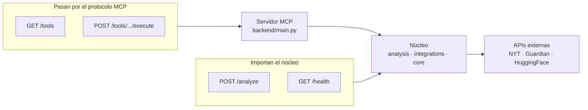

**`/analyze` y `/health` importan el núcleo.** Dar el rodeo por el protocolo
significaría serializar a JSON, volver a parsear y acabar **en la misma
función**. `/health` reutiliza el mismo `check_health` que la tool MCP, así que
las dos no pueden divergir.

**`/tools` y `/execute` sí necesitan el protocolo**, y no por elegancia: enumerar
las herramientas conectadas en tiempo de ejecución no se puede hacer importando
módulos. Es lo que exige R5.8.

La consecuencia a tener presente en H4: si algún día el NLP se separa en su
propio contenedor, `/analyze` deja de poder importar y hay que reescribirlo sobre
MCP. Es el único cambio de lógica base que ya sabemos que existe.

## 2 · Quién toca el historial

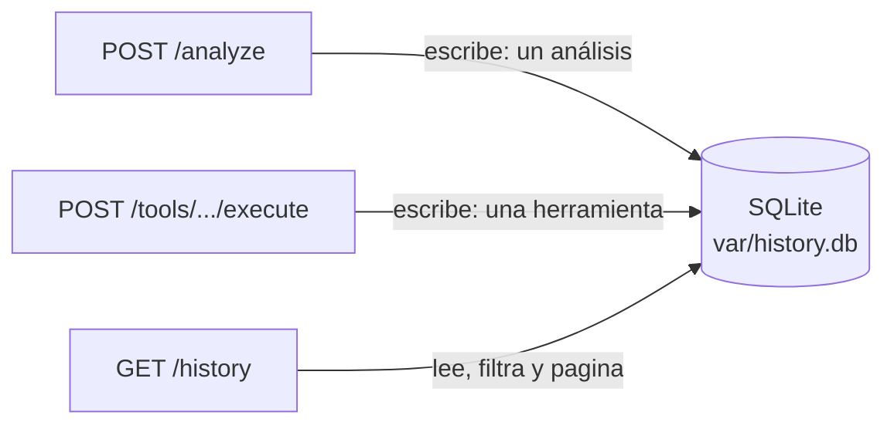

Se guardan **análisis, no invocaciones**: un `POST /analyze` es UNA entrada, no
cinco. La traza de invocaciones ya vive en los logs.

## 3 · Secuencia de `POST /analyze`

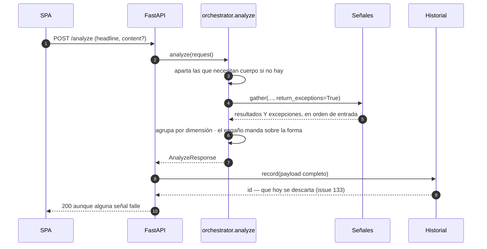

**`return_exceptions=True` es lo que aísla los fallos.** En vez de propagar la
primera excepción, `gather` la devuelve dentro de la lista, en la posición que le
toca; ahí se traduce a una señal en estado `error` y la respuesta sigue siendo un
200 con lo que sí se pudo calcular. Perder tres análisis correctos porque el
cuarto dio timeout sería el error de verdad.

**El orden se conserva.** `gather` devuelve en orden de entrada, no de
finalización, así que la interfaz pinta las tarjetas siempre igual.

**El veredicto no sale de contar señales**, sino de agrupar por dimensión y
aplicar una jerarquía explícita donde el engaño pesa más que la forma. Un titular
sobrio cuyo cuerpo no cumple lo prometido tiene tres señales diciendo «no» y una
diciendo «sí», y la correcta es la cuarta.

## 4 · Secuencia de `POST /tools/.../execute`

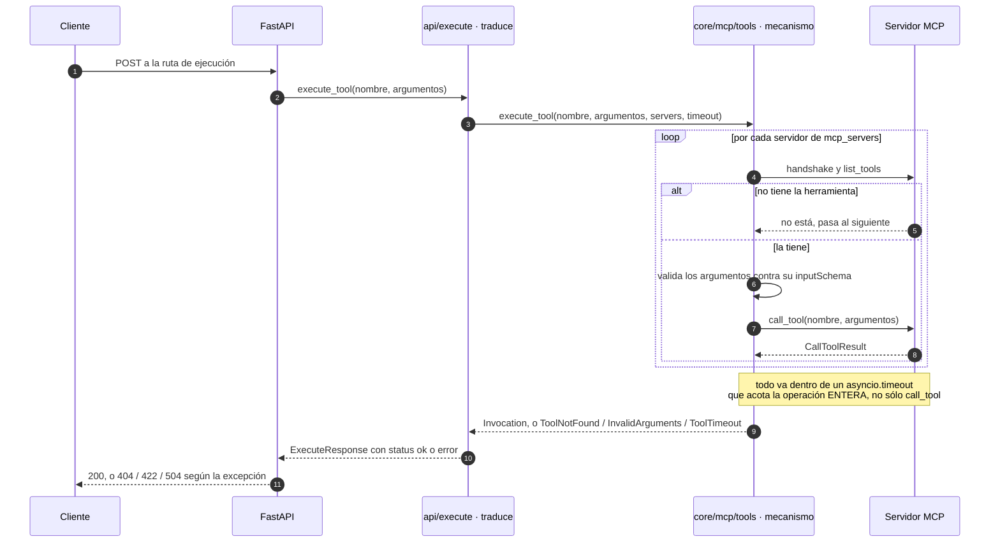

**El mecanismo y su traducción están separados** desde la issue 137. `core/mcp/tools.py`
localiza, valida e invoca sin saber que existe HTTP; `api/execute.py` convierte lo
que devuelve en un código de estado. El motivo no es estética: el agente de R13
necesita ese mecanismo y no puede importar de una fachada sin que falle
`tests/test_arquitectura.py`.

Esa frontera explica la última pareja de flechas. Lo que sube del mecanismo son
**excepciones o un resultado**, no códigos: una excepción interrumpe, un
resultado fallido es una respuesta. Por eso el 200 con `status: error` viaja
dentro de `Invocation` y los otros tres no.

**La validación ocurre antes de invocar** (R4.5). Si se dejara a MCP, un argumento
mal escrito llegaría como fallo de ejecución y sería indistinguible de un análisis
que salió mal; validando aquí, la API responde 422 diciendo qué campo falla.

**Cuatro salidas, cuatro significados distintos.** El 200 con `status: error`
dice «la herramienta se ejecutó y falló»: la petición era correcta. El 504 es su
propia categoría porque **la herramienta pudo terminar bien al otro lado** — lo
que falló es la espera, y decir «el análisis falló» sería mentir.

**Hay dos timeouts y hacen falta los dos.** El de `httpx` mide inactividad entre
bytes; el `asyncio.timeout` acota la duración. Hasta el arreglo de la issue 113,
sólo estaba el primero y una herramienta lenta **no fallaba, se colgaba**.

## 5 · El historial: escritura y lectura

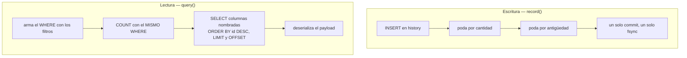

**La poda va dentro de la transacción del `INSERT`**, y eso es lo que la hace
prácticamente gratis: una escritura ya paga un `fsync`, y las dos sentencias de
poda viajan en ese mismo commit. Se descartaron las alternativas: podar de forma
programada exige un proceso vivo, y podar al leer convierte una consulta en una
operación destructiva.

**El `COUNT` lleva el mismo `WHERE` que la consulta.** Con filtros aplicados, el
total tiene que ser el de lo filtrado, o la interfaz pintaría «1-3 de 500» sobre
una lista de tres.

**Las columnas se nombran en vez de usar `SELECT *`.** No es repetición inútil:
como la capa de arriba construye el modelo con `HistoryEntry(**fila)`, con el
asterisco sería la forma de la tabla la que decidiría la del contrato — y
renombrar una columna dejaría su campo a `None` sin un solo error.

## 6 · El dominio del análisis

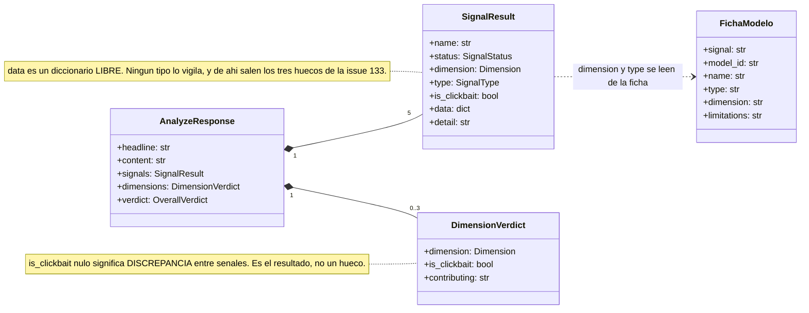

**Las señales son una lista de objetos con la misma forma**, no un objeto con un
campo por señal. Así la interfaz itera y pinta tarjetas sin conocerlas de
antemano: añadir una quinta señal no obliga a tocar Angular.

**El estado va por señal, no global.** Un único `status` cubre dos situaciones que
desde la respuesta son la misma —esa señal no tiene resultado pero las demás sí—:
que falten datos de entrada (`no_aplicable`) y que la ejecución falle (`error`).

**`is_clickbait` nulo en una dimensión es el resultado**, no un hueco: significa
que dos señales fiables no coincidieron. No se promedia ni se resuelve por mayoría.

**`data` no tiene tipo, y es deliberado**: es el JSON crudo de la herramienta, sin
aplanar, porque es lo que alimenta las tarjetas de explicabilidad. El precio lo
paga quien lo consume, que tiene que declarar por su cuenta qué espera — y de ahí
salieron los tres huecos de contrato de la issue 133.

## 7 · Capas y dirección de dependencias

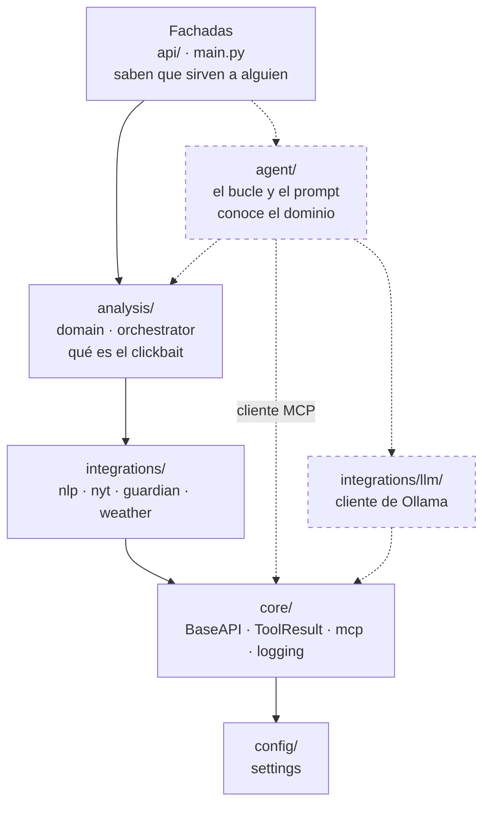

**Lo punteado es H5.** `agent/` va de primer nivel, hermano de `analysis/`,
porque **conoce el dominio** —el prompt codifica qué es cada señal— y por eso no
puede ir en `core/`; y no envuelve nada externo, así que tampoco es una
integración. El cliente de Ollama sí lo es, y por eso va a `integrations/llm/`,
con cliente y factoría como `nlp/`.

La regla que el agente tiene que respetar es la primera de abajo: **habla con las
herramientas por MCP, importando `core/mcp/`, nunca a través de `api/`**. No hace
falta tocar el test para que lo vigile: su lista es de excepciones, y `agent/`
no está en ella.

Las flechas son la **dirección permitida**, no cada import concreto. La regla que
sostiene el diseño es la inversa, y no se dibuja porque no existe:

- **Ninguna capa del núcleo importa de las fachadas.** Verificado sobre **todo
  `backend/` salvo `api/` y `main.py`**: 52 módulos, cero coincidencias de
  `backend.api`. La lista se invirtió en la issue 137 —antes enumeraba
  `analysis`, `integrations` y `core`—, porque enumerar deja fuera en silencio a
  cualquier paquete nuevo, y `backend/agent/` llega con R13 siendo justo el caso
  donde reutilizar `api/` tienta.
- **Los detectores no conocen la configuración.** `lexical`, `linear`,
  `incoherence` y `dedicated` no importan `settings`; sólo lo hacen `remote.py`
  (`client.py` hasta la issue 108), que necesita el token, y `factory.py`, cuyo
  trabajo es leer configuración. Eso
  es lo que permite probarlos sin montar nada, y lo que hay que preservar al
  parametrizar sus umbrales.

**Las dos las sostiene [`tests/test_arquitectura.py`](../tests/test_arquitectura.py).**
Parsea el árbol de cada módulo —no hace `grep`, así que un import comentado no lo
hace fallar— y recorre también los imports dentro de funciones, que es por donde
se esquivaría la regla sin querer. Al fallar nombra el fichero y el import
culpables.

Se comprobó **rompiendo las dos reglas a propósito** y verificando que fallan: un
test de arquitectura que pasa, pero que nadie ha visto fallar, no demuestra nada.

**Las dos reglas listan excepciones, no incluidos**, y por el mismo motivo: lo
nuevo queda cubierto sin tocar nada, y sacarlo obliga a editar la lista a mano —
que es la decisión consciente que se quiere forzar. Vale para meter `settings` en
un módulo de la capa NLP al parametrizar los umbrales (issue 93), y para añadir
un paquete que no debería hablar con las fachadas.

La primera lleva además un `assert modulos` delante del recorrido: si la
travesía del árbol se rompiera, la prueba se convertiría en un `assert not []`
que pasa siempre.

## 8 · El frontend: de dónde salen sus tipos

Es la única cadena del sistema que **cruza dos lenguajes y un paso de
compilación**, así que no se ve entera en ningún fichero.

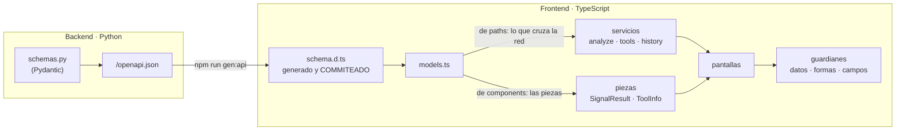

Cuatro cosas que el dibujo hace visibles:

- **`schema.d.ts` se genera y se commitea.** Podría regenerarse al construir,
  pero entonces un cambio de contrato no aparecería en ningún diff. Commiteado,
  la PR que cambia el backend enseña qué tipos cambian en el frontend.
- **El CI lo regenera y falla si difiere.** Es lo único que impide que el
  frontend compile contra un contrato viejo, y saltó de verdad al cambiar
  `ToolModelCard` en #128.
- **La bifurcación de `models.ts` no es de estilo.** Lo que cruza la red se toma
  de `paths`, porque `http.post<T>()` no comprueba nada: es una afirmación, y
  eligiendo `T` a mano de `components` la afirmación deja de estar atada a la
  ruta. Pasó en #133 —el backend empezó a devolver un sobre y el frontend siguió
  compilando— y por eso la regla es dura. Las piezas de dentro sí vienen de
  `components`: son formas con nombre propio que se pasan a un componente.
- **Los guardianes son la frontera de lo no tipado.** El `data` de una señal, el
  `payload` del historial y el `input_schema` de una herramienta son
  diccionarios libres en el contrato **a propósito**, para que quepa lo que aún
  no existe. Cada uno pasa por una función que comprueba y devuelve `null` si no
  encaja, y lo que no encaja **se enseña en crudo** en vez de desaparecer.

## 9 · Volver a un análisis guardado

`/analizar` y `/analisis/:id` son **la misma pantalla**. Lo único distinto es de
dónde sale el resultado, y eso lo dejó preparado #127 al hacer que el bloque de
resultados recibiera el análisis como estado en vez de calcularlo.

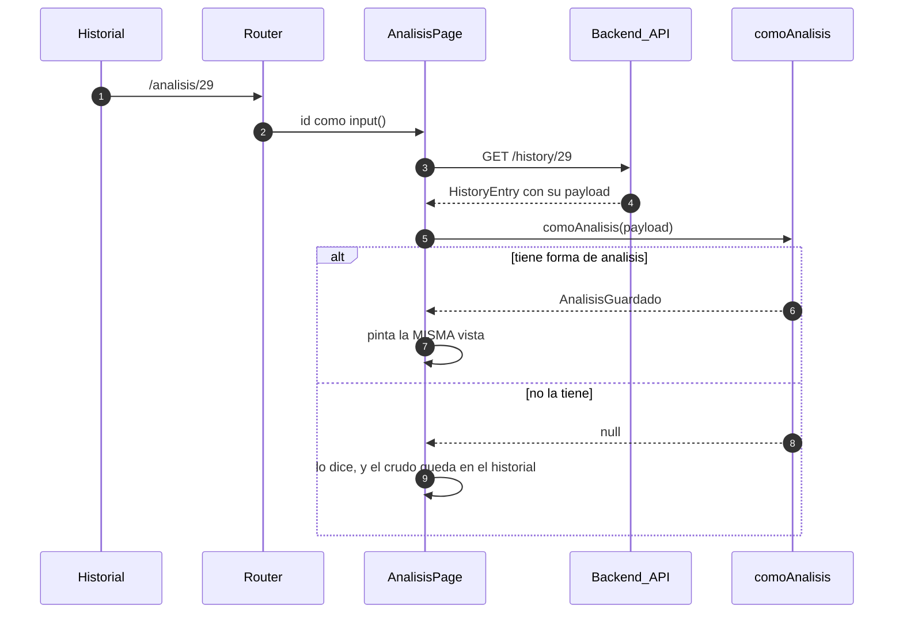

Tres decisiones que el diagrama no puede enseñar solo:

- **El id llega como `input()`**, enlazado por `withComponentInputBinding()`. La
  carga va en un `effect` y no en el constructor porque ir de `/analisis/28` a
  `/analisis/29` **reutiliza el componente**: un `snapshot` leído al construir no
  se enteraría del cambio.
- **`comoAnalisis` devuelve tipos más anchos que el contrato**, y es deliberado.
  `required` describe lo que el backend produce HOY; el historial guarda lo de
  ayer. Hay filas sin `label` —anterior a #133— y con el veredicto en castellano
  —anterior a #134—. `AnalyzeResponse` es asignable a `AnalisisGuardado` y al
  revés no: esa asimetría es la que permite una sola vista para los dos orígenes.
- **El 404 de `GET /history/{id}` es normal, no excepcional.** La retención poda
  entradas, así que un enlace guardado deja de existir por funcionamiento
  corriente; por eso el código está declarado en el contrato desde #129 y la
  pantalla lo explica con esas palabras en vez de decir «no se pudo cargar».

## 10 · Despliegue

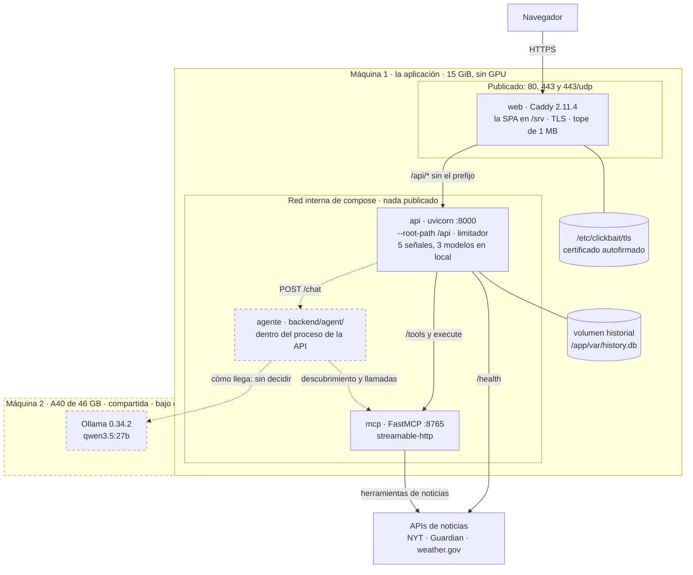

**Tres contenedores y dos imágenes.** `api` y `mcp` son **la misma imagen** con
otro comando (issue 162): los modelos van horneados en ella y el proceso arranca
con `HF_HUB_OFFLINE=1`, así que analizar un titular **no necesita red**. Lo único
que sale a internet son las APIs de noticias —y `/health`, que las sondea con una
caché de 30 s—.

**Sólo se publica Caddy.** `api` y `mcp` no tienen ningún puerto publicado, y no
es un detalle de limpieza: es lo que hace creíble la cabecera con la IP del
cliente, y con ella el límite de velocidad ([§11](#11--el-camino-de-una-petición-en-despliegue)).
Lo vigila `tests/test_compose.py`.

**El certificado vive fuera de la imagen y del repositorio**, en la máquina, y
Caddy lo lee de un directorio montado. Caduca el 2027-05-18, y renovarlo es
`caddy reload --force`: sin `--force`, Caddy ve la misma configuración y sigue
sirviendo el viejo sin avisar.

**Sin `depends_on`, a propósito.** Con la API caída, la web sigue sirviendo la
aplicación y el indicador de salud explica el 502; con el MCP caído, sólo se
degrada la pantalla de Sistema. Ningún servicio necesita a otro para arrancar, y
por eso R7.4 —«en el orden correcto»— se cumple sin orden: `up --wait` los deja
sanos a los tres.

**Lo punteado es H5**, y el despliegue tiene que seguir funcionando **sin ello**:
la máquina 2 se apaga cuando no se usa, así que el análisis no puede depender del
agente. Si no hay agente, la interfaz no ofrece el chat (R6.14).

## 11 · El camino de una petición en despliegue

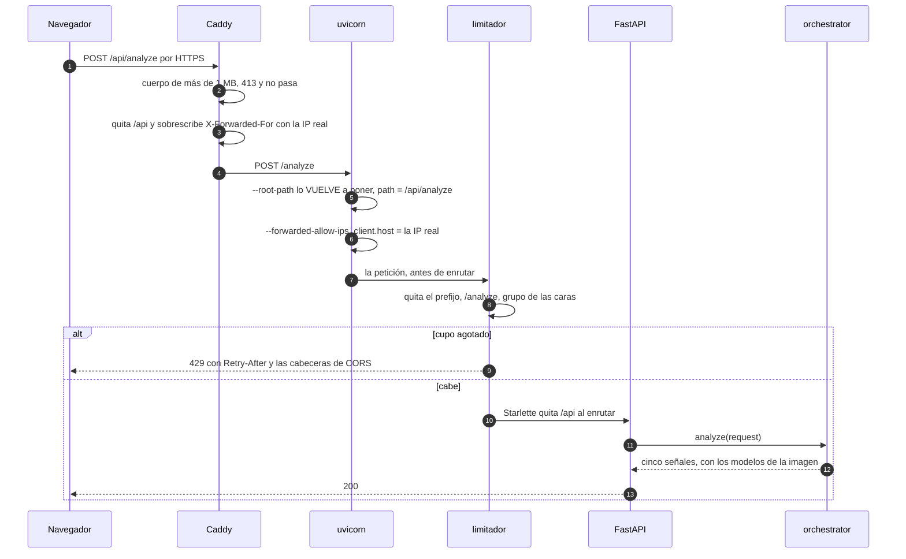

Lo que este diagrama enseña y el código no, porque está repartido entre tres
ficheros de dos lenguajes distintos:

- **El prefijo `/api` viaja.** Caddy lo quita, uvicorn lo vuelve a poner en el
  `scope` y Starlette lo quita al enrutar. Un middleware corre **entre** lo
  segundo y lo tercero, así que lo ve: es el fallo que dejó el límite de
  velocidad sin efecto en la primera versión de la issue 169, con toda la suite
  en verde.
- **La IP del cliente son tres eslabones**: Caddy la escribe (sobrescribiendo, no
  añadiendo), uvicorn se fía de ella y la API no se publica. Si uno se suelta, el
  límite pasa a ser uno para todo internet.
- **Cada tope vive donde es más barato**: el tamaño del cuerpo, en Caddy (R12.5),
  para que lo rechazado no llegue a ocupar memoria en la API; el ritmo, en la API
  (R12.4), porque depende de la ruta y hay que probarlo en el CI.

## 12 · Plano de H5: el agente conversacional

**Esto es un plano, no el sistema.** Declarado el 2026-09-23 a partir de las
decisiones de H1 —`POST /chat` con sondeo, `backend/agent/`,
`integrations/llm/`— y de las medidas del spike rehecho en la A40 (PR 176). Se
contrastará con lo construido al cerrar H5.

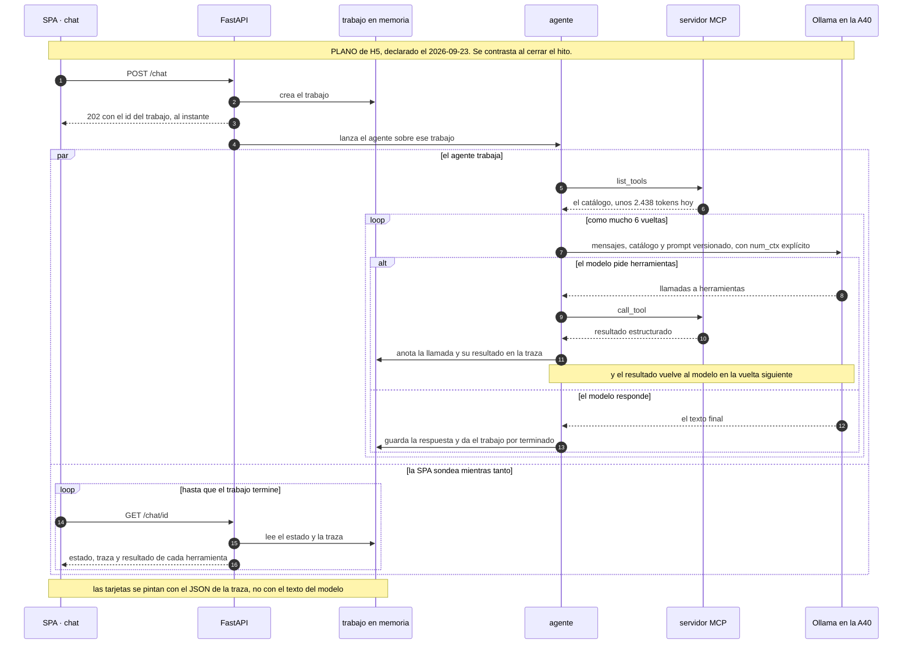

**Lo decidido, y de dónde sale:**

- **Asíncrono**: `POST /chat` devuelve un id y la SPA sondea. Un bucle completo
  con el 27B tarda **13–36 s**, y la máquina 2 se arranca bajo demanda. SSE se
  descartó porque dejaría el único endpoint fuera del contrato generado.
- **Los trabajos, en memoria del proceso**: el backend va con un solo worker
  desde la issue 125, porque cada proceso carga sus propios modelos.
- **El resultado estructurado va a dos sitios**: de vuelta al modelo, como
  mensaje de rol `tool` en la vuelta siguiente, para que pueda narrarlo; y a la
  **traza del trabajo**, que es lo que lee la SPA. Las tarjetas salen de la
  traza (R13.3, R6.13), así que **el veredicto nunca pasa por el texto del
  modelo** (R13.4) — que es justo donde el spike vio al modelo inventarse
  detalles.
- **La SPA sondea mientras el agente trabaja**, no cuando termina: la traza crece
  entre sondeo y sondeo, y por eso es «acumulada». Cada herramienta que acaba se
  puede enseñar antes de que el modelo haya escrito una palabra.
- **`qwen3.5:27b` con el prompt `04-preciso` o `03-estricto`**. El 2B es cinco
  veces más rápido, pero **se inventa detalles que una criba automática no ve**:
  0 marcas y 2 errores de 2 con el mismo prompt.
- **`num_ctx` explícito, nunca el valor por defecto.** El catálogo cuesta 2.438
  tokens contados por el propio modelo, y con 2048 **Ollama lo recorta en
  silencio**: el modelo elige mal sin que nada falle.
- **Descubrimiento por MCP** (R13.2): añadir una herramienta no toca el agente.
- **El veredicto sale de las herramientas** (R13.4) y las tarjetas se pintan con
  su JSON (R6.13). El modelo narra y contrasta; no decide.
- **Modo guiado** (R13.8) como degradación: si el *tool calling* falla, el
  backend elige las herramientas y el modelo sólo narra.

**Lo que el plano todavía NO decide**, y H5 tendrá que resolver:

- **Cómo llega la API a la A40**: un túnel SSH desde la máquina 1 o un puerto en
  la red de la universidad. Ni decidido ni medido.
- **Quién arranca Ollama y cuándo suelta la GPU**, con las normas de una máquina
  compartida. Hoy existe `~/bin/gpu-sesion` para uso a mano.
- **Separar las descripciones de `detect_clickbait` y `detect_clickbait_linear`**:
  es el único fallo de selección que quedaba con la ventana entera, idéntico en
  los dos modelos, y es de los docstrings.
- **La ficha de modelo del agente** (R13.7) y dónde vive.
- **El arranque real de la máquina 2**, con la caché de disco fría.

## Los diagramas de la Fase A

Se conservan como estaban. Describen **el servidor MCP**, que sigue siendo cierto
como componente aunque ya no sea el sistema entero.

- **Capas:** `Cliente MCP → MCP Server → Tools → Clients`. Cada `tool` delega en
  su `client`; todos heredan de `BaseAPI`, donde viven rate-limit, reintentos,
  cuota, autenticación y el log `api.call`.
- **`health_check`** es un caso aparte: no pasa por `BaseAPI`, hace sondeos
  directos con su propio `httpx` y agrega `ok` / `degraded` / `down`.
- El patrón **`tool.py` (registro) + `client.py` (lógica)** se repite idéntico en
  las integraciones, así que la estructura es predecible.
- **El rótulo «MCP Server (STDIO)» ya no describe el despliegue**: el transporte es configurable desde #90 y hoy se sirve por `streamable-http`, **en su propio contenedor y sólo dentro de la red de compose** ([§10](#10--despliegue)). El diagrama se conserva porque lo demás sigue siendo cierto, y mover un dibujo congelado por una etiqueta costaría más de lo que aclara — pero conviene leerlo con esta nota delante. *(Revisado en #173: con el despliegue dibujado aparte, la nota basta.)*

- Dentro de `BaseAPI.make_request`: rate-limit (R2.4), cálculo de cuota (R2.7) y
  el log `api.call` con `call_count` y `remaining_quota` (R2.6).
- El bucle reintenta sólo ante `TimeoutException` o `503`, y sólo si el cliente
  declara reintentos (HuggingFace 3; NYT y Guardian 0).

## Estado de los requisitos

| Requisito | Estado |
| :--- | :--- |
| **R1** Infraestructura MCP | ✅ transporte configurable y registro automático de integraciones |
| **R2** Tools de APIs públicas | ✅ con validación, rate-limit, tracking y cuota |
| **R3** NLP y explicabilidad | ✅ cinco señales contrastadas, incoherencia (R3.7), fichas de modelo y **modelo de cada señal intercambiable por configuración** (R3.9, completo desde #119 y #87). Sólo en inglés, que es lo que pide R3.4: el español quedó como mejora futura |
| **R4** API REST | ✅ análisis, catálogo, ejecución, historial, CORS y OpenAPI |
| **R5** Catálogo y transparencia | ✅ catálogo por handshake MCP, con procedencia y ficha de modelo |
| **R6** Interfaz web | ◑ las tres pantallas del camino determinista ✅ (127–130): análisis, catálogo e historial, con errores entendibles (R6.7), escritorio y tabletas (R6.8) y sin controles que no funcionen (R6.14). Pendiente lo que depende del asistente: R6.10, R6.12 y R6.13 llegan con R13 |
| **R7** Docker | ✅ compose con `api`, `mcp` y `web`, red interna, volumen del historial, 80 y 443 publicados y configuración por entorno (#162–#165). R7.4 se cumple **sin `depends_on`, a propósito**: ningún servicio necesita a otro para arrancar ([§10](#10--despliegue)) |
| **R8** CI/CD | ◑ integración continua ✅ (Python y frontend), y **las dos imágenes construidas en cada PR sin publicarlas** (R8.4, #173); R8.5 **matizado** —la compilación correcta la marcan el check del commit y el tag de la release, porque no se publica ninguna imagen—; R8.6 **a revisar**: pull requests y `main` comparten `ci.yml`; despliegue continuo ⬜ |
| **R9** Persistencia e historial | ✅ SQLite con filtros y retención configurable |
| **R10** Errores y logging | ✅ logging estructurado, invocaciones y health check |
| **R11** Configuración | ✅ `pydantic-settings`, *fail-fast*, sin secretos en logs |
| **R12** Seguridad y validación | ✅ validación de entrada y de claves al arranque, texto de excepción saneado (#89), tope de 1 MB en Caddy (R12.5, #165) y límite de velocidad por cliente (R12.4, #169). Un límite por IP no para el abuso desde muchas IPs |
| **R13** Agente conversacional | ⬜ sin construir. *Tool calling* validado en el spike #82 y **rehecho en la A40** (#176); el diseño está declarado como plano en [§12](#12--plano-de-h5-el-agente-conversacional) |
