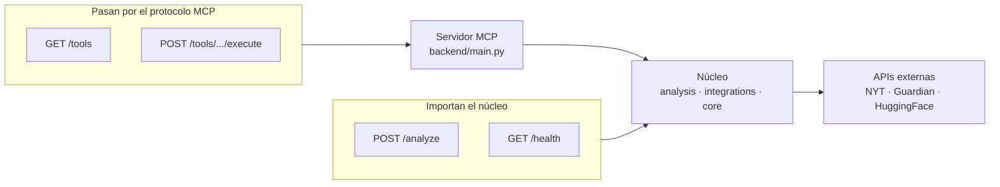
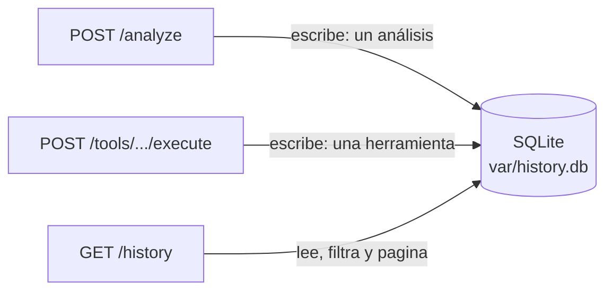
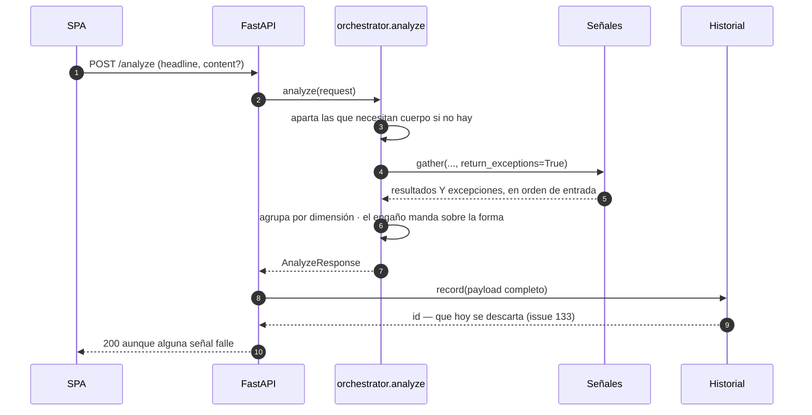
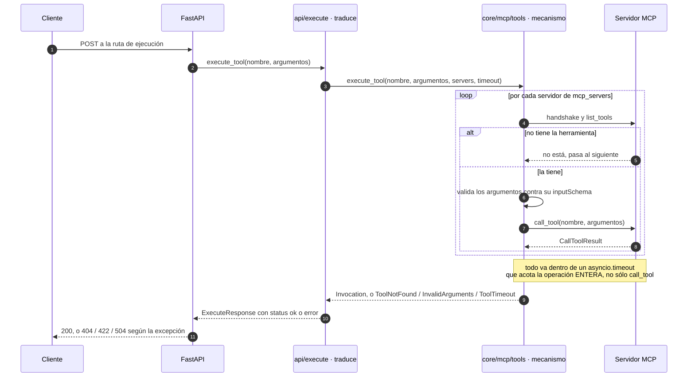
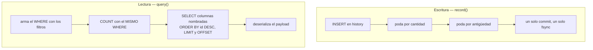
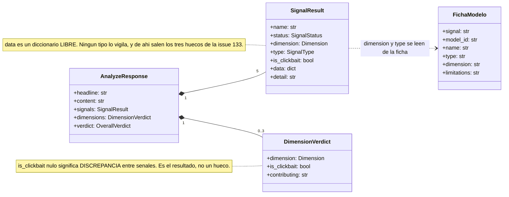
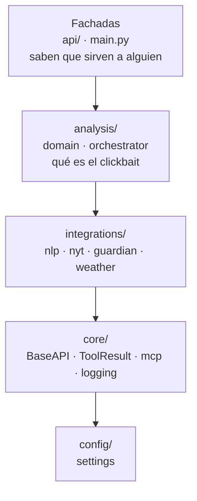

# Arquitectura

> **Documento vivo.** Refleja el estado tras cerrar **H2** (API REST completa) y
> la primera pantalla de H3. Para los requisitos, ver [`requisitos.md`](requisitos.md);
> para dónde vive cada cosa y con qué criterio, [`estructura.md`](estructura.md).
>
> **Formato.** Los diagramas de flujo van en **Mermaid**: GitHub los renderiza,
> viven junto al texto y se revisan en el diff de una pull request. Los dos SVG
> de **draw.io** son el UML de la Fase A y se conservan como material de la
> memoria. El criterio para elegir: si un diagrama necesita control fino de la
> disposición, o va en draw.io, o está diciendo dos cosas y hay que partirlo.
>
> Dos trampas al escribir Mermaid, encontradas al hacer estos diagramas:
> **`#` inicia un código de entidad** y se traga lo que venga detrás (escribir
> «issue 133», no «#133»), y **`;` termina la sentencia**, así que parte una
> etiqueta en dos y deja el diagrama sin renderizar.

## Visión general

El sistema es **un núcleo servido por dos fachadas**.

El **núcleo** —`analysis/`, `integrations/`, `core/`— sabe qué es el clickbait y
cómo se analiza un titular, y no sabe quién lo llama. Encima hay dos formas de
consumirlo:

- **El servidor MCP** (`backend/main.py`, FastMCP), que expone las herramientas a
  un cliente MCP: hoy Claude Desktop, mañana el agente de R13. El transporte es
  configurable (`stdio` o `streamable-http`).
- **La API REST** (`backend/api/`, FastAPI), que sirve a la SPA de Angular.

No es una encima de la otra: son **dos fachadas sobre el mismo núcleo**. Esa
decisión explica la asimetría del primer diagrama, que es lo que más se malinterpreta.

## 1 · Las dos fachadas: qué cruza la frontera MCP

**`/analyze` y `/health` importan el núcleo.** Dar el rodeo por el protocolo
significaría serializar a JSON, volver a parsear y acabar **en la misma
función**. `/health` reutiliza el mismo `check_health` que la tool MCP, así que
las dos no pueden divergir.

**`/tools` y `/execute` sí necesitan el protocolo**, y no por elegancia: enumerar
las herramientas conectadas en tiempo de ejecución no se puede hacer importando
módulos. Es lo que exige R5.8.

La consecuencia a tener presente en H4: si algún día el NLP se separa en su
propio contenedor, `/analyze` deja de poder importar y hay que reescribirlo sobre
MCP. Es el único cambio de lógica base que ya sabemos que existe.

## 2 · Quién toca el historial

Se guardan **análisis, no invocaciones**: un `POST /analyze` es UNA entrada, no
cinco. La traza de invocaciones ya vive en los logs.

## 3 · Secuencia de `POST /analyze`

**`return_exceptions=True` es lo que aísla los fallos.** En vez de propagar la
primera excepción, `gather` la devuelve dentro de la lista, en la posición que le
toca; ahí se traduce a una señal en estado `error` y la respuesta sigue siendo un
200 con lo que sí se pudo calcular. Perder tres análisis correctos porque el
cuarto dio timeout sería el error de verdad.

**El orden se conserva.** `gather` devuelve en orden de entrada, no de
finalización, así que la interfaz pinta las tarjetas siempre igual.

**El veredicto no sale de contar señales**, sino de agrupar por dimensión y
aplicar una jerarquía explícita donde el engaño pesa más que la forma. Un titular
sobrio cuyo cuerpo no cumple lo prometido tiene tres señales diciendo «no» y una
diciendo «sí», y la correcta es la cuarta.

## 4 · Secuencia de `POST /tools/.../execute`

**El mecanismo y su traducción están separados** desde la issue 137. `core/mcp/tools.py`
localiza, valida e invoca sin saber que existe HTTP; `api/execute.py` convierte lo
que devuelve en un código de estado. El motivo no es estética: el agente de R13
necesita ese mecanismo y no puede importar de una fachada sin que falle
`tests/test_arquitectura.py`.

Esa frontera explica la última pareja de flechas. Lo que sube del mecanismo son
**excepciones o un resultado**, no códigos: una excepción interrumpe, un
resultado fallido es una respuesta. Por eso el 200 con `status: error` viaja
dentro de `Invocation` y los otros tres no.

**La validación ocurre antes de invocar** (R4.5). Si se dejara a MCP, un argumento
mal escrito llegaría como fallo de ejecución y sería indistinguible de un análisis
que salió mal; validando aquí, la API responde 422 diciendo qué campo falla.

**Cuatro salidas, cuatro significados distintos.** El 200 con `status: error`
dice «la herramienta se ejecutó y falló»: la petición era correcta. El 504 es su
propia categoría porque **la herramienta pudo terminar bien al otro lado** — lo
que falló es la espera, y decir «el análisis falló» sería mentir.

**Hay dos timeouts y hacen falta los dos.** El de `httpx` mide inactividad entre
bytes; el `asyncio.timeout` acota la duración. Hasta el arreglo de la issue 113,
sólo estaba el primero y una herramienta lenta **no fallaba, se colgaba**.

## 5 · El historial: escritura y lectura

**La poda va dentro de la transacción del `INSERT`**, y eso es lo que la hace
prácticamente gratis: una escritura ya paga un `fsync`, y las dos sentencias de
poda viajan en ese mismo commit. Se descartaron las alternativas: podar de forma
programada exige un proceso vivo, y podar al leer convierte una consulta en una
operación destructiva.

**El `COUNT` lleva el mismo `WHERE` que la consulta.** Con filtros aplicados, el
total tiene que ser el de lo filtrado, o la interfaz pintaría «1-3 de 500» sobre
una lista de tres.

**Las columnas se nombran en vez de usar `SELECT *`.** No es repetición inútil:
como la capa de arriba construye el modelo con `HistoryEntry(**fila)`, con el
asterisco sería la forma de la tabla la que decidiría la del contrato — y
renombrar una columna dejaría su campo a `None` sin un solo error.

## 6 · El dominio del análisis

**Las señales son una lista de objetos con la misma forma**, no un objeto con un
campo por señal. Así la interfaz itera y pinta tarjetas sin conocerlas de
antemano: añadir una quinta señal no obliga a tocar Angular.

**El estado va por señal, no global.** Un único `status` cubre dos situaciones que
desde la respuesta son la misma —esa señal no tiene resultado pero las demás sí—:
que falten datos de entrada (`no_aplicable`) y que la ejecución falle (`error`).

**`is_clickbait` nulo en una dimensión es el resultado**, no un hueco: significa
que dos señales fiables no coincidieron. No se promedia ni se resuelve por mayoría.

**`data` no tiene tipo, y es deliberado**: es el JSON crudo de la herramienta, sin
aplanar, porque es lo que alimenta las tarjetas de explicabilidad. El precio lo
paga quien lo consume, que tiene que declarar por su cuenta qué espera — y de ahí
salieron los tres huecos de contrato de la issue 133.

## 7 · Capas y dirección de dependencias

Las flechas son la **dirección permitida**, no cada import concreto. La regla que
sostiene el diseño es la inversa, y no se dibuja porque no existe:

- **Ninguna capa del núcleo importa de las fachadas.** Verificado sobre **todo
  `backend/` salvo `api/` y `main.py`**: 52 módulos, cero coincidencias de
  `backend.api`. La lista se invirtió en la issue 137 —antes enumeraba
  `analysis`, `integrations` y `core`—, porque enumerar deja fuera en silencio a
  cualquier paquete nuevo, y `backend/agent/` llega con R13 siendo justo el caso
  donde reutilizar `api/` tienta.
- **Los detectores no conocen la configuración.** `lexical`, `linear`,
  `incoherence` y `dedicated` no importan `settings`; sólo lo hacen `client.py`,
  que necesita el token, y `factory.py`, cuyo trabajo es leer configuración. Eso
  es lo que permite probarlos sin montar nada, y lo que hay que preservar al
  parametrizar sus umbrales.

**Las dos las sostiene [`tests/test_arquitectura.py`](../tests/test_arquitectura.py).**
Parsea el árbol de cada módulo —no hace `grep`, así que un import comentado no lo
hace fallar— y recorre también los imports dentro de funciones, que es por donde
se esquivaría la regla sin querer. Al fallar nombra el fichero y el import
culpables.

Se comprobó **rompiendo las dos reglas a propósito** y verificando que fallan: un
test de arquitectura que pasa, pero que nadie ha visto fallar, no demuestra nada.

**Las dos reglas listan excepciones, no incluidos**, y por el mismo motivo: lo
nuevo queda cubierto sin tocar nada, y sacarlo obliga a editar la lista a mano —
que es la decisión consciente que se quiere forzar. Vale para meter `settings` en
un módulo de la capa NLP al parametrizar los umbrales (issue 93), y para añadir
un paquete que no debería hablar con las fachadas.

La primera lleva además un `assert modulos` delante del recorrido: si la
travesía del árbol se rompiera, la prueba se convertiría en un `assert not []`
que pasa siempre.

## Los diagramas de la Fase A

Se conservan como estaban. Describen **el servidor MCP**, que sigue siendo cierto
como componente aunque ya no sea el sistema entero.

- **Capas:** `Cliente MCP → MCP Server → Tools → Clients`. Cada `tool` delega en
  su `client`; todos heredan de `BaseAPI`, donde viven rate-limit, reintentos,
  cuota, autenticación y el log `api.call`.
- **`health_check`** es un caso aparte: no pasa por `BaseAPI`, hace sondeos
  directos con su propio `httpx` y agrega `ok` / `degraded` / `down`.
- El patrón **`tool.py` (registro) + `client.py` (lógica)** se repite idéntico en
  las integraciones, así que la estructura es predecible.

- Dentro de `BaseAPI.make_request`: rate-limit (R2.4), cálculo de cuota (R2.7) y
  el log `api.call` con `call_count` y `remaining_quota` (R2.6).
- El bucle reintenta sólo ante `TimeoutException` o `503`, y sólo si el cliente
  declara reintentos (HuggingFace 3; NYT y Guardian 0).

## Estado de los requisitos

| Requisito | Estado |
| :--- | :--- |
| **R1** Infraestructura MCP | ✅ transporte configurable y registro automático de integraciones |
| **R2** Tools de APIs públicas | ✅ con validación, rate-limit, tracking y cuota |
| **R3** NLP y explicabilidad | ◑ cinco señales contrastadas, incoherencia (R3.7) y fichas de modelo (R3.9) ✅; **sólo inglés**, y R3.9 a medias — los modelos no son intercambiables por configuración (issue 119) |
| **R4** API REST | ✅ análisis, catálogo, ejecución, historial, CORS y OpenAPI |
| **R5** Catálogo y transparencia | ✅ catálogo por handshake MCP, con procedencia y ficha de modelo |
| **R6** Interfaz web | ◑ pantalla de análisis ✅ (issue 127); catálogo, historial y responsive pendientes (128, 129, 130); el asistente llega con R13 |
| **R7** Docker | ⬜ H4 |
| **R8** CI/CD | ◑ integración continua ✅ (Python y frontend); despliegue continuo ⬜ |
| **R9** Persistencia e historial | ✅ SQLite con filtros y retención configurable |
| **R10** Errores y logging | ✅ logging estructurado, invocaciones y health check |
| **R11** Configuración | ✅ `pydantic-settings`, *fail-fast*, sin secretos en logs |
| **R12** Seguridad y validación | ◑ validación de entrada y de API keys al arranque; falta sanear el texto de excepción que se expone (issue 89) |
| **R13** Agente conversacional | ⬜ *tool calling* validado en el spike 82; sin construir |
