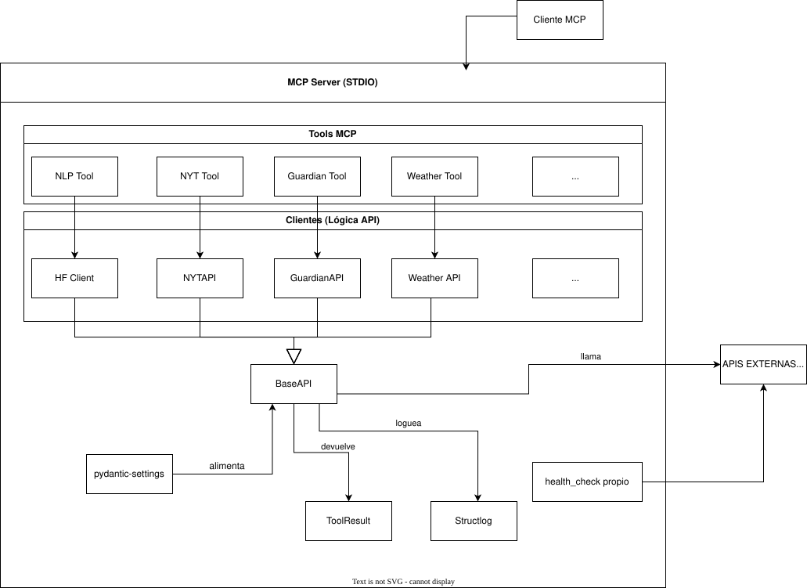
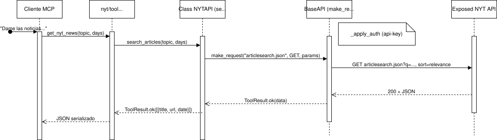

# Arquitectura (estado actual — MVP)

> Documento vivo. Refleja el estado del sistema al **cerrar el MVP** (Fase A del plan). Diagramas en Mermaid (se renderizan en GitHub). Para los requisitos ver [`requisitos.md`](requisitos.md).

## Visión general

El sistema es un **servidor MCP** (FastMCP, transporte *stdio*) que expone *tools* a un cliente MCP (un LLM, p.ej. Claude Desktop). Las tools consumen APIs públicas (meteorología, noticias) y aplican análisis NLP (clickbait, sentimiento) vía HuggingFace.

Capas (de fuera hacia dentro):

- **`main.py`** — arranca `FastMCP`, configura logging y **registra** todas las tools.
- **Tools** (`integrations/*/tool.py`, `core/health.py`) — capa fina que declara la herramienta MCP (`@mcp.tool()` + `@log_tool_invocation`) y delega en el cliente.
- **Clients** (`integrations/*/client.py`) — la lógica de cada API; todos heredan de `BaseAPI`.
- **`BaseAPI`** (`core/base_api.py`) — el corazón compartido: *rate-limit*, reintentos, cuota, autenticación y el log `api.call`.
- **Transversal** — `config/settings` (configuración con `pydantic-settings`), `core/models` (`ToolResult`), `core/logging` (`structlog`), `core/observability` (decorador `log_tool_invocation`).

## Diagrama de componentes

- **Capas:** `Cliente MCP → MCP Server (stdio) → Tools → Clients`. Cada `tool` delega en su `client`; todos los clients **heredan `BaseAPI`** (donde viven rate-limit, retry, cuota, auth y el log `api.call`).
- **`health_check`** es un caso aparte: no pasa por `BaseAPI` — hace *probes* directos con su propio `httpx` a weather/guardian/nyt y agrega `ok` / `degraded` / `down`.
- **Transversal:** `pydantic-settings` (config), `ToolResult` (modelo de retorno) y `structlog` (logging) sostienen a `BaseAPI` y a las capas.
- Solo **APIS EXTERNAS** queda fuera de la frontera del server.
- El patrón **`tool.py` (registro) + `client.py` (lógica)** se repite idéntico en las 4 integraciones → estructura predecible.

## Diagrama de secuencia — flujo estrella

"Dame titulares del NYT sobre `<tema>`" (el primer paso del caso de uso clickbait). Los demás flujos de noticias/NLP siguen la misma forma `Tool → Client → BaseAPI → API`.

- **Dentro de `BaseAPI.make_request`** (el diagrama lo resume en la nota): además de `_apply_auth`, aplica **rate-limit** (`async with limiter`, R2.4) y, tras la respuesta, calcula la **cuota** (`_read_quota`, R2.7) y emite el log `api.call` con `call_count` / `remaining_quota` (R2.6).

- **Reintento (E4-02):** el bucle de `make_request` reintenta solo ante `TimeoutException`/`503` y solo si `MAX_RETRIES > 0` (HF = 3; NYT/Guardian = 0, no reintentan).
- **Encadenado:** para "¿cuáles son clickbait?", el LLM toma esos titulares y llama a `detect_clickbait`, que sigue el mismo camino contra el `HFClient` (zero-shot `facebook/bart-large-mnli`).

## Cierre del MVP

El MVP cubre el **núcleo del detector de clickbait sobre titulares** vía MCP, con dos fuentes de noticias reputadas + NLP. Estado de los requisitos ([`requisitos.md`](requisitos.md)):

| Requisito | Estado en el MVP |
| :--- | :--- |
| **R1** Infraestructura MCP | ✅ completo |
| **R2** Tools de APIs públicas | ✅ para weather/guardian/nyt, con validación (R2.5), rate-limit (R2.4), tracking (R2.6) y cuota (R2.7, observabilidad) |
| **R3** NLP (clickbait + sentimiento) | ◑ parcial: sentimiento ✅, clickbait *zero-shot* ✅, **solo inglés** (R3.4 relajado); clickbait por **incoherencia** (R3.7) pendiente |
| **R10** Errores y logging | ✅ logging estructurado + invocaciones + health check |
| **R11** Configuración | ✅ `pydantic-settings`, *fail-fast*, sin secretos en logs |
| **R12** Seguridad/validación | ◑ parcial: validación de entrada (pydantic `Field`), validación de API keys al arranque |
| **R4–R9** REST/catálogo/web/Docker/CI-CD/persistencia | ⬜ Fase B |

**Frontera del MVP:** servidor MCP funcional consumible por un LLM. Lo que queda (API REST con FastAPI, catálogo de tools, web Angular, Docker, persistencia de historial) constituye la **Fase B** del plan.
